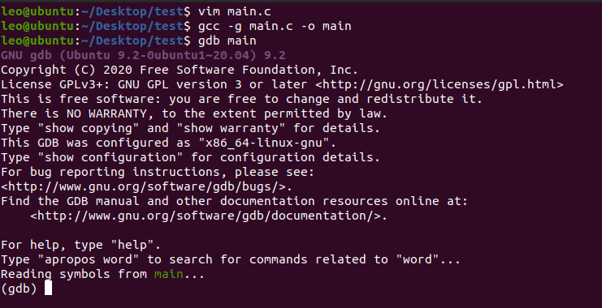
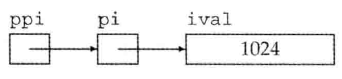
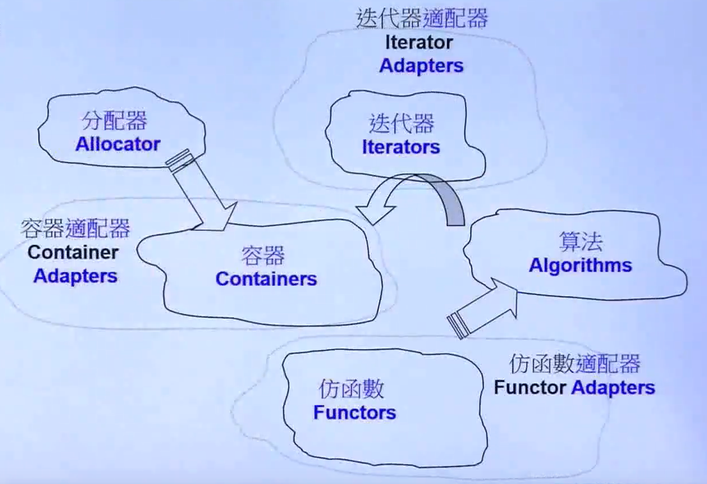
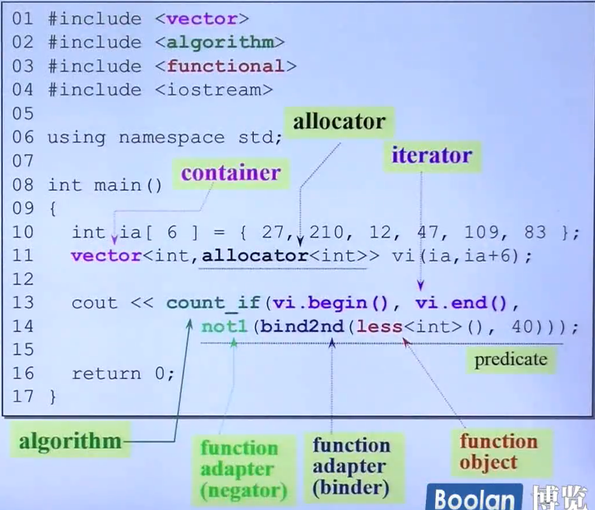
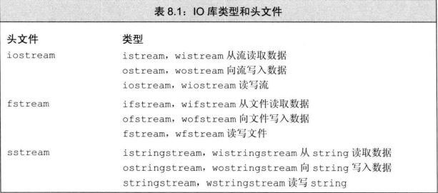
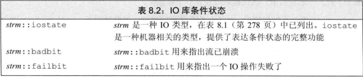
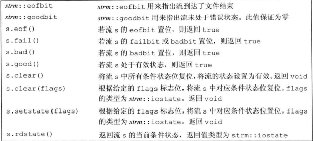

# C++学习笔记

[TOC]


## Linux下gdb调试

### 1. 单步执行和跟踪函数调用

看下面的程序：

**例 10.1. 函数调试实例**

```c
#include <stdio.h> 
int add_range(int low, int high)
{    int i, sum;    
 for (i = low; i <= high; i++)        
     sum = sum + i;    
 return sum;
} 
int main(void)
{    
    int result[100];    
    result[0] = add_range(1, 10);    
    result[1] = add_range(1, 100);    
    printf("result[0]=%d\nresult[1]=%d\n", result[0], result[1]);    
    return 0;
}
```

`add_range`函数从`low`加到`high`，在`main`函数中首先从1加到10，把结果保存下来，然后从1加到100，再把结果保存下来，最后打印的两个结果是：

```
result[0]=55
result[1]=5105
```

第一个结果正确[[20](https://www.bookstack.cn/read/linux-c/22b739ab35bcee97.md#ftn.id2740258)]，第二个结果不正确，在小学我们就听说过高斯小时候的故事，从1加到100应该是5050。一段代码，第一次运行结果是对的，第二次运行却不对，这是很常见的一类错误现象，这种情况不应该怀疑代码而应该怀疑数据，因为第一次和第二次运行的都是同一段代码，如果代码是错的，那为什么第一次的结果能对呢？然而第一次和第二次运行时相关的数据却有可能不同，错误的数据会导致错误的结果。

在编译时要加上`-g`选项，生成的可执行文件才能用`gdb`进行源码级调试：

```shell
$ gcc -g main.c -o main
$ gdb main
GNU gdb 6.8-debian
Copyright (C) 2008 Free Software Foundation, Inc.
License GPLv3+: GNU GPL version 3 or later <http://gnu.org/licenses/gpl.html>
This is free software: you are free to change and redistribute it.
There is NO WARRANTY, to the extent permitted by law.  Type "show copying"
and "show warranty" for details.
This GDB was configured as "i486-linux-gnu"...
(gdb) 
```



`-g`选项的作用是在可执行文件中加入源代码的信息，比如可执行文件中第几条机器指令对应源代码的第几行，但并不是把整个源文件嵌入到可执行文件中，所以在调试时必须保证`gdb`能找到源文件。

`gdb`提供一个类似Shell的命令行环境，上面的`(gdb)`就是提示符，在这个提示符下输入`help`可以查看命令的类别。

也可以进一步查看某一类别中有哪些命令，例如查看`files`类别下有哪些命令可用：

```shell
(gdb) help files
Specifying and examining files.
 
List of commands:
...
```

现在试试用`list`命令从第一行开始列出源代码：

```shell
(gdb) list 1
1    #include <stdio.h>
2    
3    int add_range(int low, int high)
4    {
5        int i, sum;
6        for (i = low; i <= high; i++)
7            sum = sum + i;
8        return sum;
9    }
10
```

一次只列10行，如果要从第11行开始继续列出源代码可以输入

```
(gdb) list
```

也可以直接敲回车**Enter**，`gdb`提供了一个很方便的功能，在提示符下直接敲回车表示重复上一条命令。

`gdb`的很多常用命令有简写形式，例如`list`命令可以写成`l`，列出一个函数的源代码也可以用函数名做参数：

```shell
(gdb) l add_range
1    #include <stdio.h>
2    
3    int add_range(int low, int high)
4    {
5        int i, sum;
6        for (i = low; i <= high; i++)
7            sum = sum + i;
8        return sum;
9    }
10
```

现在退出`gdb`的环境：

```
(gdb) quit
```

首先用`start`命令开始执行程序：

```shell
$ gdb main
...
(gdb) start
Breakpoint 1 at 0x80483ad: file main.c, line 14.
Starting program: /home/akaedu/main 
main () at main.c:14
14        result[0] = add_range(1, 10); #即将执行的下一条语句。
(gdb)
```

`gdb`停在`main`函数中变量定义之后的第一条语句处等待我们发命令，可以用`next`命令（简写为`n`）控制这些语句一条一条地执行：

```shell
(gdb) n
15        result[1] = add_range(1, 100);
(gdb) （直接回车）
16        printf("result[0]=%d\nresult[1]=%d\n", result[0], result[1]);
(gdb) （直接回车）
result[0]=55
result[1]=5105
17        return 0;
```

用`n`命令依次执行每行语句，在执行打印语句时结果立刻打出来了，然后停在`return`语句之前等待我们发命令。

虽然控制了程序的执行，但看不出哪里错了，因为错误不在`main`函数中而在`add_range`函数中，用`start`命令重新来过，这次用`step`命令（简写为`s`）钻进`add_range`函数中去跟踪执行：

```shell
(gdb) start
The program being debugged has been started already.
Start it from the beginning? (y or n) y
 
Breakpoint 2 at 0x80483ad: file main.c, line 14.
Starting program: /home/akaedu/main 
main () at main.c:14
14        result[0] = add_range(1, 10);
(gdb) s
add_range (low=1, high=10) at main.c:6
6        for (i = low; i <= high; i++)
```

这次停在了`add_range`函数中变量定义之后的第一条语句处。在函数中有几种查看状态的办法，`backtrace`命令（简写为`bt`）可以查看函数调用的栈帧：

```shell
(gdb) bt
#0  add_range (low=1, high=10) at main.c:6
#1  0x080483c1 in main () at main.c:14
```

可见当前的`add_range`函数是被`main`函数调用的，`main`传进来的参数是`low=1, high=10`。`main`函数的栈帧编号为1，`add_range`的栈帧编号为0。现在可以用`info`命令（简写为`i`）查看`add_range`函数局部变量的值：

```shell
(gdb) i locals
i = 0
sum = 0
```

如果想查看`main`函数当前局部变量的值也可以做到，先用`frame`命令（简写为`f`）选择1号栈帧然后再查看局部变量：

```shell
(gdb) f 1
#1  0x080483c1 in main () at main.c:14
14        result[0] = add_range(1, 10);
(gdb) i locals 
result = {0, 0, 0, 0, 0, 0, 134513196, 225011984, -1208685768, -1081160480, 
...
  -1208623680}
```

注意到`result`数组中有很多元素具有杂乱无章的值，因为未经初始化的局部变量具有不确定的值。到目前为止一切正常。用`s`或`n`往下走几步，然后用`print`命令（简写为`p`）打印出变量`sum`的值：

```shell
(gdb) s
7            sum = sum + i;
(gdb) （直接回车）
6        for (i = low; i <= high; i++)
(gdb) （直接回车）
7            sum = sum + i;
(gdb) （直接回车）
6        for (i = low; i <= high; i++)
(gdb) p sum
$1 = 3
```

第一次循环`i`是1，第二次循环`i`是2，加起来是3，没错。这里的`$1`表示`gdb`保存着这些中间结果，$后面的编号会自动增长，在命令中可以用`$1`、`$2`、`$3`等编号代替相应的值。

可以用`finish`命令让程序一直运行到从当前函数返回为止：

```shell
(gdb) finish
Run till exit from #0  add_range (low=1, high=10) at main.c:6
0x080483c1 in main () at main.c:14
14        result[0] = add_range(1, 10);
Value returned is $2 = 55
```

返回值是55，当前正准备执行赋值操作，用`s`命令，查看`result`数组：

```shell
(gdb) s
15        result[1] = add_range(1, 100);
(gdb) p result
$3 = {55, 0, 0, 0, 0, 0, 134513196, 225011984, -1208685768, -1081160480, 
...
  -1208623680}
```

第一个值55确实赋给了`result`数组的第0个元素。

下面用`s`命令进入第二次`add_range`调用，进入之后首先查看参数和局部变量：

```shell
(gdb) s
add_range (low=1, high=100) at main.c:6
6        for (i = low; i <= high; i++)
(gdb) bt
#0  add_range (low=1, high=100) at main.c:6
#1  0x080483db in main () at main.c:15
(gdb) i locals 
i = 11
sum = 55
```

由于局部变量`i`和`sum`没初始化，所以具有不确定的值，又由于两次调用是挨着的，`i`和`sum`正好取了上次调用时的值。`i`的初值不是0倒没关系，在`for`循环中会赋值为0的，但`sum`如果初值不是0，累加得到的结果就错了,所以设法让局部变量`sum`在调用时初值为0。我们已经找到错误原因，可以退出`gdb`修改源代码了。

我们也可以在`gdb`中马上把`sum`的初值改为0继续运行，看看这一处改了之后还有没有别的Bug：

```shell
(gdb) set var sum=0
(gdb) finish
Run till exit from #0  add_range (low=1, high=100) at main.c:6
0x080483db in main () at main.c:15
15        result[1] = add_range(1, 100);
Value returned is $4 = 5050
(gdb) n
16        printf("result[0]=%d\nresult[1]=%d\n", result[0], result[1]);
(gdb) （直接回车）
result[0]=55
result[1]=5050
17        return 0;
```

这样结果就对了。修改变量的值除了用`set`命令之外也可以用`print`命令，因为`print`命令后面跟的是表达式，而我们知道赋值和函数调用也都是表达式，所以也可以用`print`命令修改变量的值或者调用函数：

```shell
(gdb) p result[2]=33
$5 = 33
(gdb) p printf("result[2]=%d\n", result[2])
result[2]=33
$6 = 13
```

我们讲过，`printf`的返回值表示实际打印的字符数，所以`$6`的结果是13。

**gdb基本命令1**

| 命令                | 描述                                                   |
| :------------------ | :----------------------------------------------------- |
| backtrace（或bt）   | 查看各级函数调用及参数                                 |
| finish              | 连续运行到当前函数返回为止，然后停下来等待命令         |
| frame（或f） 帧编号 | 选择栈帧                                               |
| info（或i） locals  | 查看当前栈帧局部变量的值                               |
| list（或l）         | 列出源代码，接着上次的位置往下列，每次列10行           |
| list 行号           | 列出从第几行开始的源代码                               |
| list 函数名         | 列出某个函数的源代码                                   |
| next（或n）         | 执行下一行语句                                         |
| print（或p）        | 打印表达式的值，通过表达式可以修改变量的值或者调用函数 |
| quit（或q）         | 退出`gdb`调试环境                                      |
| set var             | 修改变量的值                                           |
| start               | 开始执行程序，停在`main`函数第一行语句前面等待命令     |
| step（或s）         | 执行下一行语句，如果有函数调用则进入到函数中           |

### 2. 断点

**断点调试实例**

```c
#include <stdio.h>
int main(void)
{
    int sum = 0, i = 0;
    char input[5];
 
    while (1) {
        scanf("%s", input);
        for (i = 0; input[i] != '\0'; i++)
            sum = sum*10 + input[i] - '0';
        printf("input=%d\n", sum);
    }
    return 0;
}
```

首先从键盘读入一串数字存到字符数组`input`中，转换成整型存到`sum`中，然后打印出来，一直这样循环下去。`scanf`把其中第一段非空白（非空格、Tab、换行）的字符串保存到`input`数组中，并自动在末尾添加`'\0'`。接下来的循环从左到右扫描字符串并把每个数字累加到结果中，例如输入是`"2345"`，则循环累加的过程是(((0\*10+2)\*10+3)\*10+4)\*10+5=2345。

注意字符型的`'2'`要减去`'0'`的ASCII码才能转换成整数值2。

下面编译运行程序看看有什么问题：

```shell
$ gcc main.c -g -o main
$ ./main 
123
input=123
234
input=123234
（Ctrl-C退出程序）
$
```

第一次是对的，第二次就不对。这个程序我们并没有忘了赋初值，不仅`sum`赋了初值，连不必赋初值的i都赋了初值。

进入调试，可以用`display`命令使得每次停下来的时候都显示当前`sum`的值，然后继续往下走：

```shell
(gdb) display sum
1: sum = -1208103488
(gdb) n
9            scanf("%s", input);
1: sum = 0
(gdb) 
123
10            for (i = 0; input[i] != '\0'; i++)
1: sum = 0
```

`undisplay`命令可以取消跟踪显示。

变量`sum`的编号是1，可以用`undisplay 1`命令取消它的跟踪显示。

这个循环应该没有问题，因为上面第一次输入时打印的结果是正确的。如果不想一步一步走这个循环，可以用`break`命令（简写为`b`）在第9行设一个断点（Breakpoint）：

```shell
(gdb) l
5        int sum = 0, i;
6        char input[5];
7    
8        while (1) {
9            scanf("%s", input);
10            for (i = 0; input[i] != '\0'; i++)
11                sum = sum*10 + input[i] - '0';
12            printf("input=%d\n", sum);
13        }
14        return 0;
(gdb) b 9
Breakpoint 2 at 0x80483bc: file main.c, line 9.
```

`break`命令的参数也可以是函数名，表示在某个函数开头设断点。

现在用`continue`命令（简写为`c`）连续运行而非单步运行，程序到达断点会自动停下来，这样就可以停在下一次循环的开头：

```shell
(gdb) c
Continuing.
input=123
 
Breakpoint 2, main () at main.c:9
9            scanf("%s", input);
1: sum = 123
```

然后输入新的字符串准备转换：

```shell
(gdb) n
234
10            for (i = 0; input[i] != '\0'; i++)
1: sum = 123
```

问题暴露出来了，新的转换应该再次从0开始累加，而`sum`现在已经是123了，原因在于新的循环没有把`sum`归零。

可见断点有助于快速跳过没有问题的代码，然后在有问题的代码上慢慢走慢慢分析，“断点加单步”是使用调试器的基本方法。

一次调试可以设置多个断点，用`info`命令可以查看已经设置的断点：

```shell
(gdb) b 12
Breakpoint 3 at 0x8048411: file main.c, line 12.
(gdb) i breakpoints
Num     Type           Disp Enb Address    What
2       breakpoint     keep y   0x080483c3 in main at main.c:9
    breakpoint already hit 1 time
3       breakpoint     keep y   0x08048411 in main at main.c:12
```

每个断点都有一个编号，可以用编号指定删除某个断点：

```
(gdb) delete breakpoints 2
(gdb) i breakpoints 
Num     Type           Disp Enb Address    What
3       breakpoint     keep y   0x08048411 in main at main.c:12
```

有时候一个断点暂时不用可以禁用掉而不必删除，以后想用的时候再启用：

```
(gdb) disable breakpoints 3
(gdb) i breakpoints 
Num     Type           Disp Enb Address    What
3       breakpoint     keep n   0x08048411 in main at main.c:12
(gdb) enable 3
(gdb) i breakpoints 
Num     Type           Disp Enb Address    What
3       breakpoint     keep y   0x08048411 in main at main.c:12
(gdb) delete breakpoints 
Delete all breakpoints? (y or n) y
(gdb) i breakpoints
No breakpoints or watchpoints.
```

`gdb`的断点功能非常灵活，还可以设置断点在满足某个条件时才激活，例如我们仍然在循环开头设置断点，但是仅当`sum`不等于0时才中断，然后用`run`命令（简写为`r`）重新从程序开头连续运行：

```shell
(gdb) break 9 if sum != 0
Breakpoint 5 at 0x80483c3: file main.c, line 9.
(gdb) i breakpoints 
Num     Type           Disp Enb Address    What
5       breakpoint     keep y   0x080483c3 in main at main.c:9
    stop only if sum != 0
(gdb) r
The program being debugged has been started already.
Start it from the beginning? (y or n) y
Starting program: /home/akaedu/main 
123
input=123
 
Breakpoint 5, main () at main.c:9
9            scanf("%s", input);
1: sum = 123
```

结果是第一次执行`scanf`之前没有中断，第二次却中断了。总结一下本节用到的`gdb`命令：

**gdb基本命令2**

| 命令                       | 描述                                     |
| :------------------------- | :--------------------------------------- |
| break（或b） 行号          | 在某一行设置断点                         |
| break 函数名               | 在某个函数开头设置断点                   |
| break … if …               | 设置条件断点                             |
| continue（或c）            | 从当前位置开始连续运行程序               |
| delete breakpoints 断点号  | 删除断点                                 |
| display 变量名             | 跟踪查看某个变量，每次停下来都显示它的值 |
| disable breakpoints 断点号 | 禁用断点                                 |
| enable 断点号              | 启用断点                                 |
| info（或i） breakpoints    | 查看当前设置了哪些断点                   |
| run（或r）                 | 从头开始连续运行程序                     |
| undisplay 跟踪显示号       | 取消跟踪显示                             |

### 3. 观察点

接着上一节的步骤，经过调试我们知道，虽然`sum`已经赋了初值0，但仍需要在`while (1)`循环的开头加上`sum = 0;`：

**观察点调试实例**

```c
#include <stdio.h>
 
int main(void)
{
    int sum = 0, i = 0;
    char input[5];
 
    while (1) {
        sum = 0;
        scanf("%s", input);
        for (i = 0; input[i] != '\0'; i++)
            sum = sum*10 + input[i] - '0';
        printf("input=%d\n", sum);
    }
    return 0;
}
```

这里还存在一个问题数组访问越界，现象是这样的：

```shell
$ ./main

12345
input=123407
```

下面用调试器看看这个诡异的结果是怎么出来的。

```shell
$ gdb main
...
(gdb) start
Breakpoint 1 at 0x80483b5: file main.c, line 5.
Starting program: /home/akaedu/main 
main () at main.c:5
5        int sum = 0, i = 0;
(gdb) n
9            sum = 0;
(gdb) （直接回车）
10            scanf("%s", input);
(gdb) （直接回车）
12345
11            for (i = 0; input[i] != '\0'; i++)
(gdb) p input
$1 = "12345"
```

`input`数组只有5个元素，写出界的是`scanf`自动添的`'\0'`，用`x`命令看会更清楚一些：

```
(gdb) x/7b input
0xbfb8f0a7:    0x31    0x32    0x33    0x34    0x35    0x00    0x00
```

`x`命令打印指定存储单元的内容。`7b`是打印格式，`b`表示每个字节一组，7表示打印7组，从`input`数组的第一个字节开始连续打印7个字节。前5个字节是`input`数组的存储单元，打印的正是十六进制ASCII码的`'1'`到`'5'`，第6个字节是写出界的`'\0'`。

根据运行结果，前4个字符转成数字都没错，第5个错了，也就是`i`从0到3的循环都没错，我们设一个条件断点从`i`等于4开始单步调试：

```
(gdb) l
6        char input[5];
7    
8        while (1) {
9            sum = 0;
10            scanf("%s", input);
11            for (i = 0; input[i] != '\0'; i++)
12                sum = sum*10 + input[i] - '0';
13            printf("input=%d\n", sum);
14        }
15        return 0;
(gdb) b 12 if i == 4
Breakpoint 2 at 0x80483e6: file main.c, line 12.
(gdb) c
Continuing.
 
Breakpoint 2, main () at main.c:12
12                sum = sum*10 + input[i] - '0';
(gdb) p sum
$2 = 1234
```

现在`sum`是1234，根据运行结果是123407我们知道即将进行的这步计算肯定要出错，算出来应该是12340，那就是说`input[4]`肯定不是`'5'`了，事实证明这个推理是不严谨的：

```
(gdb) x/7b input
0xbfb8f0a7:    0x31    0x32    0x33    0x34    0x35    0x04    0x00
```

`input[4]`的确是0x35，产生123407还有另外一种可能，就是在下一次循环中123450不是加上而是减去一个数得到123407。可现在不是到字符串末尾了吗？怎么会有下一次循环呢？注意到循环控制条件是`input[i] != '\0'`，而本来应该是0x00的位置现在莫名其妙地变成了0x04，因此循环不会结束。继续单步：

```
(gdb) n
11            for (i = 0; input[i] != '\0'; i++)
(gdb) p sum
$3 = 12345
(gdb) n
12                sum = sum*10 + input[i] - '0';
(gdb) x/7b input
0xbfb8f0a7:    0x31    0x32    0x33    0x34    0x35    0x05    0x00
```

进入下一次循环，原来的0x04又莫名其妙地变成了0x05，这是怎么回事？这个暂时解释不了，但123407这个结果可以解释了，是12345*10 + 0x05 - 0x30得到的，虽然多循环了一次，但下次一定会退出循环了，因为0x05的后面是`'\0'`。

`input[4]`后面那个字节到底是什么时候变的？

可以用观察点（Watchpoint）来跟踪。**观察点是当程序访问某个存储单元时中断。**下面删除原来设的断点，从头执行程序，重复上次的输入，用`watch`命令设置观察点，跟踪`input[4]`后面那个字节（可以用`input[5]`表示，虽然这是访问越界）：

```
(gdb) delete breakpoints 
Delete all breakpoints? (y or n) y
(gdb) start
Breakpoint 1 at 0x80483b5: file main.c, line 5.
Starting program: /home/akaedu/main 
main () at main.c:5
5        int sum = 0, i = 0;
(gdb) n
9            sum = 0;
(gdb) （直接回车）
10            scanf("%s", input);
(gdb) （直接回车）
12345
11            for (i = 0; input[i] != '\0'; i++)
(gdb) watch input[5]
Hardware watchpoint 2: input[5]
(gdb) i watchpoints 
Num     Type           Disp Enb Address    What
2       hw watchpoint  keep y              input[5]
(gdb) c
Continuing.
Hardware watchpoint 2: input[5]
 
Old value = 0 '\0'
New value = 1 '\001'
0x0804840c in main () at main.c:11
11            for (i = 0; input[i] != '\0'; i++)
(gdb) c
Continuing.
Hardware watchpoint 2: input[5]
 
Old value = 1 '\001'
New value = 2 '\002'
0x0804840c in main () at main.c:11
11            for (i = 0; input[i] != '\0'; i++)
(gdb) c
Continuing.
Hardware watchpoint 2: input[5]
 
Old value = 2 '\002'
New value = 3 '\003'
0x0804840c in main () at main.c:11
11            for (i = 0; input[i] != '\0'; i++)
```

已经很明显了，每次都是回到`for`循环开头的时候改变了`input[5]`的值，而且是每次加1，而循环变量`i`正是在每次回到循环开头之前加1，原来`input[5]`就是变量`i`的存储单元，换句话说，`i`的存储单元是紧跟在`input`数组后面的。

如果你发现了这个Bug却没想到数组访问越界这一点，也许一时想不出原因，就会先去处理另外一个更容易修正的Bug：如果输入的不是数字而是字母或别的符号也能算出结果来，可以在循环中加上判断条件检查非法字符：

```
while (1) {
    sum = 0;
    scanf("%s", input);
    for (i = 0; input[i] != '\0'; i++) {
        if (input[i] < '0' || input[i] > '9') {
            printf("Invalid input!\n");
            sum = -1;
            break;
        }
        sum = sum*10 + input[i] - '0';
    }
    printf("input=%d\n", sum);
}
```

然后你会惊喜地发现，不仅输入字母会报错，输入超长也会报错：

```
$ ./main
123a
Invalid input!
input=-1
dead
Invalid input!
input=-1
1234578
Invalid input!
input=-1
1234567890abcdef
Invalid input!
input=-1
```

似乎是两个Bug一起解决掉了，但这是治标不治本的解决方法。看起来输入超长的错误是不出现了，但只要没有找到根本原因就不可能真的解决掉，等到条件一变，它可能又冒出来了，在下一节你会看到它又以一种新的形式冒出来了。

**gdb基本命令3**

| 命令                    | 描述                                                         |
| :---------------------- | :----------------------------------------------------------- |
| watch                   | 设置观察点                                                   |
| info（或i） watchpoints | 查看当前设置了哪些观察点                                     |
| x                       | 从某个位置开始打印存储单元的内容，全部当成字节来看，而不区分哪个字节属于哪个变量 |

### 4. 段错误

如果程序运行时出现段错误，用`gdb`可以很容易定位到究竟是哪一行引发的段错误

**段错误调试实例一**

```
#include <stdio.h>
 
int main(void)
{
    int man = 0;
    scanf("%d", man);
    return 0;
}
```

调试过程如下：

```
$ gdb main
...
(gdb) r
Starting program: /home/akaedu/main 
123
 
Program received signal SIGSEGV, Segmentation fault.
0xb7e1404b in _IO_vfscanf () from /lib/tls/i686/cmov/libc.so.6
(gdb) bt
#0  0xb7e1404b in _IO_vfscanf () from /lib/tls/i686/cmov/libc.so.6
#1  0xb7e1dd2b in scanf () from /lib/tls/i686/cmov/libc.so.6
#2  0x0804839f in main () at main.c:6
```

在`gdb`中运行，遇到段错误会自动停下来，这时可以用命令查看当前执行到哪一行代码了。`gdb`显示段错误出现在`_IO_vfscanf`函数中，用`bt`命令可以看到这个函数是被我们的`scanf`函数调用的，所以是`scanf`这一行代码引发的段错误。仔细观察程序发现是`man`前面少了个&。

继续调试上一节的程序，上一节最后提出修正Bug的方法是在循环中加上判断条件，如果不是数字就报错退出，不仅输入字母可以报错退出，输入超长的字符串也会报错退出。表面上看这个程序无论怎么运行都不出错了，但假如我们把`while (1)`循环去掉，每次执行程序只转换一个数：

**例 10.5. 段错误调试实例二**

```
#include <stdio.h>
 
int main(void)
{
    int sum = 0, i = 0;
    char input[5];
 
    scanf("%s", input);
    for (i = 0; input[i] != '\0'; i++) {
        if (input[i] < '0' || input[i] > '9') {
            printf("Invalid input!\n");
            sum = -1;
            break;
        }
        sum = sum*10 + input[i] - '0';
    }
    printf("input=%d\n", sum);
    return 0;
}
```

然后输入一个超长的字符串，看看会发生什么：

```
$ ./main 
1234567890
Invalid input!
input=-1
```

看起来正常。再来一次，这次输个更长的：

```
$ ./main 
1234567890abcdef
Invalid input!
input=-1
Segmentation fault
```

又出段错误了。我们按同样的方法用`gdb`调试看看：

```
$ gdb main
...
(gdb) r
Starting program: /home/akaedu/main 
1234567890abcdef
Invalid input!
input=-1
 
Program received signal SIGSEGV, Segmentation fault.
0x0804848e in main () at main.c:19
19    }
(gdb) l
14            }
15            sum = sum*10 + input[i] - '0';
16        }
17        printf("input=%d\n", sum);
18        return 0;
19    }
```

`gdb`指出，段错误发生在第19行。可是这一行什么都没有啊，只有表示`main`函数结束的}括号。这可以算是一条规律，*如果某个函数的局部变量发生访问越界，有可能并不立即产生段错误，而是在函数返回时产生段错误*。


## 指针

指针(pointer)是 ” 指向(point to)" 另外一种类型的复合类型。

指针存放某个对象的地址， 要想获取该地址， 需要使用取地址符（操作符&）：

```
int ival = 42; 
int *p = &ival; // p存放变量ival的地址， 或者说p是指向变量ival的指针
```

把p定义为一个指向int的指针， 随后初始化p令其指向名为ival的int 对象。**因为引用不是对象， 没有实际地址， 所以不能定义指向引用的指针。**

如果一个指针指向了一个对象，可以使用解引用符（*）来访问该对象

```
int ival = 42; 
int *p= &ival; // p存放着变量ival的地址．或者说p是指向变量ival的指针 
cout << *p; //由符号＊得到指针p所指的对象，输出42
```

对指针解引用会得出所指的对象，因此如果给解引用的结果赋值，实际上也就是给指针所 指的对象赋值：

```
*p=0;
```

CPU 读写数据必须要知道数据在内存中的地址，普通变量和指针变量都是地址的助记符，虽然通过 *p 和 a 获取到的数据一样，但它们的运行过程稍有不同：a 只需要一次运算就能够取得数据，而 *p 要经过两次运算，多了一层“间接”。

假设变量 a、p 的地址分别为 0X1000、0XF0A0，它们的指向关系如下图所示：


程序被编译和链接后，a、p 被替换成相应的地址。使用 *p 的话，要先通过地址 0XF0A0 取得变量 p 本身的值，这个值是变量 a 的地址，然后再通过这个值取得变量 a 的数据，前后共有两次运算；而使用 a 的话，可以通过地址 0X1000 直接取得它的数据，只需要一步运算。

`*`在不同的场景下有不同的作用：`*`可以用在指针变量的定义中，表明这是一个指针变量，以和普通变量区分开；使用指针变量时在前面加`*`表示获取指针指向的数据，或者说表示的是指针指向的数据本身。

**空指针**

空指针(null pointer)不指向任何对象，三种生成空指针方法

+ int *p1 = nullptr;（C++11新标准）
+ int *p2 = 0; 
+ int *p3 = NULL;

建议：初始化所有指针

**void\*指针**

void* 是一种特殊的指针类型，可存放任意对象的地址。一个void*指针存放着一个地址，这一点和其他指针类似。不同的是，我们对该地址中到底是个什么类型的对象并不了解：

```
double obj= 3.14, *pd= &obJ; 
//正确：void*能存放任仓类型对象的地址 
void *pv = &obj; // obj可以是任意类型的对象
pv = pd; // pv可以存放任意类型的指针
```

利用void＊指针能做的事儿比较有限：拿它和别的指针比较、作为函数的输入或输出，或 者赋给另外一个void＊指针。不能直接操作void＊指针所指的对象，因为我们并不知道这个对象到底是什么类型，也就无法确定能在这个对象上做哪些操作。

**定义多个变量**

```
int* p1, p2; // p1指向int的指针，p2是int
int *pl, *p2;//p1,p2都指向int的指针
```

### 指向指针的指针

通过＊的个数可以区分指针的级别。也就是说， ＊＊表示指向指针的指针，＊＊＊表示指 向指针的指针的指针，以此类推。

```
int ival = 1024; 
int *pi= &ival; // pi指向一个int型的数
int **ppi = &pi;// ppi指向一个int型的指针
```



解引用int型指针会得到一个int型的数，同样，解引用指向指针的指针会得到一个指针。此时为了访问最原始的那个对象，需要对指针的指针做两次解引用。

假设 a、p1、p2、p3 的地址分别是 0X00A0、0X1000、0X2000、0X3000，它们之间的关系可以用下图来描述：


方框里面是变量本身的值，方框下面是变量的地址。

### 指向指针的引用

引用本身不是一个对象，因此不能定义指向引用的指针。但指针是对象，所以存在对指针的引用

```
int i=42;
int *p=0;	// p是 一个int 型指针
int *&r=p;	// r是 一个对指针p 的引用
r=&i;		// r引用了 一个指针，因此给r赋值&i就是令p指向i
*r=0;		//解引用r得到i,也就是 p指向的 对象，将1的值改为0
```

**对指针可以执行加减运算**
指针加1是加上一个基类型的长度
指针减1是减掉一个基类型的长度
如：

```c++
int a,*pa=&a;
double b,*pd=&b;
++pa;	//pi的值增加4
++pd;	//pd的值增加8
```
以 a 和 pa 为例，a 的类型为 int，占用 4 个字节，pa 是指向 a 的指针，如下图所示：


刚开始的时候，pa 指向 a 的开头，通过 *pa 读取数据时，从 pa 指向的位置向后移动 4 个字节，把这 4 个字节的内容作为要获取的数据，这 4 个字节也正好是变量 a 占用的内存。

如果`pa++;`使得地址加 4 的话，正好能够完全跳过整数 a，指向它后面的内存，如下图所示：


### 数组指针

假设 p 是指向数组 arr 中第 n 个元素的指针，那么 *p++、*++p、(*p)++ 分别是什么意思呢？

`*p++` 等价于 `*(p++)`，表示p指向第 n 个元素的值，p++将 p 指向下一个元素，`*(p++)` 表示取第 n+1 个元素的数据，它等价于 p[n+1]。

`*++p` 等价于 `*(++p)`，会先进行 ++p 运算，使得 p 的值增加，指向下一个元素，整体上相当于 `*(p+1)`，所以会获得第 n+1 个数组元素的值。

(*p)++ 就非常简单了，会先取得第 n 个元素的值，再对该元素的值加 1。假设 p 指向第 0  个元素，并且第 0 个元素的值为 99，执行完该语句后，第 0  个元素的值就会变为 100。

### 指针与const限定符

1. 

```C++
const int *a;
int const *a;
```

这两种写法是一样的，`a`是一个指向`const int`型的指针，`a`所指向的内存单元不可改写，所以`(*a)++`是不允许的，但`a`可以改写，所以`a++`是允许的。

所指是const，表示不能通过这个指针去修改那个变量

```c++
const int *p = &i;
*p = 26; //Error (*p)是const
i = 26; //OK
p = &j; //OK
```

2. 

```
int* const a = &i;
*a=26; // OK
a++; //Error
```

`a`是一个指向`int`型的`const`指针，`*a`是可以改写的，但`a`不允许改写。一旦得到了某个变量的地址，不能再指向其他变量。

3. 

```
int const * const a;
```

`a`是一个指向`const int`型的`const`指针，因此`*a`和`a`都不允许改写。

指向非`const`变量的指针或者非`const`变量的地址可以传给指向`const`变量的指针，编译器可以做隐式类型转换，例如：

```
char c = 'a';
const char *pc = &c;
```

但是，指向`const`变量的指针或者`const`变量的地址不可以传给指向非`const`变量的指针，以免透过后者意外改写了前者所指向的内存单元，例如对下面的代码编译器会报警告：

```
const char c = 'a';
char *pc = &c;
```

即使不用`const`限定符也能写出功能正确的程序，但良好的编程习惯应该尽可能多地使用`const`，因为：

1. `const`给读代码的人传达非常有用的信息。比如一个函数的参数是`const char *`，你在调用这个函数时就可以放心地传给它`char *`或`const char *`指针，而不必担心指针所指的内存单元被改写。
2. 尽可能多地使用`const`限定符，把不该变的都声明成只读，这样可以依靠编译器检查程序中的Bug，防止意外改写数据。
3. `const`对编译器优化是一个有用的提示，编译器也许会把`const`变量优化成常量。

字符串字面值通常分配在`.rodata`段，字符串字面值类似于数组名，做右值使用时自动转换成指向首元素的指针，这种指针应该是`const char *`型。我们知道`printf`函数原型的第一个参数是`const char *`型，可以把`char *`或`const char *`指针传给它，所以下面这些调用都是合法的：

```c
const char *p = "abcd";
const char str1[5] = "abcd";
char str2[5] = "abcd";
printf(p);
printf(str1);
printf(str2);
printf("abcd");
```

注意上面第一行，如果要定义一个指针指向字符串字面值，这个指针应该是`const char *`型，如果写成`char *p = "abcd";`就不好了，有隐患，例如：

```
int main(void)
{
    char *p = "abcd";
...
    *p = 'A';
...
}
```

`p`指向`.rodata`段，不允许改写，但编译器不会报错，在运行时会出现段错误。

## 函数

### 函数指针

在C语言中，函数也是一种类型，可以定义指向函数的指针。

**函数指针**

```c
#include <stdio.h>
 
void say_hello(const char *str)
{
    printf("Hello %s\n", str);
}
 
int main(void)
{
    void (*f)(const char *) = say_hello;
    f("Guys");
    return 0;
}
```

分析一下变量`f`的类型声明`void (*f)(const char *)`，`f`首先跟`*`号结合在一起，因此是一个指针。`(*f)`外面是一个函数原型的格式，参数是`const char *`，返回值是`void`，所以`f`是指向这种函数的指针。

而`say_hello`的参数是`const char *`，返回值是`void`，正好是这种函数，因此`f`可以指向`say_hello`。注意，`say_hello`是一种函数类型，而函数类型和数组类型类似，做右值使用时自动转换成函数指针类型，所以可以直接赋给`f`，当然也可以写成`void (*f)(const char *) = &say_hello;`，把函数`say_hello`先取地址再赋给`f`，就不需要自动类型转换了。

可以直接通过函数指针调用函数，如上面的`f("Guys")`，也可以先用`*f`取出它所指的函数类型，再调用函数，即`(*f)("Guys")`。可以这么理解：函数调用运算符`()`要求操作数是函数指针，所以`f("Guys")`是最直接的写法，而`say_hello("Guys")`或`(*f)("Guys")`则是把函数类型自动转换成函数指针然后做函数调用。

### 复杂声明

如果把指针和数组、函数、结构体层层组合起来可以构成非常复杂的类型，下面看几个复杂的声明。

```c
typedef void (*sighandler_t)(int);
sighandler_t signal(int signum, sighandler_t handler);
```

`sighandler_t`是一个函数指针，它所指向的函数带一个参数，返回值为`void`，`signal`是一个函数，它带两个参数，一个`int`参数，一个`sighandler_t`参数，返回值也是`sighandler_t`参数。如果把这两行合成一行写，就是：

```c
void (*signal(int signum, void (*handler)(int)))(int);
```

在分析复杂声明时，要借助`typedef`把复杂声明分解成几种基本形式：

- `T *p;`，`p`是指向`T`类型的指针。
- `T a[];`，`a`是由`T`类型的元素组成的数组，但有一个例外，如果`a`是函数的形参，则相当于`T *a;`
- `T1 f(T2, T3...);`，`f`是一个函数，参数类型是`T2`、`T3`等等，返回值类型是`T1`。

我们分解一下这个复杂声明：

```c
int (*(*fp)(void *))[10];
```

1、`fp`和`*`号括在一起，说明`fp`是一个指针，指向`T1`类型：

```c
typedef int (*T1(void *))[10];T1 *fp;
```

2、`T1`应该是一个函数类型，参数是`void *`，返回值是`T2`类型：

```c
typedef int (*T2)[10];typedef T2 T1(void *);T1 *fp;
```

3、`T2`和`*`号括在一起，应该也是个指针，指向`T3`类型：

```c
typedef int T3[10];typedef T3 *T2;typedef T2 T1(void *);T1 *fp;
```

显然，`T3`是一个`int`数组，由10个元素组成。分解完毕。


### 回调函数

如果参数是一个函数指针，调用者可以传递一个函数的地址给实现者，让实现者去调用它，这称为回调函数（Callback Function）。

**回调函数示例：`void func(void (*f)(void *), void *p);`**

| 调用者                                                       | 实现者                                                       |
| :----------------------------------------------------------- | :----------------------------------------------------------- |
| 提供一个回调函数，再提供一个准备传给回调函数的参数。把回调函数传给参数`f`，把准备传给回调函数的参数按`void *`类型传给参数`p` | 在适当的时候根据调用者传来的函数指针`f`调用回调函数，将调用者传来的参数`p`转交给回调函数，即调用`f(p);` |

实现一个`repeat_three_times`函数，可以把调用者传来的任何回调函数连续执行三次。

```c
/* para_callback.h */
#ifndef PARA_CALLBACK_H
#define PARA_CALLBACK_H
 
typedef void (*callback_t)(void *);//typedef为复杂的声明定义一个新的简单的别名。
extern void repeat_three_times(callback_t, void *);
 
#endif
```

```c++
/* para_callback.c */
#include "para_callback.h"
 
void repeat_three_times(callback_t f, void *para)
{
     f(para);
     f(para);
     f(para);
}
```

```c
/* main.c */
#include <stdio.h>
#include "para_callback.h"
 
void say_hello(void *str)
{
     printf("Hello %s\n", (const char *)str);
}
 
void count_numbers(void *num)
{
     int i;
     for(i=1; i<=(int)num; i++)
      printf("%d ", i);
     putchar('\n');
}
 
int main(void)
{
     repeat_three_times(say_hello, "Guys");
     repeat_three_times(count_numbers, (void *)4);
     return 0;
}
```

参数类型都是由实现者规定的。而本例中回调函数的参数按什么类型解释由调用者规定，对于实现者来说就是一个`void *`指针，实现者只负责将这个指针转交给回调函数，而不关心它到底指向什么数据类型。调用者知道自己传的参数是`char *`型的，那么在自己提供的回调函数中就应该知道参数要转换成`char *`型来解释。

回调函数的一个典型应用就是实现类似C++的泛型算法（Generics Algorithm）。下面实现的`max`函数可以在任意一组对象中找出最大值，可以是一组`int`、一组`char`或者一组结构体，但是实现者并不知道怎样去比较两个对象的大小，调用者需要提供一个做比较操作的回调函数。

**泛型算法**

```c
/* generics.h */
#ifndef GENERICS_H
#define GENERICS_H
 
typedef int (*cmp_t)(void *, void *);
extern void *max(void *data[], int num, cmp_t cmp);
 
#endif
```

```c
/* generics.c */
#include "generics.h"
 
void *max(void *data[], int num, cmp_t cmp)
{
     int i;
     void *temp = data[0];
     for(i=1; i<num; i++) {
      if(cmp(temp, data[i])<0)
           temp = data[i];
     }
     return temp;
}
```

```c
/* main.c */
#include <stdio.h>
#include "generics.h"
 
typedef struct {
     const char *name;
     int score;
} student_t;
 
int cmp_student(void *a, void *b)
{
     if(((student_t *)a)->score > ((student_t *)b)->score)
      return 1;
     else if(((student_t *)a)->score == ((student_t *)b)->score)
      return 0;
     else
      return -1;
}
 
int main(void)
{
     student_t list[4] = {{"Tom", 68}, {"Jerry", 72},
               {"Moby", 60}, {"Kirby", 89}};
     student_t *plist[4] = {&list[0], &list[1], &list[2], &list[3]};
     student_t *pmax = max((void **)plist, 4, cmp_student);
     printf("%s gets the highest score %d\n", pmax->name, pmax->score);
 
     return 0;
}
```


`max`函数之所以能对一组任意类型的对象进行操作，关键在于传给`max`的是指向对象的指针所构成的数组，而不是对象本身所构成的数组，这样`max`不必关心对象到底是什么类型，只需转给比较函数`cmp`，然后根据比较结果做相应操作即可，`cmp`是调用者提供的回调函数，调用者当然知道对象是什么类型以及如何比较。

以上举例的回调函数是被同步调用的，调用者调用`max`函数，`max`函数则调用`cmp`函数，相当于调用者间接调了自己提供的回调函数。在实际系统中，异步调用也是回调函数的一种典型用法，调用者首先将回调函数传给实现者，实现者记住这个函数，这称为*注册*一个回调函数，然后当某个事件发生时实现者再调用先前注册的函数，比如`sigaction(2)`注册一个信号处理函数，当信号产生时由系统调用该函数进行处理，再比如`pthread_create(3)`注册一个线程函数，当发生调度时系统切换到新注册的线程函数中运行，在GUI编程中异步回调函数更是有普遍的应用，例如为某个按钮注册一个回调函数，当用户点击按钮时调用它。

以下是一个代码框架。

```c
/* registry.h */
#ifndef REGISTRY_H
#define REGISTRY_H 
typedef void (*registry_t)(void);
extern void register_func(registry_t); 
#endif
/* registry.c */
#include <unistd.h>
#include "registry.h" 
static registry_t func; 
void register_func(registry_t f){     
    func = f;} 
static cvoid on_some_event(void){
    ...     func();     ...}
```

既然参数可以是函数指针，返回值同样也可以是函数指针，因此可以有`func()();`这样的调用。返回函数的函数在C语言中很少见，在一些函数式编程语言（例如LISP）中则很常见，基本思想是把函数也当作一种数据来操作，输入、输出和参与运算，操作函数的函数称为高阶函数（High-order Function）。

### 特殊用途语言特性

#### 默认实参

某些函数有这样一种形参，在函数的很多次调用中它们都被赋予一个相同的值，此时， 我们把这个反复出现的值称为函数的默认实参(default argument）。调用含有默认实参的函数时，可以包含该实参，也可以省略该实参。

```c++
typedef string::size_type sz; 
string screen(sz ht= 24, sz wid = 80, char backgrnd =''); 
```

为每一个形参都提供了默认实参，默认实参作为形参的初始值出现在形参列表中。我们可以为一个或多个形参定义默认值，不过需要注意的是，**一旦某个形参被赋予了 默认值，它后面的所有形参都必须有默认值。**

**使用默认实参调用函数**

如果我们想使用默认实参，只要在调用函数的时候省略该实参就可以了。

可以使用0，1，2或3个实参调用该函数：

```c++
string window;
window=screen(); //等价于screen(24, 80,' ') 
window=screen(66); // 等价于screen(66,80,'')
window=screen(66, 256); // screen(66,256,'') 
window=screen (66, 256,'#');// screen(66,256,'#') 
```

函数调用时**实参按其位置解析，默认实参负责填补函数调用缺少的尾部实参（靠右侧位置）**。例如，要想覆盖backgrnd的默认值，必须为ht和wid提供实参：

```c++
window=screen(, ,'?'); //错误：只能省略尾部的实参
window=screen('?'); //调用screen('?',80,'')
```

注意，第二个调用传递一个字符值，是合法的调用。然而尽管如此，它的实际效果却与书写的意图不符。

该调用之所以合法是因为＇？，是个char,而函数最左侧形参的类型string: :size_type是一种无符号整数类型，当该调用发生时，char类型的实参隐式地转换成string::size_type, 然后将值传递给函数。在机器上，＇？＇对应的十六进制数是0x3F,也就是十进制数的63,所以该调用把值63传给了形参ht。

当设计含有默认实参的函数时，其中一项任务是合理设置形参的顺序，尽量让不怎么使用默认值的形参出现在前面，而让那些经常使用默认值的形参出现在后面。

**默认实参声明**

在给定的作用域中一个形参只能被赋予一次默认实参。换句话说，函数的后续声明只能为之前那些没有默认值的形参添加默认实参，而且该形参右侧的所有形参必须都有默认值。

```c++
//表示高度和宽度的形参没有默认值
string screen(sz, sz, char=' ');

//我们不能修改一个已经存在的默认值：
string screen (sz, sz, char ='*');//错误：重复声明
//但是可以按照如下形式添加默认实参：
string screen(sz = 24, sz = 80, char);//正确：添加默认实参
```

通常，应该在函数声明中指定默认实参，并将该声明放在合适的头文件中。

**默认实参初始值**

局部变量不能作为默认实参。除此之外，只要表达式的类型能转换成形参所需的类型， 该表达式就能作为默认实参

```c++
// wd、def和ht的声明必须出现在函数之外
sz wd = 80; 
char def =''; 
sz ht();
string screen(sz =ht(), sz = wd, char= def);
string window = screen();// 调用screen(ht(), 80,' ')
```

用作默认实参的名字在函数声明所在的作用域内解析，而这些名字的求值过程发生在函数调用时：

```c++
void f2 ()
{
    def = '*'; //改变默认实参的值
	sz wd = 100; //重新定义一个wd，隐藏了外层定义的wd, 但是没有改变默认值
    window = screen() ;//调用 screen(ht(), 80,'*') 
}
```

我们在函数f2内部改变了def的值， 所以对screen的调用将会传递更新过的值。另外，还声明了一个局部变量，隐藏了外部的wd，但与传递给screen的默认实参无关系。

#### 内联函数

**内联函数可避免函数调用的开销**

将函数指定为内联函数(inline)， 通常就是将它在每个调用点上 “ 内联地 ” 展开。

在shorterString函数的返回类型前面加上关键字inline, 这样就可以将它声明 成内联函数

```c++
//内联版本：寻找两个string对象中较短的那个
inline const string & 
shorterString(const string &s1, const string &s2) 
{
    return s1.size() <= s2.size() ? s1 : s2; 
}
```

`cout << shorterString(s1, s2) << endl; `将在编译过程中展开成类似于下面的形式

```c++
cout << (s1.size() < s2.size() ? s1 : s2) << endl; 
```

从而消除了 shorterString函数的运行时开销。

> 内联说明只是向编译器发出的一个请求，编译器可以忽略这个请求

一般来说， 内联机制用千优化规模较小、流程直接、 频繁调用的函数。 

#### constexpr函数

constexpr函数（constexpr function）是指能用于常量表达式的函数。 定义constexpr函数要遵循几项约定：**函数的返回类型及所有形参的类型都得是字面值类型， 而且函数体中必须有且只有一条return语句。**

```c++
constexpr int new_sz () {return 42;} 
constexpr int foo = new_sz () ; //正确： foo是一个常量表达式
```

我们把new_sz 定义成无参数的 constexpr 函数。 因为编译器能在程序编译时验证 new_sz函数返回的是常量表达式， 所以可以用new_sz函数初始化constexpr类型的变量foo。

执行该初始化任务时， 编译器把对constexpr函数的调用替换成其结果值。为了能在编译过程中随时展开，constexpr函数被隐式地指定为内联函数。

constexpr函数体内也可以包含其他语句，只要这些语句在运行时不执行任何操作就行。 例如，constexpr函数中可以有空语句、 类型别名以及using声明。

我们允许constexpr函数的返回值并非一个常量：

```c++
//如果arg是常量表达式，则scale(arg)也是常量表达式
constexpr size_t scale(size_t cnt) { return new_sz() * cnt;}
```

当scale 的实参是常量表达式时， 它的返回值也是常量表达式； 反之则不然：

```c++
int arr[scale(2) ]; //正确： scale(2)是常量表达式
int i= 2; 			// i不是常量表达式
int a2[scale(i)];	//错误： scale(i)不是常量表达式
```

当scale函数传入形如字面值2的常量表达式时，它的返回值也是常量表达式。此时，编译器用相应的结果替换scale函数的调用。

> constexpr函数不一定返回常量表达式。

**把内联函数和constexpr函数通常放在头文件内**

### 重载函数

如果同一作用域内的几个函数名字相同，但形参列表不同， 我们称之为重载(overloaded)函数。

> main函数不能重载。

不允许两个函数除了返回类型外其他所有的要素都相同。

```c++
Record lookup(const Account&); 
bool lookup(const Account&）；//错误：与上一个函数相比只有返回类型不同
```

#### 重载和 const形参

顶层const 不影响传入函数的对象。一个拥有顶层const的形参无法和另一个没有顶层const的形参区分开来：

```c++
Record lookup(Phone); 
Record lookup(const Phone);//重复声明了Record lookup(Phone)
Record lookup (Phone*) ; 
Record lookup(Phone* const）；//重复声明了Record lookup(Phone*)
```

如果形参是某种类型的指针或引用，则通过区分其指向的是常量对象还是非常量对象可以实现函数重载， 此时的const是底层的

```C++
ecord lookup(Account&); //函数作用于Account的引用
Record lookup(const Account&);//新函数 作用于常量引用
Record lookup(Account*); //新 作用于指向Account的指针 
Record lookup(const Account*);//新 作用于指向常量的指针
```

编译器可以通过实参是否是常量来推断应该调用哪个函数。

因为const 不能转换成其他类型， 所以我们只能把const对象（或指向const的指针）传递给const形参。 相反的， 因为非常量可以转换成const, 所以上面的4个函数都能作用于非常量对象或者指向非常量对象的指针。 

#### const_cast 和重载

const_cast在重载函数的情景中最有用 。

```c++
//比较两个string对象的长度， 返回较短的那个引用
const string &shorterString(const string &s1, const string &s2) 
{
    return s1.size() <= s2.size() ? sl : s2; 
}
```

这个函数的参数和返回类型都是 const string的引用。 我们可以对两个非常量的 string实参调用这个函数， 但返回的结果仍然是const string的引用。因此我们需一种新的 shorterString函数， 当它的实参不是常量时， 得到的结果是一个普通的引用，使用const_cast可以做到这一点：

```c++
string &shorterString(string &s1, string &s2)
{
    auto &r = shorterString(const_cast<const string&>(sl), 
                            const_cast<const string&>(s2)); 

    return const_cast<string&>(r); 
}
```

在这个版本的函数中，首先将它的实参强制转换成对 const的引用， 然后调用了 shorterString函数的const版本。const版本返回对conststring的引用， 这个引用事实上绑定在了某个初始的非常量实参上。 因此，我们可以再将其转换回一个普通的string&, 这显然是安全的 。

#### 调用重载函数

**函数匹配**(function matching)是指一个过程， 在这个过程中我们把函数调用与一组重载函数中的某一个关联
起来，**函数匹配**也叫做**重载确定**(overload resolution)。编译器首先将调用的实参与重载集合中每一个函数的形参进行比较， 然后根据比较的结果决定到底调用哪个函数。

当调用重载函数时有三种可能的结果：

+ 编译器找到一个与实参最佳匹配(best match)的函数， 并生成调用该函数的代码。
+ 找不到任何一个函数与调用的实参匹配，此时编译器发出无匹配(no match)的错误信息。
+ 有多于一个函数可以匹配，但是每一个都不是明显的最佳选择。此时也将发生错误，称为**二义性调用**(ambiguous call)。

## 预处理

### 头文件管理

在同一个文件中只能将同一个头文件包含一次。

基于预处理器编译指令**#ifndef(if not defined)**，可以避免多次包含同一个头文件。

如果在同一个文件中遇到其他包含coordin.h的代码，编译器就知道COORDIN_H_已经被定义了，从而跳到#endif之后。没有定义的时候，才处理**#ifndef 和 #endif**之间的语句。

```c++
#ifndef COORDIN_H_
#define COORDIN_H_
#endif
```

预处理变量有两种状态：已定义和未定义。

#define指令把一个名字设定为预处理变量，另外两个指令则分别检查某个指定的预处理变量是否已经定义：

**#ifdef**当且仅当变量已定义时为真，

**#ifndef**当且仅当变量未定义时为真。

一旦检查结果为真，则执行后续操作直至遇到#endif指令为止。

第一次包含coordin.h时，#ifndef的检查结果为真，预处理器将顺序执行后面的操作直至遇到#endif为止。此时，预处理变量SALES_DATA_H的值将变为已定义，而且coordin.h也会被拷贝到我们的程序中来。

后面如果再一次包含coordin.h，则#ifndef的检查结果将为假，编译器将忽略#ifndef到#endif之间的部分。

整个程序中的预处理变量包括**头文件保护符必须唯一**，通常的做法是基于头文件中类的名字来构建保护符的名字，以确保其唯一性。为了避免与程序中的其他实体发生名字冲突，**一般把预处理变量的名字全部大写**。

```c
#define vtkSetMacro(name, type)                             \
    virtual void Set##name(type _arg)                       \
    {                                                       \
    vtkDebugMacro(<< this->GetClassName() << " (" << this << "): setting " #name " to " << _arg);                       \
        if (this->name != _arg)                             \
        {                                                   \
        this->name = _arg;                                  \
        this->Modified();                                   \
        }                                                   \
    }
```

### 字符串化操作(#)

当用作字符串化操作时，`#`的主要作用是将宏参数不经扩展地转换成字符串常量。
要点：

- 宏定义参数的左右两边的空格会被忽略，参数的各个Token之间的多个空格会被转换成一个空格。
- 宏定义参数中含有需要特殊含义字符如`"`或`\`时，它们前面会自动被加上转义字符`\`。
  例子：

```c
#define F abc
#define B def
#define FB(arg) #arg
#define FB1(arg) FB(arg)
 
FB(F B)
FB1(F B)
```

初看到时推测这两行预编译出来后效果是一样的，但是看了使用gcc -E编译出来代码，这才理解了MSDN上对“不经扩展”有了更深刻的理解，实际的预编译后代码为：

```c
"F B";
"abc def";
```

推测变换过程应该如下：

```
FB(F B) --> #F B -->"F B"  
FB1(F B) --> FB1(abc def) --> FB(abc def) --> #abc def --> "abc def"
```

### 标记连接操作(##)

将多个Token连接成一个Token。
要点：

- 它不能是宏定义中的第一个或最后一个Token。
- 前后的空格可有可无。
  来理解一下MSDN上举的例子：

```c
#include <stdio.h>
#define paster( n ) printf_s( "token" #n " = %d", token##n )
int token9 = 9;
 
int main()
{
   paster(9);
}
```

`paster(9);`的预处理步骤应该如下：

```
paster(9);
printf_s( "token" #9 " = %d", token##9 );
printf_s( "token" "9" " = %d", token9 );
printf_s( "token9 = %d", token9 );
```

这样应该就很好理解了。

## 命名空间

当应用程序用到多个供应商提供的库时，不可避免地会发生某些名字相互冲突的情况。多个库将名字放置在全局命名空间中将引发命名空间污染（namespace pollution)。

命名空间（namespace)为防止名字冲突提供了更加可控的机制。命名空间分割了全局命名空间，其中每个命名空间是一个作用域。通过在某个命名空间中定义库的名字，库的作者（以及用户）可以避免全局名字固有的限制。

一个命名空间的定义包含两部分：首先是关键字**namespace**,随后是**命名空间的名字**。在命名空间名字后面是一系列由花括号括起来的声明和定义。只要能出现在全局作用域中的声明就能置于命名空间内，主要包括：类、变量（及其初始化操作）、函数（及其定义）、模板和其他命名空间：

```c++
namespace namespace_name 
{   // 代码声明 
    class Sales_data {/*...*/};
    Sales_data operator+(const Sales_data&, const Sales_data&);
}
```

> 命名空间作用域后无须分号

### 每个命名空间都是一个作用域

和其他作用域类似，命名空间中的每个名字都必须表示该空间内的唯一实体。因为不同命名空间的作用域不同，所以在不同命名空间内可以有相同名字的成员。定义在某个命名空间中的名字可以被该命名空间内的其他成员直接访问，也可以被这些成员内嵌作用域中的任何单位访问。位于该命名空间之外的代码则必须明确指出所用的名字属于哪个命名空间：

```C++
cplusplus_primer::Query q = cplusplus_primer::Query("hello");
```

如果其他命名空间（比如说AddisonWesley)也提供了一个名为Query的类，并且我们希望使用这个类替代cplusplus_primer中定义的同名类，则可以按照如下方式修改代码：

```C++
AddisonWesley::Query q = AddisonWesley::Query("hello");
```

### 命名空间可以是不连续的

```c++
namespace nsp{
    //
}
```

可能是定义了一个名为nsp的新命名空间，也可能为已经存在的命名空间添加一些新成员。如果之前没有名为nsp的命名空间定义，则创建一个新的命名空间；否则，打开已经存在的命名空间定义并为其添加一些新成员的声明。

### 全局命名空间

全局作用域中定义的名字（即在所有类、函数及命名空间之外定义的名字）也就是定义在全局命名空间（global namespace)中。全局命名空间以隐式的方式声明，并且在所有程序中都存在。全局作用域中定义的名字被隐式地添加到全局命名空间中。

作用域运算符同样可以用于全局作用域的成员，因为全局作用域是隐式的，所以它并没有名字。下面的形式

```
::member_name
```

表示全局命名空间中的一个成员。

### 嵌套的命名空间

嵌套的命名空间是指定义在其他命名空间中的命名空间：

```C++
namespace cplusplus primer {
//第一个嵌套的命名空间：定义了库的Query部分
	namespace QueryLib {
		class Query {/*...*/};
		Query operator& (const Query&, const Query&);
		//...
	}
//第二个嵌套的命名空间：定义了库的Sales_data部分
namespace Bookstore {
	class Quote {/*...*/};
	class Disc_quote : public Quote { /*....... */};
	//...
	}
}
```

嵌套的命名空间同时是一个嵌套的作用域，它嵌套在外层命名空间的作用域中。在嵌套的命名空间QueryLib
中声明的类名是

```C++
cplusplus_primer::QueryLib::Query
```

### 内联命名空间

C++11新标准引入了一种新的嵌套命名空间，称为内联命名空间（inline namespace)和普通的嵌套命名空间不同，内联命名空间中的名字可以被外层命名空间直接使用。也就是说，我们无须在内联命名空间的名字前添加表示该命名空间的前缀，通过外层命名空间的名字就可以直接访问它。

定义内联命名空间的方式是在关键字namespace前添加关键字inline:

```C++
inline namespace FifthEd {
	//该命名空间表示本书第5版的代码
}
namespace FifthEd { 	//隐式内联
	class Query_base {/*...*/};
	//其他与Query有关的声明
}
```

关键字inline必须出现在命名空间第一次定义的地方，后续再打开命名空间的时候可以写inline,也可以不写。
当应用程序的代码在一次发布和另一次发布之间发生了改变时，常常会用到内联命名空间。例如，我们可以把本书当前版本的所有代码都放在一个内联命名空间中，而之前版本的代码都放在一个非内联命名空间中：

```
namespace FourthEd {
class Item base {/*.............................
class Query base { /* ... * /};
//本书第4版用到的其他代码
```

命名空间cplusplus_primer将同时使用这两个命名空间。例如，假定每个命名空间都定义在同名的头文件中，则我们可以把命名空间cplusplus_primer定义成如下形式：

```C++
namespace cplusplus_primer {
#include "FifthEd.h"
#include"FourthEd.h"
}
```

因为FifthEd是内联的，所以形如`cplusplus_primer::`的代码可以直接获得FifthEd的成员。如果我们想使用早期版本的代码，则必须像其他嵌套的命名空间一样加上完整的外层命名空间名字，比如`cplusplus_primer::FourthEd:Query_base`

### 未命名的命名空间

未命名的命名空间（unnamed namespace)是指关键字namespace后紧跟花括号括起来的一系列声明语句。未命名的命名空间中定义的变量拥有静态生命周期：它们在第一次使用前创建，并且直到程序结束才销毁。

一个未命名的命名空间可以在某个给定的文件内不连续，但是不能跨越多个文件。每个文件定义自己的未命名的命名空间，如果两个文件都含有未命名的命名空间，则这两个空间互相无关。在这两个未命名的命名空间中可以定义相同的名字，并且这些定义表示的是不同实体。如果一个头文件定义了未命名的命名空间，则该命名空间中定义的名字将在每个包含了该头文件的文件中对应不同实体。

> 和其他命名空间不同，未命名的命名空间仅在特定的文件内部有效，其作用范围不会横跨多个不同的文件。

定义在未命名的命名空间中的名字可以直接使用，同样的，我们也不能对未命名的命名空间的成员使用作用域运算符。

未命名的命名空间中定义的名字的作用域与该命名空间所在的作用域相同。如果未命名的命名空间定义在文件的最外层作用域中，则该命名空间中的名字一定要与全局作用域中的名字有所区别：

```c++
int i;
//i的全局声明
namespace {
int i;
}
//二义性：i的定义既出现在全局作用域中，又出现在未嵌套的未命名的命名空间中
i=10;
```

其他情况下，未命名的命名空间中的成员都属于正确的程序实体。和所有命名空间类似，一个未命名的命名空间也能嵌套在其他命名空间当中。此时，未命名的命名空间中的成员可以通过外层命名空间的名字来访问：

```C++
namespace local {
	namespace {
		int i ;
	}
}
//正确：定义在嵌套的未命名的命名空间中的i与全局作用域中的i不同
local::i=42;
```


## 引用


### 引用 vs 指针

引用很容易与指针混淆，它们之间有三个主要的不同：

- 不存在空引用。引用必须连接到一块合法的内存。
- 一旦引用被初始化为一个对象，就不能被指向到另一个对象。指针可以在任何时候指向到另一个对象。
- 引用必须在创建时被初始化。指针可以在任何时间被初始化。

总结：

1. 定义引用时一定要将其初始化成引用某个变量。
2. 初始化后，它就一直引用该变量，不会再引用别
   的变量了。
3. 引用只能引用变量，不能引用常量和表达式。

### 引用做函数参数

**作用：**函数传参时，可以利用引用的技术让形参修饰实参

**优点：**可以简化指针修改实参

**示例：**

```C++
//1. 值传递
void mySwap01(int a, int b) {
	int temp = a;
	a = b;
	b = temp;
}

//2. 地址传递
void mySwap02(int* a, int* b) {
	int temp = *a;
	*a = *b;
	*b = temp;
}

//3. 引用传递
void mySwap03(int& a, int& b) {
	int temp = a;
	a = b;
	b = temp;
}

int main() {

	int a = 10;
	int b = 20;

	mySwap01(a, b);
	cout << "a:" << a << " b:" << b << endl;

	mySwap02(&a, &b);
	cout << "a:" << a << " b:" << b << endl;

	mySwap03(a, b);
	cout << "a:" << a << " b:" << b << endl;

	return 0;
}

```

> 总结：通过引用参数产生的效果同按地址传递是一样的。引用的语法更清楚简单

### 引用做函数返回值

作用：引用是可以作为函数的返回值存在的

注意：**不要返回局部变量引用**

用法：函数调用作为左值

**示例：**

```C++
//返回局部变量引用
int& test01() {
	int a = 10; //局部变量
	return a;
}

//返回静态变量引用
int& test02() {
	static int a = 20;
	return a;
}

int main() {

	//不能返回局部变量的引用
	int& ref = test01();
	cout << "ref = " << ref << endl;
	cout << "ref = " << ref << endl;

	//如果函数做左值，那么必须返回引用
	int& ref2 = test02();
	cout << "ref2 = " << ref2 << endl;
	cout << "ref2 = " << ref2 << endl;

	test02() = 1000;

	cout << "ref2 = " << ref2 << endl;
	cout << "ref2 = " << ref2 << endl;

	return 0;
}
```

### 引用的本质

本质：**引用的本质在c++内部实现是一个指针常量.**

讲解示例：

```C++
//发现是引用，转换为 int* const ref = &a;
void func(int& ref){
	ref = 100; // ref是引用，转换为*ref = 100
}

int main(){
	int a = 10;
    //自动转换为 int* const ref = &a; 指针常量是指针指向不可改，也说明为什么引用不可更改
	int& ref = a; 
	ref = 20; //内部发现ref是引用，自动帮我们转换为: *ref = 20;
    
	cout << "a:" << a << endl;
	cout << "ref:" << ref << endl;
    
	func(a);
	return 0;
}
```

结论：C++推荐用引用技术，因为语法方便，引用本质是指针常量，但是所有的指针操作编译器都帮我们做了

## 类和对象

类的基本思想是**数据抽象( data abstraction)和封装( encapsulation)**。数据抽象是一种依赖于**接口( interface)和实现（implementation）**分离的编程（以及设计）技术。类的接口包括用户所能执行的操作：类的实现则包括类的数据成员、负责接口实现的函数体以及定义类所需的各种私有函数。

封装实现了类的接口和实现的分离。封装后的类隐藏了它的实现细节,也就是说,类的用户只能使用接口而无法访问实现部分。

类要想实现数据抽象和封装，需要首先定义一个**抽象数据类型( abstract data type)。**在抽象数据类型中,由类的设计者负责考虑类的实现过程；使用该类的程序员则只需要抽象地思考类型做了什么，而无须了解类型的工作细节。


```c++
class className{
    //说明类成员的可访问范围
private:
//私有属性和函数
public:
//公有属性和函数
protected:
//保护属性和函数
};
```

如果某个成员没有上述关键字,则缺省地被认为是私有成员。

```c++
class Man{
int nAge;//私有成员

public:
void SetName(char szName);
};
```

> 使用class和struct定义类唯一的区别就是默认的访问权限。

### 构造函数

构造函数的名称与类的名称是完全相同的，并且不会返回任何类型，也不会返回 void。构造函数用于初始化类对象的数据成员。

++++

1. 名字与类名相同,可以有参数,不能有返回值(void也不行)

2. 作用是对对象进行初始化,如给成员变量赋初值

3. 如果定义类时没写构造函数,则编译器生成一个默认的无参数
   的构造函数
   + 默认构造函数无参数,不做任何操作

#### 默认构造函数

类通过一个特殊的构造函数来控制默认初始化过程，这个函数叫**默认构造函数（default constructor）**。默认构造函数无需任何实参。

> 只有当类没有声明任何构造函数时,编译器才会自动地生成默认构造函数。

一旦我们定义了一些其他的构造函数,那么除非我们再定义一个默认的构造函数,否则类将没有默认构造函数。

```c++
Sales_data()=default;
```

在C++11中,如果我们需要默认的行为,那么可以通过在参数列表后面写上`= default`来生成构造函数。

`= default`既可以和声明一起出现在类的内部,也可以作为定义出现在类的外部。

和其他函数一样,如果`= default`在类的内部,则默认构造函数是内联的;如果它在类的外部,则该成员默认情况下不是内联的。

**默认构造函数的作用**

当对象被默认初始化或值初始化时自动执行默认构造函数。

默认初始化在以下情况下发生：

+ 当我们在块作用域内不使用任何初始值定义一个非静态变量或者数组时。
+ 当一个类本身含有类类型的成员且使用合成的默认构造函数时。
+ 当类类型的成员没有在构造函数初始值列表中显式地初始化时。

值初始化在以下情况下发生：

+ 在数组初始化的过程中如果我们提供的初始值数量少于数组的大小时。
+ 当我们不使用初始值定义一个局部静态变量时。
+  当我们通过书写形如T（ ）的表达式显式地请求值初始化时，其中T是类型名（vector的一个构造函数只接受一个实参用于说明vector大小，它就是使用一个这种形式的实参来对它的元素初始化器进行值初始化）。

常犯的错误:

```c++
Sales_data obj();	//错误，声明了一个函数而非对象
Sales_data obj2;	//正确
```


#### 构造函数的分类及调用

两种分类方式：

​	按参数分为： 有参构造和无参构造

​	按类型分为： 普通构造和拷贝构造

三种调用方式：

+ 括号法

+ 显示法
+ 隐式转换法

```C++
//1、构造函数分类
// 按照参数分类分为 有参和无参构造   无参又称为默认构造函数
// 按照类型分类分为 普通构造和拷贝构造

class Person {
public:
	//无参（默认）构造函数
	Person() {
		cout << "无参构造函数!" << endl;
	}
	//有参构造函数
	Person(int a) {
		age = a;
		cout << "有参构造函数!" << endl;
	}
	//拷贝构造函数
	Person(const Person& p) {
		age = p.age;
		cout << "拷贝构造函数!" << endl;
	}
	//析构函数
	~Person() {
		cout << "析构函数!" << endl;
	}
public:
	int age;
};

//2、构造函数的调用
//调用无参构造函数
void test01() {
	Person p; //调用无参构造函数
}

//调用有参的构造函数
void test02() {

	//2.1  括号法，常用
	Person p1(10);
	//注意1：调用无参构造函数不能加括号，如果加了编译器认为这是一个函数声明
	//Person p2();

	//2.2 显式法
	Person p2 = Person(10); 
	Person p3 = Person(p2);
	//Person(10)单独写就是匿名对象  当前行结束之后，马上析构

	//2.3 隐式转换法
	Person p4 = 10; // Person p4 = Person(10); 
	Person p5 = p4; // Person p5 = Person(p4); 

	//注意2：不能利用 拷贝构造函数 初始化匿名对象 编译器认为是对象声明
	//Person p5(p4);
}

int main() {
	test01();
	//test02();

	return 0;
}
```

#### 使用初始化列表来初始化字段

```c++
Line::Line( double len): length(len) {   }
```

上面的语法等同于如下语法：

```c++
Line::Line( double len) { length = len; }
```

假设有一个类 C，具有多个字段 X、Y、Z 等需要进行初始化，同理地，您可以使用上面的语法，只需要在不同的字段使用逗号进行分隔，如下所示：

```c++
C::C( double a, double b, double c): X(a), Y(b), Z(c) {  .... }
```

《C++ Primer》中：

```c++
Sales_item::Sales_item(const string &book) : 
    isbn(book), units_sold(0), revenue(0.0) {}
```
等价于
```c++
Sales_item::Sales_item(const string &book)
{
    isbn = book;
    units_sold = 0;
    revenue = 0.0;
}
```


**构造函数的初始值有时必不可少。**

如果成员是const、引用，或者属于某种未提供默认构造函数的类类型，我们必须通过构造函数初始值列表为这些成员提供初值。

#### 成员初始化顺序

成员的初始化顺序与它们在类定义中的出现顺序一致：第一个成员先被初始化，然后第二个，以此类推。构造函数初始值列表中初始值的前后位置关系不会影响实际的初始化顺序。

```c++
class X{
    int i;
    int j;
public:
    //未定义的，i在j之前被初始化
    x(int val):j(val),i(j){}
};
```

实际初始化顺序，i先被初始化，因此这里试图使用未定义的值j初始化i！

> 最好令构造函数初始值的顺序与成员声明的顺序保持一致。而且如果可能的话，尽量避免使用某些成员初始化其他成员。

所以上述例子用如下形式更好：

```c++
X(int val):i(val),j(val) {}
```

#### 委托构造函数

委托构造函数（delegating constructor）使用它所属类的其他构造函数执行它自己的初始化过程，或者说它把它自己的一些（或者全部）职责委托给了其他构造函数。

在委托构造函数内，成员初始值列表只有一个唯一的入口，就是类名本身。和其他成员初始值一样，类名后面紧跟圆括号括起来的参数列表，参数列表必须与类中另外一个构造函数匹配。

```c++
class Sales_data{
public:
    //非委托构造函数使用对应实参初始化成员
    Sales_data(string s,unsigned cnt,double price):
    	bookNo(s),units_sold(cnt),revenue(cnt*price) {}
    //其余构造函数全都委托另一个构造函数
    Sales_data():Sales_data("",0,0){}	//委托使用三参数的构造函数完成初始化
    Sales_data(string s):Sales_data(s,0,0) {}
    Sales_data(istream &is):Sales_data() {read(is,*this);}
    ......
};
```


#### 拷贝构造函数

一般来说，编译器生成的版本将对对象的每个成员执行拷贝，赋值和销毁操作。

当类分配类对象之外的资源时，会失效。如，管理动态内存的类。


### 析构函数

类的**析构函数**是类的一种特殊的成员函数，它会在每次删除所创建的对象时执行。

析构函数的名称与类的名称是完全相同的，只是在前面加了个波浪号（~）作为前缀，它不会返回任何值，也不能带有任何参数。析构函数有助于在跳出程序（比如关闭文件、释放内存等）前释放资源。

### 友元

类可以允许其他类或者函数访问它的非公有成员，方法是令其他类型或函数成为它的友元（friend）。

```c++
class Sales data{
//为 Sales data的非成员函数所做的友元声明
friend Sales_data add (const Sales_data&, const Sales_data&);
friend std::istream &read(std::istream&, Sales_data&);
friend std::ostream &print(std::ostream&, const Sales_data&);
//其他成员及访问说明符与之前一致
public:
    Sales_data()= default;
    Sales_data(const std::string &s, unsigned n, double p):
    	bookNo(s), units_sold(n), revenue(p*n){}
    Sales_ data(const std::string &s):bookNo(s) {}
    Sales_data(std: istream&);
    std::string isbn() const {return bookNo;}
    Sales_data &combine(const Sales_data&);
private:
    std::string bookNo;
    unsigned units_sold =0;
    double revenue =0.0;
}；
//Sales_data接口的非成员组成部分的声明
Sales_data add(const Sales_data&, const Sales_data&);
std::istream &read(std::istream&, Sales_data&);
std::ostream &print(std::ostream&, const Sales_data&);
```

友元声明只能出现在类定义的内部，但是类内的具体位置不限。

> 一般来说，最好在类定义开始或者结束前的位置集中声明友元。

 #### 友元的声明

友元的声明仅仅指定了访问的权限。如果调用某个友元函数,那么我们就必须在友元声明之外再专门对函数进行一次
声明。

为了使友元对类的用户可见,我们通常把友元的声明与类本身放置在同一个头文件中（类的外部）。因此,我们的 Sales data头文件应该为read、 print和add提供独立的声明（除了类内部的友元声明之外）

一些编译器允许在尚无友元函数的初始声明的情况下就调用它。不过即使你的编译器支持这种行为，最好还是提供一个独立的函数声明。

#### 类之间的友元关系

例如,假设我们需要为 Window_mgr添加一个名为clear的成员，它负责把一个指定的 Screen的内容都设为空白。为了完成这一任务，clear需要访问 Screen的私有成员;而要想令这种访问合法, Screen需要把 Window_mgr指定成它的友元。

```c++
class Screen{
    // Window_mgr的成员可以访问 Screen类的私有部分
    friend class window_mgr;
    // Screen类的剩余部分
};
```

如果一个类指定了友元类，则友元类的成员函数可以访问此类包括非公有成员在内的所有成员。通过上面的声明, Window_mgr被指定为 screen的友元,因此我们可以将Window_mgr的clear成员写成如下的形式:

```c++
class window mgr{
public:
    //窗口中每个屏幕的编号
	using ScreenIndex = std::vector<Screen>::size_type;
    //按照编号将指定的 Screen重置为空白
	void clear(screenIndex)
private:
	std::vector<Screen> screens{Screen(24, 80,' ')}
};
void window_mgr::clear(ScreenIndex i)
{
    //s是一个 Screen的引用,指向我们想清空的那个屏幕
	Screen &s= screens [i];
	//将那个选定的 Screen重置为空白
	s.contents string(s.height * s.width,' ');
}
```

开始，首先把s定义成 screens vector中第i个位置上的 Screen的引用，随后利用 Screen的 height和 width成员计算出一个新的string对象,并令其含有若干个空白字符,最后我们把这个含有很多空白的字符串赋给 contents成员。

注意，友元关系不存在传递性。也就是说，如果 Window_mgr有它自己的友元，则这些友元并不能具有访问 Screen的特权。

> 每个类负责控制自己的友元类或友元函数。

##### 令成员函数作为友元

除了令整个 Window_mgr作为友元之外，Screen还可以只为clear提供访问权限。
当把一个成员函数声明成友元时，我们必须明确指出该成员函数属于哪个类:

```c++
class Screen{
    //Window_mgr:: clear必须在 Screen类之前被声明
	friend void Window_mgr::clear(ScreenIndex)
	//Screen类的剩余部分
}；
```

要想令某个成员函数作为友元，我们必须仔细组织程序的结构以满足声明和定义的彼此依赖关系。在这个例子中,我们必须按照如下方式设计程序：

+ 首先定义 Window_mgr类,其中声明clear函数，但是不能定义它。在clear使用 Screen的成员之前必须先声明 screen
+ 接下来定义 Screen，包括对于 clear的友元声明
+ 最后定义clear，此时它才可以使用 Screen的成员。

#### 函数重载和友元

如果一个类想把一组重载函数声明成它的友元，它需要对这组函数中的每一个分别声明：

```c++
//重载的 stored函数
extern std::ostream& storeOn (std::ostream &,Screen &);
extern BitMap& storeOn(BitMap &,Screen &);
class Screen{
    //stored的 ostream版本能访问 Screen对象的私有部分
	friend std::ostream& storeOn(std::ostream &,Screen &);
    //....
};

```

Screen类把接受 ostream&的 storeOn函数声明成它的友元，但是接受 BitMap作为参数的版本仍然不能访问 Screen。

#### 友元声明和作用域

类和非成员函数的声明不是必须在它们的友元声明之前。当一个名字第一次出现在一个友元声明中时，我们隐式地假定该名字在当前作用域中是可见的。然而，友元本身不一定真的声明在当前作用域中。

甚至就算在类的内部定义该函数，我们也必须在类的外部提供相应的声明从而使得函数可见。换句话说，即使我们仅仅是用声明友元的类的成员调用该友元函数,它也必须是被声明过的:

```c++
struct X{
    friend void f(){/*友元函数可以定义在类的内部*/} //在类内进行定义
    x() {f();} //错误:f还没有被声明
    void g();
	void h();  
};

void x::g() {return f();} //错误:f还没有被声明
void f(); //声明那个定义在x中的函数
void X::h() {return f();}//正确:现在f的声明在作用域中了
```


关于这段代码最重要的是理解友元声明的作用是影响访问权限,它本身并非普通意义上的声明。

### 继承

**继承（Inherice）**可以理解为一个类从另一个类获取成员变量和成员函数的过程。例如类 B 继承于类 A，那么 B 就拥有 A 的成员变量和成员函数。

在C++中，**派生（Derive）**和继承是一个概念，只是站的角度不同。继承是儿子接收父亲的产业，派生是父亲把产业传承给儿子。

被继承的类称为父类或基类，继承的类称为子类或派生类。“子类”和“父类”通常放在一起称呼，“基类”和“派生类”通常放在一起称呼。

| 继承方式/基类成员 | public成员 | protected成员 | private成员 |
| ----------------- | ---------- | ------------- | ----------- |
| public继承        | public     | protected     | 不可见      |
| protected继承     | protected  | protected     | 不可见      |
| private继承       | private    | private       | 不可见      |


由于 private 和 protected 继承方式会改变基类成员在派生类中的访问权限，导致继承关系复杂，所以实际开发中我们一般使用 public。

## 模板 (template)

泛型编程主要就是利用模板

模板机制有函数模板和类模板

+ template \<typename type>
+ template \<class type>

### 函数模板

```c++
//函数模板
//声明模板，告诉T不报错，是一个通用数据类型
template<typename T>
void Swap_template(T &a,T &b)
{
    ...
}
```

两种方式使用函数模板

```c++
//1.自动类型推导
	Swap_template(a, b);

//2.显示指定类型
	Swap_template<int>(a, b);
```

### 类模板

1. 类模板没有自动类型推导使用方式
2. 类模板在模板参数列表中可以有默认参数

使用类模板时，如果在模板外写实现时，模板的名字要加上类型

```c++
template<class NameType,class AgeType>
class Person
{
public:
	Person(NameType name, AgeType age);
	NameType m_name;
	AgeType m_age;
	void showPerson();
};
//需要如下写，才能通过编译
template<class NameType, class AgeType>
Person<NameType, AgeType>::Person(NameType name,AgeType age)
{
	this->m_name = name;
	this->m_age = age;
}
template<class NameType, class AgeType>
void Person<NameType, AgeType>::showPerson()
{
	cout << "name: " << this->m_name 
        << "age: " << this->m_age << endl;
}
```

模板的实现和声明，尽量放在一个文件里，分开麻烦，这个和类定义不一样。

类模板在模板参数列表中可以有默认参数:

```c++
template<class NameType,class AgeType=int>//加上int
class Person
{
public:
	Person(NameType name, AgeType age);
}
void test3()
{
	Person<string> p1("孙悟空", 999);
    //template<class NameType,class AgeType=int>加上int后，即可不显示指定int类型
    //只有类模板才可这样使用
}
```

####  类模板对象做函数参数

一共有三种传入方式：

1. 指定传入的类型   --- 直接显示对象的数据类型
2. 参数模板化           --- 将对象中的参数变为模板进行传递
3. 整个类模板化       --- 将这个对象类型 模板化进行传递

**示例：**

```C++
#include <string>
//类模板
template<class NameType, class AgeType = int> 
class Person
{
public:
	Person(NameType name, AgeType age)
	{
		this->mName = name;
		this->mAge = age;
	}
	void showPerson()
	{
		cout << "name: " << this->mName << " age: " << this->mAge << endl;
	}
public:
	NameType mName;
	AgeType mAge;
};

//1、指定传入的类型
void printPerson1(Person<string, int> &p) 
{
	p.showPerson();
}
void test01()
{
	Person <string, int >p("孙悟空", 100);
	printPerson1(p);
}

//2、参数模板化
template <class T1, class T2>
void printPerson2(Person<T1, T2>&p)
{
	p.showPerson();
    //typeid可查看类型
	cout << "T1的类型为： " << typeid(T1).name() << endl;
	cout << "T2的类型为： " << typeid(T2).name() << endl;
}
void test02()
{
	Person <string, int >p("猪八戒", 90);
	printPerson2(p);
}

//3、整个类模板化
template<class T>
void printPerson3(T & p)
{
	cout << "T的类型为： " << typeid(T).name() << endl;
	p.showPerson();

}
void test03()
{
	Person <string, int >p("唐僧", 30);
	printPerson3(p);
}

int main() {
	test01();
	test02();
	test03();
	system("pause");
	return 0;
}
```

总结：

* 通过类模板创建的对象，可以有三种方式向函数中进行传参
* 使用比较广泛是第一种：指定传入的类型

## STL (Standard Template Library)

### STL六大组件简介

容器、算法、迭代器、仿函数、适配器、分配器



+ 容器（Containers）：各种数据结构，如Vector,List,Deque,Set,Map,用来存放数据
+ 算法（Algorithms）：各种常用算法如Sort,Search,Copy,Erase,从实现的角度来看，STL算法是一种Function Templates。
+ 迭代器（Iterators）：用来在一个对象群集（collection of objects）的元素上进行遍历。这个对象群集或许是个容器，或许是容器的一部分。迭代器的主要好处是，为所有容器提供了一组很小的公共接口。
+ 仿函数（Functors）： 行为类似函数，可作为算法的某种策略（Policy）,从实现的角度来看，仿函数是一种重载了Operator()的Class 或 Class Template。一般函数指针可视为狭义的仿函数。
+ 配接器（适配器）（Adapters）：一种用来修饰容器（Containers）或仿函数（Functors）或迭代器（Iterators）接口的东西，为已有的类提供新的接口，目的是简化、约束、使之安全、隐藏或者改变被修改类提供的服务集合。
+ 分配器（Allocators）：负责空间配置与管理，从实现的角度来看，配置器是一个实现了动态空间配置、空间管理、空间释放的Class Template。




### String

标准库类型string表示可变长的字符序列，使用string类型必须首先包含string头文件。

| 初始化String对象的方式 |                                                       |
| ---------------------- | ----------------------------------------------------- |
| String s1              | 默认初始化，s1是空串                                  |
| String s2(s1)          | s2是s1的副本                                          |
| String s2=s1           | 等价于s2(s1),s2是s1的副本                             |
| String s1("abc")       | s1是字面值"value"的副本，除了字面值最后的那个空字符外 |
| String s1="abc"        | 等价于s1("value"),s1是字面值"value"的副本             |
| String s1(n,'a')       | 把s1初始化为由连续n个字符c组成的串                    |

**初始化，赋值等等操作的方式原理是string的构造函数，运算符重载实现**

构造函数原型：

* `string();`          				//创建一个空的字符串 例如: string str;
  `string(const char* s);`	        //使用字符串s初始化
* `string(const string& str);`    //使用一个string对象初始化另一个string对象
* `string(int n, char c);`           //使用n个字符c初始化 

赋值的函数原型：

* `string& operator=(const char* s);`             //char*类型字符串 赋值给当前的字符串
* `string& operator=(const string &s);`         //把字符串s赋给当前的字符串
* `string& operator=(char c);`                          //字符赋值给当前的字符串
* `string& assign(const char *s);`                  //把字符串s赋给当前的字符串
* `string& assign(const char *s, int n);`     //把字符串s的前n个字符赋给当前的字符串
* `string& assign(const string &s);`              //把字符串s赋给当前字符串
* `string& assign(int n, char c);`                  //用n个字符c赋给当前字符串

**字符串拼接函数原型：**

* `string& operator+=(const char* str);`                   //重载+=操作符
* `string& operator+=(const char c);`                         //重载+=操作符
* `string& operator+=(const string& str);`                //重载+=操作符
* `string& append(const char *s); `                               //把字符串s连接到当前字符串结尾
* `string& append(const char *s, int n);`                 //把字符串s的前n个字符连接到当前字符串结尾
* `string& append(const string &s);`                           //同operator+=(const string& str)
* `string& append(const string &s, int pos, int n);`//字符串s中从pos开始的n个字符连接到字符串结尾

#### 直接初始化和默认初始化

如果使用等号（=)初始化一个变量，实际上执行的是拷贝初始化（copy initialization),编译器把等号右侧的初始值拷贝到新创建的对象中去。

与之相反，如果不使用等号，则执行的是直接初始化

#### String对象操作

|       |                                                              |
| ----- | ------------------------------------------------------------ |
| os<<s | 将s写到输出流OS当中， 返回OS |
| is>>s | 从 is中读取字符串赋给S, 字符串以空白分隔， 返回is            |
| getline(is, s) | 从 is中读取一行赋给S, 返回is                                 |
| s.empty() | s为空返回true, 否则返回false                                 |
| s.size() | 返回s中字符的个数 |
| s[n] |                  返回s中第n个字符的引用， 位置n 从 0计起   |
| sl+s2 | 返回sl和s2连接后的结果      |
| s1=s2 | 用s2的副本代替sl中原来的字符 |
| sl==s2<br />s1!=s2 | 如果sl和s2中所含的字符完全一样，则它们相等； string对象的相等性判断对字母的大小写敏感 |
| <, <=, >, >= | 利用字符在字典中的顺序进行比较， 且对字母的大小写敏感 |

**使用getline读取一整行**

```c++
int main()
{
    string line;
    //每次读入一整行， 直至到达文件末尾
    while (getline (cin, line)) 
        COUt << line << endl; 
    return 0; 
}
```

注：line中不包含换行符,触发getline函数返回的那个换行符实际上被丢弃掉了，得到的string对 象中并不包含该换行符。

**只输出非空的行**

```c++
//每次读入一整行，遇到空行直接跳过 
while (getline(cin, line)) 
    if(!line.empty())
        cout<<line<<endl;
```

**输出其中超过n个字符的行**

```c++
String line; 
／／每次读入一整行，输出其中超过80个字符的行 
while (getline(cin, line)) 
    if(line.size()>80)
        cout<<line<<endl;
```

**string:: size_ type类型**

对千size函数来说，返回一个int或者返回一个unsigned似乎都是合情合理的。但其实size函数返回的是一个**string: :size_type**类型的值。

在具体使用的时候，通过作用域操作符来表明名字sizetype是在类string中定义的。尽管我们不太清楚string::size_type类型的细节，但有一点是肯定的：它是一个无符号类型的值，而且能足够存放下任何string对象的大小。所有用于存放string类的size函数返回值的变量，都应该是**string::size_type**类型的。

在C++11新标准中，允许编译器通过auto或者decltype来推断变量的类型：

`auto len = line.size(); // len的类型是string::size_type `

由千size函数返回的是一个无符号整型数，因此切记，如果在表达式中混用了带符
号数和无符号数将可能产生意想不到的结果。例如，假设n是一个具有负值的int,则表达式s.size()<n的判断结果几乎肯定是true。这是因为负值n会自动地转换成一个比较大的无符号值。

#### 字面值和string对象相加

当把string对象和字符字面值及字符串字面值混在一条语句中使用时，必须确保每个加号运算符**+**两侧至少有一个string对象

```
string s4 = s1 + ","	//正确：把一个string对象和 个字面值相加
string s5 = "hello" + ","; 	//错误： 两个运算对象都不是string

string s6 = s1 + ", " + "world"; //正确：每个加法运算符都有一个运算对象是string
string s7 = "hello" + ", " + s2; //错误：不能把字面值直接相加
```

注：

s6式子可以用如下形式分组：

```
string s6 = (s1 + ", ") + "world";
```

其中子表达式`s1+","`的结果是一个string对象，它同时作为第二个加法运算符的左侧运算对象，因此上述语句和下面的两个语句是等价的：

```
string tmp=s1+"，"；//正确：加法运算符有一个运算对象是string
string s6=tmp+"world"；//正确：加法运算符有一个运算对象是string
```

s7的初始化是非法的，根据其语义加上括号后就成了下面的形式：

```
strings7=（"hello"+"，"）+s2；//错误：不能把字面值直接相加
```

#### 处理 string 对象中的字符

cctype头文件中的函数

| isalnum(c)  | 当c是字母或数字时为真                                        |
| ----------- | ------------------------------------------------------------ |
| isalpha(c)  | 当c是字母时为真                                              |
| iscntrl(c)  | 当c是控制字符时为真                                          |
| isdigit(c)  | 当c是数字时为真                                              |
| isgraph(c)  | 当c不是空格但可打印时为真                                    |
| islower(c)  | 当c是小写字母时为真                                          |
| isprint(c)  | 当c是可打印字符时为真（即c是空格或c具有可视形式）            |
| ispunct(c)  | 当c是标点符号时为真（即c不是控制字符、数字、字母、可打印空白中的一种） |
| isspace(c)  | 当c是空白时为真（即c是空格、横纵向制表符、回车符、换行符、进纸符中的一种） |
| isupper(c)  | 当c是大写字母时为真                                          |
| isxdigit(c) | 当c是十六进制数字时为真                                      |
| tolower(c)  | 如果c是大写字母，输出对应的小写字母：否则原样输出c           |
| toupper(c)  | 如果c是小写字母，输出对应的大写字母：否则原样输出c           |

#### 处理每个字符？使用基于范围的for语句

C++11新标准提供的一种语句：范围for (range for)语句。这种语句遍历给定序列中的每个元素并对序列中的每个值执行某种操作， 其语法形式是：

```c++
for(declaration : expression)
	statement
```


其中，**declaration** 负责定义一个变量， 用于访问序列中的基础元素。每次迭代，**declaration**变量会被初始化为 **expression**的下一个元素值。**expression**是一个对象， 用于表示一个序列。

```c++
string str("some string"); 
//每行检出str中的一个字符，
for (auto c : str) 
COUt<< c << endl; 
```

此例中，通过使用**auto**关键字让编译器来决定变量c的类型，这里c的类型是char。

统计string对象中标点符号的个数

```C++
string s ("Hello World!!!"); 
// punct_cnt的类型和s.size的返回类型一样；
decltype(s.size()) punct_cnt = 0; 
//统计标点符号数量
for (auto c : s) 
    if (ispunct (c))//对于s中的每个字符，如果该字符是标点符号 
        ++punct_cnt;//将标点符号的计数值加
cout << punct_cnt <<" punctuation characters in"<< s << endl;
```

使用decltype关键字，声明计数变量punct_cnt， 它的类型是s.size函数返回值的类型，也就是string::size_type。

**使用范围for语句改变字符串中的字符**

如果想要改变string对象中字符的值，必须把循环变量定义成引用类型

+ 把字符串改写为大写字母

```c++
string s("hello,world!!！");
//转换成大写形式
for (auto &c : s) //对于s中的每个字符（注意:C是引用）
c = toupper(c); //C是一个引用，因此赋值语句将改变s中字符的值
cout << s << endl;
```

上述代码的输出结果将是：HELLO WORLD ! ! ! 

每次迭代时，变量**c**引用**string**对象s的下一个字符，赋值给**c**也就是在改变**s**中对应字符的值。

**想访问string对象中的单个字符**

有两种方式： 一种是使用下标， 另外一种是使用迭代器。
下标运算符（［］）接收的输入参数是string::size_type类型的值， 这个参数表示要访问的字符的位置； 返回值是该位置上字符的引用。

```c++
if (! s. empty()) 
cout << s [O] << endl;//输出 s的笫一个字符
```

成员函数at()

```c++
string str = "hello world";
cout << str.at(2) << endl;//访问第2个字符，即'l'
str.at(1) = 'x';//字符修改,"hxllo world"
```


### Vector

标准库类型vector表示对象的集合， 其中所有对象的类型都相同。集合中的每个对象都有一个与之对应的索引，索引用于访问对象。

Vector是一个类模板。

#### 定义和初始化Vector对象

| vector<T> v1              | v1是一个空vector, 它潜在的元素是T类型的， 执行默认初始化 |
| ------------------------- | -------------------------------------------------------- |
| vector<T> v2 (v1)         | v2中包含有v1所有元素的副本                               |
| vector<T> v2 = v1         | 等价于v2(v1), v2中包含有v1所有元素的副本                 |
| vector<T> v3(n, val)      | v3包含了n个重复的元素， 每个元素的值都是val              |
| vector<T> v4 (n)          | v4包含了n个重复地执行了值初始化的对象                    |
| vector<T>v5 {a,b,c ... }  | v5包含了初始值个数的元素，每个元素被赋予相应的初始值     |
| vector<T> v5={a,b,c ... } | 等价于vector<T> v5 {a,b,c ... }                          |

 大多数情况下这些初始化 方式可以相互等价地使用，但是有些例外：

+ 使用拷贝初始化时（即使用＝时）（参见3.2.1节， 第76页）， 只能提供一个初始值；

+ 如果提供的是一个类内初始值（参见2.6.1节， 第64页），则只能使用拷贝初始化或使用花括号的形式初始化 。

+ 第三种特殊的要求是，如果提供的是初始元素值的列表， 则只能把初始值都放在花括号里进行列表初始化 ，而不能放在圆括号里

  ```c++
  vector<string> v1{"a", "an", "the"); //列表初始化 vector<string> v2 ("a", "an", "the"); //错误
  ```

#### 向vector对象中添加元素

对vector对象来说， 直接初始化的方式适用三种情况： 

+ 初始值已知且数量较少
+ 初始值是另一个vector对象的副本
+ 所有元素的初始值都一样。

push_back负责把一个值当成vector对象的尾元素” 压 到(push)" vector对象的 “ 尾端(back)"。

```c++
vector<int> v2; ／／空vector对象
for (int i = O; i != 100; ++i) 
	v2.push_back(i); //依次把整数值放到v2尾端
//循环结束后v2有100个元素， 值从0到99
```

注：

vector在运行时能高效快速地添加元素。定义vector对象的时候设定其大小，会使性能可能更差。

如果循环体内包含有向vector对象添加元素的语句， 则不能使用**范围for**循环（非for循环）。

表3.5：vector支持的操作

| v.empty（）               | 如果v不含有任何元素，返回真：否则返回假                      |
| ------------------------- | ------------------------------------------------------------ |
| v.size（）                | 返回v中元素的个数                                            |
| V.push back（t）          | 向v的尾端添加一个值为t的元素                                 |
| v[n]                      | 返回v中第n个位置上元素的引用                                 |
| V1=v2                     | 用v2中元素的拷贝替换v1中的元素                               |
| v1={a，b，c...}           | 用列表中元素的拷贝替换v1中的元素                             |
| v1==v2                    | v1和v2相等当且仅当它们的元素数量相同且对应位置的元素值都相同 |
| v1！=v2<br /><，<=，>，>= | 顾名思义，以字典顺序进行比较                                 |

对于某个成绩来说，将其除以10就能得到对应的分数段索引。
注意：两个整数相除，结果还是整数，余数部分被自动忽略掉了。例如，42/10=4、65/10=6、100/10=10等。一旦计算得到了分数段索引，就能用它作为vector对象的下标，进而获取该分数段的计数值并加1：

```c++
//以10分为一个分数段统计成绩的数量：0~9，10~19，...90~99，100
vector<unsigned>scores（11，0）；//11个分数段，全都初始化为0
unsigned grade；
while（cin>>grade）
{//读取成绩
    if（grade<=100）//只处理有效的成绩
	++scores[grade/10]；//将对应分数段的计数值加1
}
```

**++scores[grade/10]；**等价于：

```c++
auto ind = grade/10; //得到分数段索引 
scores[ind) = scores[ind] + l;//将计数值加1
```

+ 不能使用下标形式添加元素

下面的代码试图为vector对象ivec添加10个元素：

```c++
vector<int> ivec; //空vector对象
for {decltype (ivec. size()) ix = 0; ix != 10; ++ix) ivec[ix] = ix; //严重错误： ivec不包含任何元素
```

ivec是一个空vector, 根本不包含任何元素， 当然也就不 能通过下标去访问任何元素！正确的方法是使用push_back

<<<<<<< Updated upstream
### Deque

双端数组，可以对头端进行插入删除操作

**deque与vector区别：**

* vector对于头部的插入删除效率低，数据量越大，效率越低
* deque相对而言，对头部的插入删除速度回比vector快
* vector访问元素时的速度会比deque快,这和两者内部实现有关


deque内部工作原理:

deque内部有个**中控器**，维护每段缓冲区中的内容，缓冲区中存放真实数据

中控器维护的是每个缓冲区的地址，使得使用deque时像一片连续的内存空间


* deque容器的迭代器也是支持随机访问的

### Stack

一个先进后出（FILO(last in first out)）的数据结构。


栈中只有顶端的元素才可以被外界使用，因此栈不允许有遍历行为

栈中进入数据称为  --- **入栈**  `push`

栈中弹出数据称为  --- **出栈**  `pop`

构造函数：

* `stack<T> stk;`                                 //stack采用类模板实现， stack对象的默认构造形式
* `stack(const stack &stk);`            //拷贝构造函数

赋值操作：

* `stack& operator=(const stack &stk);`           //重载等号操作符


| push(elem) | 向栈顶添加元素       |
| ---------- | -------------------- |
| pop()      | 从栈顶移除第一个元素 |
| top()      | 返回栈顶元素         |
| empty()    | 判断堆栈是否为空     |
| size();    | 返回栈的大小         |

```c++
#include <stack>
//栈容器常用接口
void test01()
{
	//创建栈容器 栈容器必须符合先进后出
	stack<int> s;
	//向栈中添加元素，叫做 压栈 入栈
	s.push(10);
	s.push(20);
	s.push(30);
	while (!s.empty()) {
		//输出栈顶元素
		cout << "栈顶元素为： " << s.top() << endl;
		//弹出栈顶元素
		s.pop();
	}
	cout << "栈的大小为：" << s.size() << endl;
}

int main() {
	test01();
	return 0;
}
```

### Queue

Queue是一种**先进先出**(First In First Out,FIFO)的数据结构，它有两个出口


队列容器允许从一端新增元素，从另一端移除元素

队列中只有队头和队尾才可以被外界使用，因此队列不允许有遍历行为

队列中进数据称为 --- **入队**    `push`

队列中出数据称为 --- **出队**    `pop`

构造函数：

- `queue<T> que;`                                 //queue采用模板类实现，queue对象的默认构造形式
- `queue(const queue &que);`            //拷贝构造函数

赋值操作：

- `queue& operator=(const queue &que);`           //重载等号操作符

| push(elem) | 向栈顶添加元素       |
| ---------- | -------------------- |
| pop()      | 从栈顶移除第一个元素 |
| back()     | 返回最后一个元素     |
| front()    | 返回第一个元素       |
| empty()    | 判断堆栈是否为空     |
| size();    | 返回栈的大小         |

### List

**链表**（list）是一种物理存储单元上非连续的存储结构，数据元素的逻辑顺序是通过链表中的指针链接实现的。

将数据进行链式存储。

链表的组成：链表由一系列**结点**组成。而结点的组成：一个是存储数据元素的**数据域**，另一个是存储下一个结点地址的**指针域**

STL中的链表是一个双向循环链表


由于链表的存储方式并不是连续的内存空间，因此链表list中的迭代器只支持前移和后移，属于**双向迭代器**


list的优点：

* 采用动态存储分配，不会造成内存浪费和溢出
* 链表执行插入和删除操作十分方便，修改指针即可，不需要移动大量元素

list的缺点：

* 链表灵活，但是空间(指针域) 和 时间（遍历）额外耗费较大


List有一个重要的性质，**插入操作和删除操作都不会造成原有list迭代器的失效**，这在vector是不成立的。

|成员函数|作用|
| ---- | ---- |
|front()|返回第一个元素。|
|back()|返回最后一个元素。|
|  assign(beg, end)    |  将[beg, end)区间中的数据拷贝赋值给本身。    |
|  assign(n, elem)    |   将n个elem拷贝赋值给本身。   |
|  swap(lst)    |    将lst与本身的元素互换。  |
|   size()   |   返回容器中元素的个数   |
|empty() | 判断容器是否为空 |
|resize(num)<br />resize(num, elem) |重新指定容器的长度为num，若容器变长，则以默认值填充新位置。如果容器变短，则末尾超出容器长度的元素被删除。<br />重新指定容器的长度为num，若容器变长，则以elem值填充新位置。|
| push_back(elem)|在容器尾部加入一个元素 |
|push_front(elem) |在容器开头插入一个元素 |
| pop_back()| 删除容器中最后一个元素|
|  pop_front()| 从容器开头移除第一个元素|
|insert(pos,elem)<br />insert(pos,n,elem)<br />insert(pos,beg,end)|在pos位置插elem元素的拷贝，返回新数据的位置。<br />在pos位置插入n个elem数据，无返回值。<br />在pos位置插入[beg,end)区间的数据，无返回值。|
|clear()|移除容器的所有数据|
| erase(beg,end)<br />erase(pos) |删除[beg,end)区间的数据，返回下一个数据的位置。<br />删除pos位置的数据，返回下一个数据的位置。|
| remove(elem)|删除容器中所有与elem值匹配的元素。|


```c++
list<int>L1;
L1.push_back(10);
L1.push_back(20);
list<int>L2;
L2.assign(10, 100);//10个100赋值给L2
L1.swap(L2);//交换L1，L2值
```
#### list 反转和排序
**函数原型：**

* `reverse();`   //反转链表
* `sort();`        //链表排序

```c++
bool myCompare(int val1 , int val2)
{
	return val1 > val2;
}
//反转和排序
void test01()
{
	list<int> L;
	L.push_back(90);
	L.push_back(30);
	L.push_back(20);
	L.push_back(70);

	//反转容器的元素
	L.reverse();
	//排序
//所有不支持随机访问迭代器的容器,不可以用标准算法
//不支持随机访问迭代器的容器,内部会提供对应一些算法
//sort (Ll. begin, Ll. end) x
	L.sort(); //默认的排序规则 从小到大
	L.sort(myCompare); //指定规则，从大到小
}
int main() {
	test01();
	return 0;
}
```
### Set

**简介：**

* 所有元素都会在插入时自动被排序

**本质：**

* set/multiset属于**关联式容器**，底层结构是用**二叉树**实现。

**set和multiset区别**：

* set不允许容器中有重复的元素
* multiset允许容器中有重复的元素

**set查找统计**

* `find(key);`                  //查找key是否存在,若存在，返回该键的元素的迭代器；若不存在，返回set.end();
* `count(key);`                //统计key的元素个数

#### set容器排序

set容器默认排序规则为从小到大，利用仿函数，可以改变排序规则

**set存放内置数据类型**

```C++
#include <set>

class MyCompare 
{
public:
	bool operator()(int v1, int v2) const
    {
		return v1 > v2;
	}
};
void test01() 
{    
	//指定排序规则
	set<int,MyCompare> s2;
	s2.insert(10);
	s2.insert(40);
	s2.insert(20);
	s2.insert(30);
	s2.insert(50);

	for (set<int, MyCompare>::iterator it = s2.begin(); it != s2.end(); it++) {
		cout << *it << " ";
	}
	cout << endl;
}

int main() {
	test01();
	return 0;
}
```

总结：利用仿函数可以指定set容器的排序规则

**set存放自定义数据类型**

```C++
#include <set>
#include <string>

class Person
{
public:
	Person(string name, int age)：m_Name(name),m_Age(age)
	{}
	string m_Name;
	int m_Age;

};
class comparePerson
{
public:
	bool operator()(const Person& p1, const Person &p2) const
	{
		//按照年龄进行排序  降序
		return p1.m_Age > p2.m_Age;
	}
};
void test01()
{
	set<Person, comparePerson> s;
	Person p1("刘备", 23);
	Person p2("关羽", 27);
	Person p3("张飞", 25);
	Person p4("赵云", 21);
	s.insert(p1);
	s.insert(p2);
	s.insert(p3);
	s.insert(p4);

	for (set<Person, comparePerson>::iterator it = s.begin(); it != s.end(); it++)
	{
		cout << "姓名： " << it->m_Name << " 年龄： " << it->m_Age << endl;
	}
}
int main() {
	test01();
	return 0;
}
```

总结：

对于自定义数据类型，set必须指定排序规则才可以插入数据

### Map

一种以键-值(key-value)存储的数据类型。

### 迭代器 

迭代器(iterator)，即容器和算法之间粘合剂。**可理解为指针。**

使用迭代器可以访问某个元素，迭代器也能从一个元素移动到另外一个元素。迭代器有有效和无效之分，这一点和指针差不多。有效的迭代器指向某个元素，或者指向容器中尾元素的下一位置；其他所有情况都属于无效。

```c++
vector<int>::iterator pBegin = v.begin();
vector<int>::iterator pEnd = v.end();
```

#### 使用迭代器

有迭代器的类型同时拥有返回迭代器的成员。比如，这些类型都拥有名为begin和end的成员，其中begin成员负责 返回指向第一个元素（或第一个字符）的迭代器。

```c++
//由编译器决定b和e的类型；参见2.5.2节（笫61页） 
// b表示v的第一个元素，e表示v尾元素的下一位置
auto b=v.begin(),e=v.end();
```

begin成员负责返回指向第一个元素（或第一个字符）的迭代器。end成员则负责返回指向容器（或string对象）“尾元素的下一位置(one past the end)" 的迭代器，也就是说，该迭代器指示的是容器的一个本不存在的＂尾后(off the end)"元素。这样的迭代器没实际含义，仅是个标记，表示容器中的所有元素已经处理完了。

特殊情况下，如果容器为空，begin和end返回同一迭代器，都是尾后迭代器。

**标准容器迭代器的运算符**

| *iter                              | 返回迭代器iter所指元素的引用                                 |
| ---------------------------------- | ------------------------------------------------------------ |
| iter->mem                          | 解引用iter并获取该元素的名为mem的成员，等价千(*iter).mem     |
| ++iter<br />--iter                 | 令iter指示容器中的下一个元素<br />令iter指示容器中的上一个元素 |
| iter1 == iter2<br />iterl != iter2 | 判断两个迭代器是否相等（不相等），如果两个迭代器指示的是同一个元 素或者它们是同一个容器的尾后迭代器，则相等；反之，不相等 |

+ 把string对象的第一个字母改为了大写形式

```c++
string s("some thing1");
if(s.begin()!=s.end())//判断s非空
{
    auto t=s.begin();//t表示s的第一个字符 
    *t=toupper(*t);//将当前字符改成大写形式
}
```
**`*t=toupper(*t);`解析**

t为迭代器，可看作指针，**解引用t，取得其值**，然后将结果传入toupper函数得到该字母对应的大写形式，再把这个大写字母重新赋值给it所指示的字符。

+ 从一个元素移动到另外一个元素

  迭代器使用递增（＋＋）运算符来从一个元素移动到下一个 元素。

```c++
//依次处理s中的字符，直到全部处理完或者遇到空格
for(auto it=s.begin();it!=s.end()&&!isspace(*it);++it)
    *it=toupper(*it);
```

#### 迭代器类型

```c++
vector<int>::iterator it;//it能读写vector<int>的元素
string::iterator it2;//it2能读写string对象中的字符

vector<int>::const_iterator it3;//it3只能读元素，不能写元素
string::const_iteratorit4;//it4只能读字符，不能写字符
```

const_iterator和常量指针（参见2.4.2节，第56页）差不多，能读取但不能修改它所指的元素值。相反，iterator的对象可读可写。

如果vector对象或string对象是一个常量，只能使用const_iterator;

如果vector对象或string对象不是常量，那么既能使用iterator也能使用const_iterator。

**begin和end运算符**

**begin和end返回的具体类型由对象是否是常量决定**，如果对象是常量，begin和 end返回const_iterator;如果对象不是常量，返回iterator。

```c++
vector<int> v1;
const vector<int> v2;
auto v1=v1.begin();//v1类型vector<int>::iterator
auto v2=v2.begin();//v2类型vector<int>::const_iterator
```

如果对象只须读操作而不须写操作的话，最好使用常量类型（比如const_iterator)。为了便于得到const_iterator类型的返回值，C++11引入了两个新函数，分别是cbegin,cend

```c++
auto it3 = v.cbegin(); 
// it3的类型是vector<int>::const_iterator 
```

上述两个新函数分别返回指示容器第一个元素或最后元素下一位置的迭代器。不同的是，不论vector对象（或string对象）本身是否是常量， 返回值都是const_iterator。

#### 结合解引用和成员访问操作

解引用迭代器可获得迭代器所指的对象，如果该对象的类型恰好是类，就有可能访问到它的成员。

例如，对于一个由字符串组成的vector对象来说，要想检查其元素是否为空，令it是该vector对象的迭代器，只需检查it所指字符串是否为空就可以了，其代码如下所示：

```
(*it) .empty() 
```


注意， (＊it).empty()中的圆括号()必不可少，具体原因将在4.1.2节（第121页）介绍， 该表达式的含义是先对it解引用，然后解引用的结果再执行点运算符。如果不加**()**，点运算符将由it来执行，而非it解引用的结果：

```C++
(*it).empty();//解引用it，然后调用结果对象的 empty成员

*it.empty();//错误,试图访问it的名为empty的成员，但it是个迭代器 ,没有empty成员
```

C++语言定义 了箭头运算符（－＞）。箭头运算符把解引用和成员访问两个操作结合在一起，也就是说，it->mem和(＊it).mem表达的意思相同。

```c++
//依次捡出 text的每一行直至遇到笫一个空白行为止 
for (auto it= text.cbegin(); it != text.cend() && !it->empty(); ++it) 
    cout <<*it<< endl; 
```

首先初始化it令其指向text的第一个元素，循环执行直至处理完了text的所有元素或者发现某个元素为空。每次迭代时只要发现还有元素并且尚未遇到空元素，就输出当前正在处理的元素。值得注意的是，因为循环从头到尾只是读取text的元素而未向其中写值，所以使用了cbegin和cend来控制整个迭代过程。

+ 二分搜索

二分搜索从有序序列中寻找某个给定的值。二分搜索从序列中间的位置开始搜索， 如果中间位置的元素正好就是要找的元素， 搜索完成；如果不是，假如该元素小于要找的元素，则在序列的后半部分继续搜素；假如该元素大于要找的元素，则在序列的前半部分继续搜索。在缩小的范围中计算一个新的中间元素并重复之前的过程， 直至最终找到目标或者没有元素可供继续搜索。

```c++
// text必须是有序的
// beg和end表示我们搜索的范围
auto beg = text.begin(), end = text.end(); 
auto mid = text.begin() + (end - beg)/2; //初始状态下的中间点
//当还有元素尚未检查并且我们还没有找到sought时执行循环
while (mid ! = end && *mid ! = sought) { 
    if(sought < *mid) //我们要找的元素在前半部分吗？
 
        end = mid; 	//如果是， 调整搜索范围使得忽略掉后半部分
    else	//我们要找的元素在后半部分
        beg=mid+1;	 //在mid过之后寻找
    mid=beg+(end-beg)/2;	//新的中间点
}
```

### 容器适配器

适配器( adaptor)是标准库中的一个通用概念。容器、迭代器和函数都有适配器。本质上，一个适配器是一种机制，能使某种事物的行为看起来像另外一种事物一样。一个容器适配器接受一种已有的容器类型，使其行为看起来像一种不同的类型。

例如， stack适配器接受一个顺序容器(除 array或 forward_list外)，并使其操作起来像一个 stack一样。

表列出了所有容器适配器都支持的操作和类型。

| size_type                 | 一种类型,足以保存当前类型的最大对象的大小                    |
| ------------------------- | ------------------------------------------------------------ |
| value_type                | 元素类型                                                     |
| container_type            | 实现适配器的底层容器类型                                     |
| A a;                      | 创建一个名为a的空适配器                                      |
| A a(c);                   | 创建一个名为a的适配器,带有容器c的一个拷贝                    |
| 关系运算符                | 每个适配器都支持所有关系运算符: ==、!=、<、<=、>和>=这些运算符返回底层容器的比较结果 |
| a.empty ()                | 若a包含任何元素,返回false,否则返回true                       |
| a.size()                  | 返回a中的元素数目                                            |
| swap(a, b)<br />a.swap(b) | 交换a和b的内容,a和b必须有相同类型,包括底层容器类型也必须相同 |

#### 定义一个适配器

每个适配器都定义两个构造函数:默认构造函数创建一个空对象，接受一个容器的构造函数拷贝该容器来初始化适配器。

例如，假定deq是一个 deque\<int>,我们可以用deq来初始化一个新的 stack,如下所示:

```C++
stack<int> stk(deq);   //从deq拷贝元素到stk
```

默认情况下, stack和 queue是基于 deque实现的，priority_queue是在 vector之上实现的。我们可以在创建一个适配器时将一个命名的顺序容器作为第二个类型参数来重载默认容器类型。

```C++
//在 vector上实现的空栈
stack<string, vector<string>> str_stk;
// str_stk2在 vector上实现,初始化时保存svec的拷贝
stack<string, vector<string>> str_stk2(svec);
```

所有适配器都要求容器具有添加和删除元素的能力。因此，不适用于array。

##### 栈适配器

```c++
stack<int> intStack;//空栈
//填满栈
for (size_t ix=0; ix !=10; ++ix)
	intstack. push(ix);	// intstack保存0到9十个数
while(! intstack.empty(){// intstack中有值就继续循环
	int value = intstack.top();
	//使用栈顶值的代码
	intstack.pop();//弹出栈顶元素,继续循环
}
```

其中,声明语句`stack<int> intStack;`定义了一个保存整型元素的栈 intstack,初始时为空。for循环将10个元素添加到栈中，这些元素被初始化为从0开始连续的整数。 while循环遍历整个 stack，获取top值，将其从栈中弹出,直至栈空。

| 栈默认基于 deque实现,             | 也可以在list或 vector之上实现                                |
| --------------------------------- | ------------------------------------------------------------ |
| s.pop()                           | 删除栈顶元素,但不返回该元素值                                |
| s.push(item)<br />s.emplace(args) | 创建一个新元素压入栈顶,该元素通过拷贝或移动item而来,或者由args构造 |
| s. top()                          | 返回栈顶元素,但不将元素弹出栈                                |

##### 队列适配器

queue和 priority_queue适配器定义在 queue头文件中。

| queue默认基于 deque实现,priority_queue默认基于 vector实现; | queue也可以用list或 vector实现, priority_queue也可以用 deque实现。 |
| ---------------------------------------------------------- | ------------------------------------------------------------ |
| q.pop()                                                    | 返回 queue的首元素或 priority_queue的最高优先级的元素，但不删除此元素 |
| q.front()                                                  | 返回首元素或尾元素,但不删除此元素                            |
| q.back()                                                   | 只适用于 queue                                               |
| q.top()                                                    | 返回最高优先级元素,但不删除该元素                            |
| q.push(item)<br />q.emplace(args)                          | 在 queue末尾或 priority_queue中恰当的位置创建一个元素,其值为item,或者由args构造 |

## 泛型算法

大多数算法都定义在头文件algorithm中。

一般情况下，这些算法并不直接操作容器，而是遍历由两个迭代器指定的一个元素范围来进行操作。通常情况，算法遍历范围，对其中每个元素进行一些处理。

> 算法永远不会执行容器的操作
> 泛型算法本身不会执行容器的操作，它们只会运行于迭代器之上，执行迭代器的操作。
>
> 泛型算法的特性带来了一个编程假定:算法永远不会改变底层容器的大小。算法可能改变容器中保存的元素的值，也可能在容器内移动元素，但永远不会直接添加或删除元素。


## try和异常处理

异常是指存在千运行时的反常行为， 这些行为超出了函数正常功能的范围。典型的异常包括失去数据库连接以及遇到意外输入等。

异常处理包括：

+ throw表达式(throw expression), 异常检测部分使用throw表达式来表示它遇到了无法处理的问题。我们说throw引发(raise)了异常。
+ try语句块(try block), 异常处理部分使用try语句块处理异常。try语句块以关键字try开始，并以一个或多个catch子句(catch clause)结束。try语句块中代码抛出的异常通常会被某个catch子句处理。因为catch子句“处理”异常，所以它们也被称作异常处理代码(exception handler)。
+ 一套异常类(exceptionclass), 用千在throw表达式和相关的catch子句之间传递异常的具体信息。

### throw表达式

程序的异常检测部分使用throw表达式引发一个异常。throw表达式包含关键字 throw和紧随其后的一个表达式，其中表达式的类型就是抛出的异常类型。throw表达式后面通常紧跟一个分号，从而构成一条表达式语句。

把两个Sales_itern对象相加的程序。＜五勺这个程序检查它读入的记录是否是关千同一种书籍的，如果不是，输出一条信息然后退出。

```c++
Sales_item item1,item2; 
cin >> item1 >> item2;
//首先检查两条数据是否是关于同一种书籍的
if (iteml.isbn() != item2.isbn()) 
	throw runtime_error("Data must refer to same ISBN"); 
//如果程序执行到了这里，表示两个ISBN是相同的
cout << item1+ item2 << endl; 
```

如果ISBN不一样，就会抛出异常，该异常是类型runtime_error的对象。抛出异常将终止当前的函数，并把控制权转移给能处理该异常的代码。

类型runtime_error是标准库异常类型的一种，定义在stdexcept头文件中。

### try语句块

try语句块的通用语法形式是

```c++
try {
	program-statements
} catch (exception-declaration ){
	handler-statements
}catch (exception-declaration){
	handler-statements
}//...
```

try块之后的是一个或多个 catch子句。 catch子句包括三部分:关键字catch、括号内一个(可能未命名的)对象的声明（称作异常声明, exception declaration）以及一个块。当选中了某个 catch子句处理异常之后,执行与之对应的块。 catch一旦完成,程序跳转到try语句块最后一个 catch子句之后的那条语句继续执行。

```c++
while(cin>>item1>>item2){
    try{
        //执行添加两个Sales_item对象的代码
        //如果添加失败，代码抛出一个runtime_error异常
    }catch(runtime_error err){
        //提醒用户两个ISBN必须一致，询问是否重新输入
        cout<<err.what()<<"\nTry Again?Enter y or n"<<endl;
        char c;
        cin>>c;
        if(!cin||c=='n')
            break;//跳出while循环
    }
}
```

此try语句块对应一个 catch子句，该子句负责处理类型为 runtime error的异常。如果try语句块的代码抛出了 runtime error异常，接下来执行 catch块内的语句。在 catch子句中，输岀一段信息询问用户是否继续。如果用户输入′n’，执行 break语句并退出 while循环；否则，直接执行 while循环的右侧花括号，意味着程序控制权跳回到while条件部分准备下一次迭代。

给用户的提示信息中输出了err.what()的返回值。err的类型是runtime_error，因此能推断what是 runtime_error类的一个成员函数。每个标准库异常类都定义了名为what的成员函数,这些函数没有参数,返回值是C风格字符串(即 const char*)。其中, runtime_error的what成员返回的是初始化一个具体对象时所用的 string对象的副本。

综合示例：

```c++
#include<iostream>
#include<stdexcept>//需要包含头文件，才能使用异常处理
using namespace std;
int main()
{
	int a,b=0;
	//cout<<a<<b<<endl;
	cout<<"input two num"<<endl;
	try{
		cin>>a>>b;
		if(b==0)
		throw runtime_error("data cant be 0");
		cout<<"a/b= "<<a/b<<endl;
	}catch(runtime_error err){
		cout<<err.what()<<"\nwrong"<<endl;
	}
	return 0;
 } 
```


### 标准异常

C++标准库定义了一组类，用于报告标准库函数遇到的问题。这些异常类分别定义在4个头文件中：

+ exception头文件定义了最通用的异常类 exception。它只报告异常的发生，不提供任何额外信息。
+ stdexcept头文件定义了几种常用的异常类
+ new头文件定义了bad_alloc异常类型。
+ type_info头文件定义了 bad_cast异常类型。

| < stdexcept>定义的异常类 |                                               |
| ------------------------ | --------------------------------------------- |
| exception                | 最常见的问题                                  |
| runtime error            | 只有在运行时才能检测出的问题                  |
| range_error              | 运行时错误:生成的结果超出了有意义的值域范围   |
| overflow_error           | 运行时错误:计算上溢                           |
| underflow_error          | 运行时错误:计算下溢                           |
| logic_error              | 程序逻辑错误                                  |
| domain_error             | 逻辑错误:参数对应的结果值不存在               |
| invalid_argument         | 逻辑错误:无效参数                             |
| length_error             | 逻辑错误:试图创建一个超出该类型最大长度的对象 |
| out_of_range             | 逻辑错误:使用一个超出有效范围的值             |

标准库异常类只定义了几种运算，包括创建或拷贝异常类型的对象，以及为异常类型的对象赋值。

我们只能以**默认初始化**的方式初始化 **exception、bad_alloc和 bad_cast**对象，不允许为这些对象提供初始值。

其他异常类型的行为则恰好相反：应该使用 **string对象或者C风格字符串初始化**这些类型的对象，但是不允许使用默认初始化的方式。当创建此类对象时，必须提供初始值，该初始值含有错误相关的信息。

## C++标准库

### IO类



为了支持使用宽字符的语言,标准库定义了一组类型和对象来操纵 wchar_t类型的数据。宽字符版本的类型和函数的名字以一个w开始。例如wcin、 scout和 wcerr是分别对应cin、cout和cerr的宽字符版对象。宽字符版本的类型和对象与其对应的普通char版本的类型定义在同一个头文件中。例如，头文件fstream定义了 ifstream和 wifstream类型。

**IO类型间的关系**

继承机制使我们可以声明一个特定的类继承自另一个类。我们通常可以将个派生类(继承类)对象当作其基类(所继承的类)对象来使用。

类型 ifstream和 istringstream都继承自 istream。因此，我们可以像使用istream对象一样来使用 ifstream和 istringstream对象。

#### IO对象无拷贝或赋值

我们不能拷贝或对IO对象赋值:

```c++
ofstream out1, out2
outl = out2;	//错误:不能对流对象赋值
ofstream print(ofstream);	//错误:不能初始化ofstream参数
out2= print(out2);	//错误:不能拷贝流对象
```

由于不能拷贝IO对象,因此我们也不能将形参或返回类型设置为流类型。进行IO操作的函数通常以引用方式传递和返回流。读写一个IO对象会改变其状态,因此传递和返回的引用不能是 const的。

#### 条件状态

IO操作一个与生俱来的问题是可能发生错误。一些错误是可恢复的，而其他错误则发生在系统深处，已经超出了应用程序可以修正的范围。

访问和操纵流的条件状态( condition state)






## Lambda表达式

### 声明Lambda表达式

Lambda表达式完整的声明格式如下：

```
[capture list] (params list) mutable exception-> return type { function body }
```

各项具体含义如下：

1. capture list：捕获外部变量列表
2. params list：形参列表
3. mutable指示符：用来说用是否可以修改捕获的变量
4. exception：异常设定
5. return type：返回类型
6. function body：函数体

此外，我们还可以省略其中的某些成分来声明“不完整”的Lambda表达式，常见的有以下几种：

| 序号 | 格式                                                        |
| ---- | ----------------------------------------------------------- |
| 1    | [capture list] (params list) -> return type {function body} |
| 2    | [capture list] (params list) {function body}                |
| 3    | [capture list] {function body}                              |

其中：

- 格式1声明了const类型的表达式，这种类型的表达式不能修改捕获列表中的值。
- 格式2省略了返回值类型，但编译器可以根据以下规则推断出Lambda表达式的返回类型： （1）：如果function body中存在return语句，则该Lambda表达式的返回类型由return语句的返回类型确定； （2）：如果function body中没有return语句，则返回值为void类型。
- 格式3中省略了参数列表，类似普通函数中的无参函数。

讲了这么多，我们还没有看到Lambda表达式的庐山真面目，下面我们就举一个实例。

```C++
#include <iostream>
#include <vector>
#include <algorithm>
using namespace std;

bool cmp(int a, int b)
{
    return  a < b;
}
int main()
{
    vector<int> myvec{ 3, 2, 5, 7, 3, 2 };
    vector<int> lbvec(myvec);

    sort(myvec.begin(), myvec.end(), cmp); // 旧式做法

    sort(lbvec.begin(), lbvec.end(), [](int a, int b) -> bool { return a < b; });   // Lambda表达式
}
```

在C++11之前，我们使用STL的sort函数，需要提供一个谓词函数。如果使用C++11的Lambda表达式，我们只需要传入一个匿名函数即可，方便简洁，而且代码的可读性也比旧式的做法好多了。

下面，我们就重点介绍一下Lambda表达式各项的具体用法。

### 捕获外部变量

Lambda表达式可以使用其可见范围内的外部变量，但必须明确声明（明确声明哪些外部变量可以被该Lambda表达式使用）。那么，在哪里指定这些外部变量呢？Lambda表达式通过在最前面的方括号`[ ]`来明确指明其内部可以访问的外部变量，这一过程也称过Lambda表达式“捕获”了外部变量。

我们通过一个例子来直观地说明一下：

```c++
#include <iostream>
using namespace std;

int main()
{
    int a = 123;
    auto f = [a] { cout << a << endl; }; 
    f(); // 输出：123

    //或通过“函数体”后面的‘()’传入参数
    auto x = [](int a){cout << a << endl;}(123); 
}
```

上面这个例子先声明了一个整型变量a，然后再创建Lambda表达式，该表达式“捕获”了a变量，这样在Lambda表达式函数体中就可以获得该变量的值。

类似参数传递方式（值传递、引入传递、指针传递），在Lambda表达式中，外部变量的捕获方式也有值捕获、引用捕获、隐式捕获。

#### **1、值捕获**

值捕获和参数传递中的值传递类似，被捕获的变量的值在Lambda表达式创建时通过值拷贝的方式传入，因此随后对该变量的修改不会影响影响Lambda表达式中的值。

示例如下：

```c++
int main()
{
    int a = 123;
    auto f = [a] { cout << a << endl; }; 
    a = 321;
    f(); // 输出：123
}
```

这里需要注意的是，如果以传值方式捕获外部变量，则在Lambda表达式函数体中不能修改该外部变量的值。

#### **2、引用捕获**

使用引用捕获一个外部变量，只需要在捕获列表变量前面加上一个引用说明符&。如下：

```C++
int main()
{
    int a = 123;
    auto f = [&a] { cout << a << endl; }; 
    a = 321;
    f(); // 输出：321
}
```

从示例中可以看出，引用捕获的变量使用的实际上就是该引用所绑定的对象。

#### **3、隐式捕获**

上面的值捕获和引用捕获都需要我们在捕获列表中显示列出Lambda表达式中使用的外部变量。除此之外，我们还可以让编译器根据函数体中的代码来推断需要捕获哪些变量，这种方式称之为隐式捕获。隐式捕获有两种方式，分别是[=]和[&]。[=]表示以值捕获的方式捕获外部变量，[&]表示以引用捕获的方式捕获外部变量。

隐式值捕获示例：

```C++
int main()
{
    int a = 123;
    auto f = [=] { cout << a << endl; };    // 值捕获
    f(); // 输出：123
}
```

隐式引用捕获示例：

```C++
int main()
{
    int a = 123;
    auto f = [&] { cout << a << endl; };    // 引用捕获
    a = 321;
    f(); // 输出：321
}
```

#### **4、混合方式**

上面的例子，要么是值捕获，要么是引用捕获，Lambda表达式还支持混合的方式捕获外部变量，这种方式主要是以上几种捕获方式的组合使用。

到这里，我们来总结一下：C++11中的Lambda表达式捕获外部变量主要有以下形式：

| 捕获形式    | 说明                                                         |
| ----------- | ------------------------------------------------------------ |
| [ ]         | 不捕获任何外部变量                                           |
| [变量名, …] | 默认以值得形式捕获指定的多个外部变量（用逗号分隔），如果引用捕获，需要显示声明（使用&说明符） |
| [this]      | 以值的形式捕获this指针                                       |
| [=]         | 以值的形式捕获所有外部变量                                   |
| [&]         | 以引用形式捕获所有外部变量                                   |
| [=, &x]     | 变量x以引用形式捕获，其余变量以传值形式捕获                  |
| [&, x]      | 变量x以值的形式捕获，其余变量以引用形式捕获                  |

### 修改捕获变量

前面我们提到过，在Lambda表达式中，如果以传值方式捕获外部变量，则函数体中不能修改该外部变量，否则会引发编译错误。那么有没有办法可以修改值捕获的外部变量呢？这是就需要使用mutable关键字，该关键字用以说明表达式体内的代码可以修改值捕获的变量，示例：

```C++
int main()
{
    int a = 123;
    auto f = [a]()mutable { cout << ++a; }; // 不会报错
    cout << a << endl; // 输出：123
    f(); // 输出：124
}
```

### Lambda表达式的参数

Lambda表达式的参数和普通函数的参数类似，那么这里为什么还要拿出来说一下呢？原因是在Lambda表达式中传递参数还有一些限制，主要有以下几点：

1. 参数列表中不能有默认参数
2. 不支持可变参数
3. 所有参数必须有参数名

常用举例：

```C++
   {　　 int m = [](int x) { return [](int y) { return y * 2; }(x)+6; }(5);
        std::cout << "m:" << m << std::endl;            　　//输出m:16

        std::cout << "n:" << [](int x, int y) { return x + y; }(5, 4) << std::endl;            //输出n:9
        
        auto gFunc = [](int x) -> function<int(int)> { return [=](int y) { return x + y; }; };
        auto lFunc = gFunc(4);
        std::cout << lFunc(5) << std::endl;

        auto hFunc = [](const function<int(int)>& f, int z) { return f(z) + 1; };
        auto a = hFunc(gFunc(7), 8);

        int a = 111, b = 222;
        auto func = [=, &b]()mutable { a = 22; b = 333; std::cout << "a:" << a << " b:" << b << std::endl; };

        func();
        std::cout << "a:" << a << " b:" << b << std::endl;

        a = 333;
        auto func2 = [=, &a] { a = 444; std::cout << "a:" << a << " b:" << b << std::endl; };
        func2();

        auto func3 = [](int x) ->function<int(int)> { return [=](int y) { return x + y; }; };    　　
　　　　 std::function<void(int x)> f_display_42 = [](int x) { print_num(x); };
	f_display_42(44);
　　}
```


