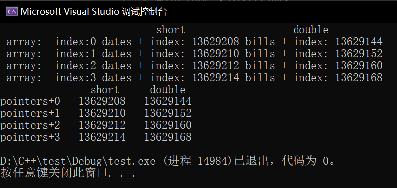

# C++学习笔记

## Linux下gdb调试

### 1. 单步执行和跟踪函数调用

看下面的程序：

**例 10.1. 函数调试实例**

```c
#include <stdio.h> 
int add_range(int low, int high)
{    int i, sum;    
 for (i = low; i <= high; i++)        
     sum = sum + i;    
 return sum;
} 
int main(void)
{    
    int result[100];    
    result[0] = add_range(1, 10);    
    result[1] = add_range(1, 100);    
    printf("result[0]=%d\nresult[1]=%d\n", result[0], result[1]);    
    return 0;
}
```

`add_range`函数从`low`加到`high`，在`main`函数中首先从1加到10，把结果保存下来，然后从1加到100，再把结果保存下来，最后打印的两个结果是：

```
result[0]=55
result[1]=5105
```

第一个结果正确[[20](https://www.bookstack.cn/read/linux-c/22b739ab35bcee97.md#ftn.id2740258)]，第二个结果不正确，在小学我们就听说过高斯小时候的故事，从1加到100应该是5050。一段代码，第一次运行结果是对的，第二次运行却不对，这是很常见的一类错误现象，这种情况不应该怀疑代码而应该怀疑数据，因为第一次和第二次运行的都是同一段代码，如果代码是错的，那为什么第一次的结果能对呢？然而第一次和第二次运行时相关的数据却有可能不同，错误的数据会导致错误的结果。

在编译时要加上`-g`选项，生成的可执行文件才能用`gdb`进行源码级调试：

```shell
$ gcc -g main.c -o main
$ gdb main
GNU gdb 6.8-debian
Copyright (C) 2008 Free Software Foundation, Inc.
License GPLv3+: GNU GPL version 3 or later <http://gnu.org/licenses/gpl.html>
This is free software: you are free to change and redistribute it.
There is NO WARRANTY, to the extent permitted by law.  Type "show copying"
and "show warranty" for details.
This GDB was configured as "i486-linux-gnu"...
(gdb) 
```


`-g`选项的作用是在可执行文件中加入源代码的信息，比如可执行文件中第几条机器指令对应源代码的第几行，但并不是把整个源文件嵌入到可执行文件中，所以在调试时必须保证`gdb`能找到源文件。

`gdb`提供一个类似Shell的命令行环境，上面的`(gdb)`就是提示符，在这个提示符下输入`help`可以查看命令的类别。

也可以进一步查看某一类别中有哪些命令，例如查看`files`类别下有哪些命令可用：

```shell
(gdb) help files
Specifying and examining files.
 
List of commands:
...
```

现在试试用`list`命令从第一行开始列出源代码：

```shell
(gdb) list 1
1    #include <stdio.h>
2    
3    int add_range(int low, int high)
4    {
5        int i, sum;
6        for (i = low; i <= high; i++)
7            sum = sum + i;
8        return sum;
9    }
10
```

一次只列10行，如果要从第11行开始继续列出源代码可以输入

```
(gdb) list
```

也可以直接敲回车**Enter**，`gdb`提供了一个很方便的功能，在提示符下直接敲回车表示重复上一条命令。

`gdb`的很多常用命令有简写形式，例如`list`命令可以写成`l`，列出一个函数的源代码也可以用函数名做参数：

```shell
(gdb) l add_range
1    #include <stdio.h>
2    
3    int add_range(int low, int high)
4    {
5        int i, sum;
6        for (i = low; i <= high; i++)
7            sum = sum + i;
8        return sum;
9    }
10
```

现在退出`gdb`的环境：

```
(gdb) quit
```

首先用`start`命令开始执行程序：

```shell
$ gdb main
...
(gdb) start
Breakpoint 1 at 0x80483ad: file main.c, line 14.
Starting program: /home/akaedu/main 
main () at main.c:14
14        result[0] = add_range(1, 10); #即将执行的下一条语句。
(gdb)
```

`gdb`停在`main`函数中变量定义之后的第一条语句处等待我们发命令，可以用`next`命令（简写为`n`）控制这些语句一条一条地执行：

```shell
(gdb) n
15        result[1] = add_range(1, 100);
(gdb) （直接回车）
16        printf("result[0]=%d\nresult[1]=%d\n", result[0], result[1]);
(gdb) （直接回车）
result[0]=55
result[1]=5105
17        return 0;
```

用`n`命令依次执行每行语句，在执行打印语句时结果立刻打出来了，然后停在`return`语句之前等待我们发命令。

虽然控制了程序的执行，但看不出哪里错了，因为错误不在`main`函数中而在`add_range`函数中，用`start`命令重新来过，这次用`step`命令（简写为`s`）钻进`add_range`函数中去跟踪执行：

```shell
(gdb) start
The program being debugged has been started already.
Start it from the beginning? (y or n) y
 
Breakpoint 2 at 0x80483ad: file main.c, line 14.
Starting program: /home/akaedu/main 
main () at main.c:14
14        result[0] = add_range(1, 10);
(gdb) s
add_range (low=1, high=10) at main.c:6
6        for (i = low; i <= high; i++)
```

这次停在了`add_range`函数中变量定义之后的第一条语句处。在函数中有几种查看状态的办法，`backtrace`命令（简写为`bt`）可以查看函数调用的栈帧：

```shell
(gdb) bt
#0  add_range (low=1, high=10) at main.c:6
#1  0x080483c1 in main () at main.c:14
```

可见当前的`add_range`函数是被`main`函数调用的，`main`传进来的参数是`low=1, high=10`。`main`函数的栈帧编号为1，`add_range`的栈帧编号为0。现在可以用`info`命令（简写为`i`）查看`add_range`函数局部变量的值：

```shell
(gdb) i locals
i = 0
sum = 0
```

如果想查看`main`函数当前局部变量的值也可以做到，先用`frame`命令（简写为`f`）选择1号栈帧然后再查看局部变量：

```shell
(gdb) f 1
#1  0x080483c1 in main () at main.c:14
14        result[0] = add_range(1, 10);
(gdb) i locals 
result = {0, 0, 0, 0, 0, 0, 134513196, 225011984, -1208685768, -1081160480, 
...
  -1208623680}
```

注意到`result`数组中有很多元素具有杂乱无章的值，因为未经初始化的局部变量具有不确定的值。到目前为止一切正常。用`s`或`n`往下走几步，然后用`print`命令（简写为`p`）打印出变量`sum`的值：

```shell
(gdb) s
7            sum = sum + i;
(gdb) （直接回车）
6        for (i = low; i <= high; i++)
(gdb) （直接回车）
7            sum = sum + i;
(gdb) （直接回车）
6        for (i = low; i <= high; i++)
(gdb) p sum
$1 = 3
```

第一次循环`i`是1，第二次循环`i`是2，加起来是3，没错。这里的`$1`表示`gdb`保存着这些中间结果，$后面的编号会自动增长，在命令中可以用`$1`、`$2`、`$3`等编号代替相应的值。

可以用`finish`命令让程序一直运行到从当前函数返回为止：

```shell
(gdb) finish
Run till exit from #0  add_range (low=1, high=10) at main.c:6
0x080483c1 in main () at main.c:14
14        result[0] = add_range(1, 10);
Value returned is $2 = 55
```

返回值是55，当前正准备执行赋值操作，用`s`命令，查看`result`数组：

```shell
(gdb) s
15        result[1] = add_range(1, 100);
(gdb) p result
$3 = {55, 0, 0, 0, 0, 0, 134513196, 225011984, -1208685768, -1081160480, 
...
  -1208623680}
```

第一个值55确实赋给了`result`数组的第0个元素。

下面用`s`命令进入第二次`add_range`调用，进入之后首先查看参数和局部变量：

```shell
(gdb) s
add_range (low=1, high=100) at main.c:6
6        for (i = low; i <= high; i++)
(gdb) bt
#0  add_range (low=1, high=100) at main.c:6
#1  0x080483db in main () at main.c:15
(gdb) i locals 
i = 11
sum = 55
```

由于局部变量`i`和`sum`没初始化，所以具有不确定的值，又由于两次调用是挨着的，`i`和`sum`正好取了上次调用时的值。`i`的初值不是0倒没关系，在`for`循环中会赋值为0的，但`sum`如果初值不是0，累加得到的结果就错了,所以设法让局部变量`sum`在调用时初值为0。我们已经找到错误原因，可以退出`gdb`修改源代码了。

我们也可以在`gdb`中马上把`sum`的初值改为0继续运行，看看这一处改了之后还有没有别的Bug：

```shell
(gdb) set var sum=0
(gdb) finish
Run till exit from #0  add_range (low=1, high=100) at main.c:6
0x080483db in main () at main.c:15
15        result[1] = add_range(1, 100);
Value returned is $4 = 5050
(gdb) n
16        printf("result[0]=%d\nresult[1]=%d\n", result[0], result[1]);
(gdb) （直接回车）
result[0]=55
result[1]=5050
17        return 0;
```

这样结果就对了。修改变量的值除了用`set`命令之外也可以用`print`命令，因为`print`命令后面跟的是表达式，而我们知道赋值和函数调用也都是表达式，所以也可以用`print`命令修改变量的值或者调用函数：

```shell
(gdb) p result[2]=33
$5 = 33
(gdb) p printf("result[2]=%d\n", result[2])
result[2]=33
$6 = 13
```

我们讲过，`printf`的返回值表示实际打印的字符数，所以`$6`的结果是13。

**gdb基本命令1**

| 命令                | 描述                                                   |
| :------------------ | :----------------------------------------------------- |
| backtrace（或bt）   | 查看各级函数调用及参数                                 |
| finish              | 连续运行到当前函数返回为止，然后停下来等待命令         |
| frame（或f） 帧编号 | 选择栈帧                                               |
| info（或i） locals  | 查看当前栈帧局部变量的值                               |
| list（或l）         | 列出源代码，接着上次的位置往下列，每次列10行           |
| list 行号           | 列出从第几行开始的源代码                               |
| list 函数名         | 列出某个函数的源代码                                   |
| next（或n）         | 执行下一行语句                                         |
| print（或p）        | 打印表达式的值，通过表达式可以修改变量的值或者调用函数 |
| quit（或q）         | 退出`gdb`调试环境                                      |
| set var             | 修改变量的值                                           |
| start               | 开始执行程序，停在`main`函数第一行语句前面等待命令     |
| step（或s）         | 执行下一行语句，如果有函数调用则进入到函数中           |

### 2. 断点

**断点调试实例**

```c
#include <stdio.h>
int main(void)
{
    int sum = 0, i = 0;
    char input[5];
 
    while (1) {
        scanf("%s", input);
        for (i = 0; input[i] != '\0'; i++)
            sum = sum*10 + input[i] - '0';
        printf("input=%d\n", sum);
    }
    return 0;
}
```

首先从键盘读入一串数字存到字符数组`input`中，转换成整型存到`sum`中，然后打印出来，一直这样循环下去。`scanf`把其中第一段非空白（非空格、Tab、换行）的字符串保存到`input`数组中，并自动在末尾添加`'\0'`。接下来的循环从左到右扫描字符串并把每个数字累加到结果中，例如输入是`"2345"`，则循环累加的过程是(((0\*10+2)\*10+3)\*10+4)\*10+5=2345。

注意字符型的`'2'`要减去`'0'`的ASCII码才能转换成整数值2。

下面编译运行程序看看有什么问题：

```shell
$ gcc main.c -g -o main
$ ./main 
123
input=123
234
input=123234
（Ctrl-C退出程序）
$
```

第一次是对的，第二次就不对。这个程序我们并没有忘了赋初值，不仅`sum`赋了初值，连不必赋初值的i都赋了初值。

进入调试，可以用`display`命令使得每次停下来的时候都显示当前`sum`的值，然后继续往下走：

```shell
(gdb) display sum
1: sum = -1208103488
(gdb) n
9            scanf("%s", input);
1: sum = 0
(gdb) 
123
10            for (i = 0; input[i] != '\0'; i++)
1: sum = 0
```

`undisplay`命令可以取消跟踪显示。

变量`sum`的编号是1，可以用`undisplay 1`命令取消它的跟踪显示。

这个循环应该没有问题，因为上面第一次输入时打印的结果是正确的。如果不想一步一步走这个循环，可以用`break`命令（简写为`b`）在第9行设一个断点（Breakpoint）：

```shell
(gdb) l
5        int sum = 0, i;
6        char input[5];
7    
8        while (1) {
9            scanf("%s", input);
10            for (i = 0; input[i] != '\0'; i++)
11                sum = sum*10 + input[i] - '0';
12            printf("input=%d\n", sum);
13        }
14        return 0;
(gdb) b 9
Breakpoint 2 at 0x80483bc: file main.c, line 9.
```

`break`命令的参数也可以是函数名，表示在某个函数开头设断点。

现在用`continue`命令（简写为`c`）连续运行而非单步运行，程序到达断点会自动停下来，这样就可以停在下一次循环的开头：

```shell
(gdb) c
Continuing.
input=123
 
Breakpoint 2, main () at main.c:9
9            scanf("%s", input);
1: sum = 123
```

然后输入新的字符串准备转换：

```shell
(gdb) n
234
10            for (i = 0; input[i] != '\0'; i++)
1: sum = 123
```

问题暴露出来了，新的转换应该再次从0开始累加，而`sum`现在已经是123了，原因在于新的循环没有把`sum`归零。

可见断点有助于快速跳过没有问题的代码，然后在有问题的代码上慢慢走慢慢分析，“断点加单步”是使用调试器的基本方法。

一次调试可以设置多个断点，用`info`命令可以查看已经设置的断点：

```shell
(gdb) b 12
Breakpoint 3 at 0x8048411: file main.c, line 12.
(gdb) i breakpoints
Num     Type           Disp Enb Address    What
2       breakpoint     keep y   0x080483c3 in main at main.c:9
    breakpoint already hit 1 time
3       breakpoint     keep y   0x08048411 in main at main.c:12
```

每个断点都有一个编号，可以用编号指定删除某个断点：

```
(gdb) delete breakpoints 2
(gdb) i breakpoints 
Num     Type           Disp Enb Address    What
3       breakpoint     keep y   0x08048411 in main at main.c:12
```

有时候一个断点暂时不用可以禁用掉而不必删除，以后想用的时候再启用：

```
(gdb) disable breakpoints 3
(gdb) i breakpoints 
Num     Type           Disp Enb Address    What
3       breakpoint     keep n   0x08048411 in main at main.c:12
(gdb) enable 3
(gdb) i breakpoints 
Num     Type           Disp Enb Address    What
3       breakpoint     keep y   0x08048411 in main at main.c:12
(gdb) delete breakpoints 
Delete all breakpoints? (y or n) y
(gdb) i breakpoints
No breakpoints or watchpoints.
```

`gdb`的断点功能非常灵活，还可以设置断点在满足某个条件时才激活，例如我们仍然在循环开头设置断点，但是仅当`sum`不等于0时才中断，然后用`run`命令（简写为`r`）重新从程序开头连续运行：

```shell
(gdb) break 9 if sum != 0
Breakpoint 5 at 0x80483c3: file main.c, line 9.
(gdb) i breakpoints 
Num     Type           Disp Enb Address    What
5       breakpoint     keep y   0x080483c3 in main at main.c:9
    stop only if sum != 0
(gdb) r
The program being debugged has been started already.
Start it from the beginning? (y or n) y
Starting program: /home/akaedu/main 
123
input=123
 
Breakpoint 5, main () at main.c:9
9            scanf("%s", input);
1: sum = 123
```

结果是第一次执行`scanf`之前没有中断，第二次却中断了。总结一下本节用到的`gdb`命令：

**gdb基本命令2**

| 命令                       | 描述                                     |
| :------------------------- | :--------------------------------------- |
| break（或b） 行号          | 在某一行设置断点                         |
| break 函数名               | 在某个函数开头设置断点                   |
| break … if …               | 设置条件断点                             |
| continue（或c）            | 从当前位置开始连续运行程序               |
| delete breakpoints 断点号  | 删除断点                                 |
| display 变量名             | 跟踪查看某个变量，每次停下来都显示它的值 |
| disable breakpoints 断点号 | 禁用断点                                 |
| enable 断点号              | 启用断点                                 |
| info（或i） breakpoints    | 查看当前设置了哪些断点                   |
| run（或r）                 | 从头开始连续运行程序                     |
| undisplay 跟踪显示号       | 取消跟踪显示                             |

### 3. 观察点

接着上一节的步骤，经过调试我们知道，虽然`sum`已经赋了初值0，但仍需要在`while (1)`循环的开头加上`sum = 0;`：

**观察点调试实例**

```c
#include <stdio.h>
 
int main(void)
{
    int sum = 0, i = 0;
    char input[5];
 
    while (1) {
        sum = 0;
        scanf("%s", input);
        for (i = 0; input[i] != '\0'; i++)
            sum = sum*10 + input[i] - '0';
        printf("input=%d\n", sum);
    }
    return 0;
}
```

这里还存在一个问题数组访问越界，现象是这样的：

```shell
$ ./main

12345
input=123407
```

下面用调试器看看这个诡异的结果是怎么出来的。

```shell
$ gdb main
...
(gdb) start
Breakpoint 1 at 0x80483b5: file main.c, line 5.
Starting program: /home/akaedu/main 
main () at main.c:5
5        int sum = 0, i = 0;
(gdb) n
9            sum = 0;
(gdb) （直接回车）
10            scanf("%s", input);
(gdb) （直接回车）
12345
11            for (i = 0; input[i] != '\0'; i++)
(gdb) p input
$1 = "12345"
```

`input`数组只有5个元素，写出界的是`scanf`自动添的`'\0'`，用`x`命令看会更清楚一些：

```
(gdb) x/7b input
0xbfb8f0a7:    0x31    0x32    0x33    0x34    0x35    0x00    0x00
```

`x`命令打印指定存储单元的内容。`7b`是打印格式，`b`表示每个字节一组，7表示打印7组，从`input`数组的第一个字节开始连续打印7个字节。前5个字节是`input`数组的存储单元，打印的正是十六进制ASCII码的`'1'`到`'5'`，第6个字节是写出界的`'\0'`。

根据运行结果，前4个字符转成数字都没错，第5个错了，也就是`i`从0到3的循环都没错，我们设一个条件断点从`i`等于4开始单步调试：

```
(gdb) l
6        char input[5];
7    
8        while (1) {
9            sum = 0;
10            scanf("%s", input);
11            for (i = 0; input[i] != '\0'; i++)
12                sum = sum*10 + input[i] - '0';
13            printf("input=%d\n", sum);
14        }
15        return 0;
(gdb) b 12 if i == 4
Breakpoint 2 at 0x80483e6: file main.c, line 12.
(gdb) c
Continuing.
 
Breakpoint 2, main () at main.c:12
12                sum = sum*10 + input[i] - '0';
(gdb) p sum
$2 = 1234
```

现在`sum`是1234，根据运行结果是123407我们知道即将进行的这步计算肯定要出错，算出来应该是12340，那就是说`input[4]`肯定不是`'5'`了，事实证明这个推理是不严谨的：

```
(gdb) x/7b input
0xbfb8f0a7:    0x31    0x32    0x33    0x34    0x35    0x04    0x00
```

`input[4]`的确是0x35，产生123407还有另外一种可能，就是在下一次循环中123450不是加上而是减去一个数得到123407。可现在不是到字符串末尾了吗？怎么会有下一次循环呢？注意到循环控制条件是`input[i] != '\0'`，而本来应该是0x00的位置现在莫名其妙地变成了0x04，因此循环不会结束。继续单步：

```
(gdb) n
11            for (i = 0; input[i] != '\0'; i++)
(gdb) p sum
$3 = 12345
(gdb) n
12                sum = sum*10 + input[i] - '0';
(gdb) x/7b input
0xbfb8f0a7:    0x31    0x32    0x33    0x34    0x35    0x05    0x00
```

进入下一次循环，原来的0x04又莫名其妙地变成了0x05，这是怎么回事？这个暂时解释不了，但123407这个结果可以解释了，是12345*10 + 0x05 - 0x30得到的，虽然多循环了一次，但下次一定会退出循环了，因为0x05的后面是`'\0'`。

`input[4]`后面那个字节到底是什么时候变的？

可以用观察点（Watchpoint）来跟踪。**观察点是当程序访问某个存储单元时中断。**下面删除原来设的断点，从头执行程序，重复上次的输入，用`watch`命令设置观察点，跟踪`input[4]`后面那个字节（可以用`input[5]`表示，虽然这是访问越界）：

```
(gdb) delete breakpoints 
Delete all breakpoints? (y or n) y
(gdb) start
Breakpoint 1 at 0x80483b5: file main.c, line 5.
Starting program: /home/akaedu/main 
main () at main.c:5
5        int sum = 0, i = 0;
(gdb) n
9            sum = 0;
(gdb) （直接回车）
10            scanf("%s", input);
(gdb) （直接回车）
12345
11            for (i = 0; input[i] != '\0'; i++)
(gdb) watch input[5]
Hardware watchpoint 2: input[5]
(gdb) i watchpoints 
Num     Type           Disp Enb Address    What
2       hw watchpoint  keep y              input[5]
(gdb) c
Continuing.
Hardware watchpoint 2: input[5]
 
Old value = 0 '\0'
New value = 1 '\001'
0x0804840c in main () at main.c:11
11            for (i = 0; input[i] != '\0'; i++)
(gdb) c
Continuing.
Hardware watchpoint 2: input[5]
 
Old value = 1 '\001'
New value = 2 '\002'
0x0804840c in main () at main.c:11
11            for (i = 0; input[i] != '\0'; i++)
(gdb) c
Continuing.
Hardware watchpoint 2: input[5]
 
Old value = 2 '\002'
New value = 3 '\003'
0x0804840c in main () at main.c:11
11            for (i = 0; input[i] != '\0'; i++)
```

已经很明显了，每次都是回到`for`循环开头的时候改变了`input[5]`的值，而且是每次加1，而循环变量`i`正是在每次回到循环开头之前加1，原来`input[5]`就是变量`i`的存储单元，换句话说，`i`的存储单元是紧跟在`input`数组后面的。

如果你发现了这个Bug却没想到数组访问越界这一点，也许一时想不出原因，就会先去处理另外一个更容易修正的Bug：如果输入的不是数字而是字母或别的符号也能算出结果来，可以在循环中加上判断条件检查非法字符：

```
while (1) {
    sum = 0;
    scanf("%s", input);
    for (i = 0; input[i] != '\0'; i++) {
        if (input[i] < '0' || input[i] > '9') {
            printf("Invalid input!\n");
            sum = -1;
            break;
        }
        sum = sum*10 + input[i] - '0';
    }
    printf("input=%d\n", sum);
}
```

然后你会惊喜地发现，不仅输入字母会报错，输入超长也会报错：

```
$ ./main
123a
Invalid input!
input=-1
dead
Invalid input!
input=-1
1234578
Invalid input!
input=-1
1234567890abcdef
Invalid input!
input=-1
```

似乎是两个Bug一起解决掉了，但这是治标不治本的解决方法。看起来输入超长的错误是不出现了，但只要没有找到根本原因就不可能真的解决掉，等到条件一变，它可能又冒出来了，在下一节你会看到它又以一种新的形式冒出来了。

**gdb基本命令3**

| 命令                    | 描述                                                         |
| :---------------------- | :----------------------------------------------------------- |
| watch                   | 设置观察点                                                   |
| info（或i） watchpoints | 查看当前设置了哪些观察点                                     |
| x                       | 从某个位置开始打印存储单元的内容，全部当成字节来看，而不区分哪个字节属于哪个变量 |

### 4. 段错误

如果程序运行时出现段错误，用`gdb`可以很容易定位到究竟是哪一行引发的段错误

**段错误调试实例一**

```
#include <stdio.h>
 
int main(void)
{
    int man = 0;
    scanf("%d", man);
    return 0;
}
```

调试过程如下：

```
$ gdb main
...
(gdb) r
Starting program: /home/akaedu/main 
123
 
Program received signal SIGSEGV, Segmentation fault.
0xb7e1404b in _IO_vfscanf () from /lib/tls/i686/cmov/libc.so.6
(gdb) bt
#0  0xb7e1404b in _IO_vfscanf () from /lib/tls/i686/cmov/libc.so.6
#1  0xb7e1dd2b in scanf () from /lib/tls/i686/cmov/libc.so.6
#2  0x0804839f in main () at main.c:6
```

在`gdb`中运行，遇到段错误会自动停下来，这时可以用命令查看当前执行到哪一行代码了。`gdb`显示段错误出现在`_IO_vfscanf`函数中，用`bt`命令可以看到这个函数是被我们的`scanf`函数调用的，所以是`scanf`这一行代码引发的段错误。仔细观察程序发现是`man`前面少了个&。

继续调试上一节的程序，上一节最后提出修正Bug的方法是在循环中加上判断条件，如果不是数字就报错退出，不仅输入字母可以报错退出，输入超长的字符串也会报错退出。表面上看这个程序无论怎么运行都不出错了，但假如我们把`while (1)`循环去掉，每次执行程序只转换一个数：

**例 10.5. 段错误调试实例二**

```
#include <stdio.h>
 
int main(void)
{
    int sum = 0, i = 0;
    char input[5];
 
    scanf("%s", input);
    for (i = 0; input[i] != '\0'; i++) {
        if (input[i] < '0' || input[i] > '9') {
            printf("Invalid input!\n");
            sum = -1;
            break;
        }
        sum = sum*10 + input[i] - '0';
    }
    printf("input=%d\n", sum);
    return 0;
}
```

然后输入一个超长的字符串，看看会发生什么：

```
$ ./main 
1234567890
Invalid input!
input=-1
```

看起来正常。再来一次，这次输个更长的：

```
$ ./main 
1234567890abcdef
Invalid input!
input=-1
Segmentation fault
```

又出段错误了。我们按同样的方法用`gdb`调试看看：

```
$ gdb main
...
(gdb) r
Starting program: /home/akaedu/main 
1234567890abcdef
Invalid input!
input=-1
 
Program received signal SIGSEGV, Segmentation fault.
0x0804848e in main () at main.c:19
19    }
(gdb) l
14            }
15            sum = sum*10 + input[i] - '0';
16        }
17        printf("input=%d\n", sum);
18        return 0;
19    }
```

`gdb`指出，段错误发生在第19行。可是这一行什么都没有啊，只有表示`main`函数结束的}括号。这可以算是一条规律，*如果某个函数的局部变量发生访问越界，有可能并不立即产生段错误，而是在函数返回时产生段错误*。


## 指针

指针(pointer)是 ” 指向(point to)" 另外一种类型的复合类型。

指针存放某个对象的地址， 要想获取该地址， 需要使用取地址符（操作符&）：

```
int ival = 42; 
int *p = &ival; // p存放变量ival的地址， 或者说p是指向变量ival的指针
```

把p定义为一个指向int的指针， 随后初始化p令其指向名为ival的int 对象。**因为引用不是对象， 没有实际地址， 所以不能定义指向引用的指针。**

如果一个指针指向了一个对象，可以使用解引用符（*）来访问该对象

```
int ival = 42; 
int *p= &ival; // p存放着变量ival的地址．或者说p是指向变量ival的指针 
cout << *p; //由符号＊得到指针p所指的对象，输出42
```

对指针解引用会得出所指的对象，因此如果给解引用的结果赋值，实际上也就是给指针所 指的对象赋值：

```
*p=0;
```

**空指针**

空指针(null pointer)不指向任何对象，三种生成空指针方法

+ int *p1 = nullptr;（C++11新标准）
+ int *p2 = 0; 
+ int *p3 = NULL;

建议：初始化所有指针

**void\*指针**

void* 是一种特殊的指针类型，可存放任意对象的地址。一个void*指针存放着一个地址，这一点和其他指针类似。不同的是，我们对该地址中到底是个什么类型的对象并不了解：

```
double obj= 3.14, *pd= &obJ; 
//正确：void*能存放任仓类型对象的地址 
void *pv = &obj; // obj可以是任意类型的对象
pv = pd; // pv可以存放任意类型的指针
```

利用void＊指针能做的事儿比较有限：拿它和别的指针比较、作为函数的输入或输出，或 者赋给另外一个void＊指针。不能直接操作void＊指针所指的对象，因为我们并不知道这个对象到底是什么类型，也就无法确定能在这个对象上做哪些操作。

**定义多个变量**

```
int* p1, p2; // p1指向int的指针，p2是int
int *pl, *p2;//p1,p2都指向int的指针
```

**指向指针的指针**

通过＊的个数可以区分指针的级别。也就是说， ＊＊表示指向指针的指针，＊＊＊表示指 向指针的指针的指针，以此类推。

```
int ival = 1024; 
int *pi= &ival; // pi指向一个int型的数
int **ppi = &pi;// ppi指向一个int型的指针
```


解引用int型指针会得到一个int型的数，同样，解引用指向指针的指针会得到一个指针。此时为了访问最原始的那个对象，需要对指针的指针做两次解引用。

**指向指针的引用**

引用本身不是一个对象，因此不能定义指向引用的指针。但指针是对象，所以存在对指针的引用

```
int i=42;
int *p=0;	// p是 一个int 型指针
int *&r=p;	// r是 一个对指针p 的引用
r=&i;		// r引用了 一个指针，因此给r赋值&i就是令p指向i
*r=0;		//解引用r得到i,也就是 p指向的 对象，将1的值改为0
```


**对指针可以执行加减运算**
指针加1是加上一个基类型的长度
指针减1是减掉一个基类型的长度
如：

```c++
int a,*pi=&a;
double b,*pd=&b;
++pi;	//pi的值增加4
++pd;	//pd的值增加8
```

```c++
int main()
{
	using namespace std;
	short dates[4]{1,2,3,4}, * pti, index;
	double bills[4]{}, * ptf;
	
	cout<<"          \t\t  short  \t \t double \n";
	for (index = 0; index < 4; index++)
		cout << " array:  index:"<< index << " dates + index: " <<int(dates + index) << " bills + index: "<<
		int(bills + index) << endl;
	pti = dates;
	ptf = bills;
	cout << "               short \t double\n";
		
	for (index = 0; index < 4; index++)
		cout<<"pointers+"<< index << "   " << int(pti + index) <<"\t"<<
			int(ptf + index) << endl;
	return 0;
}
```



即，short型数组加上1个基型长度2，double型数组为加8个基型长度，**dates + index**与**pti + index**等效，即由dates[0]变为dates[1]

**指针与const限定符**

```C++
const int *a;
int const *a;
```

这两种写法是一样的，`a`是一个指向`const int`型的指针，`a`所指向的内存单元不可改写，所以`(*a)++`是不允许的，但`a`可以改写，所以`a++`是允许的。

```
int * const a;
```

`a`是一个指向`int`型的`const`指针，`*a`是可以改写的，但`a`不允许改写。

```
int const * const a;
```

`a`是一个指向`const int`型的`const`指针，因此`*a`和`a`都不允许改写。

指向非`const`变量的指针或者非`const`变量的地址可以传给指向`const`变量的指针，编译器可以做隐式类型转换，例如：

```
char c = 'a';
const char *pc = &c;
```

但是，指向`const`变量的指针或者`const`变量的地址不可以传给指向非`const`变量的指针，以免透过后者意外改写了前者所指向的内存单元，例如对下面的代码编译器会报警告：

```
const char c = 'a';
char *pc = &c;
```

即使不用`const`限定符也能写出功能正确的程序，但良好的编程习惯应该尽可能多地使用`const`，因为：

1. `const`给读代码的人传达非常有用的信息。比如一个函数的参数是`const char *`，你在调用这个函数时就可以放心地传给它`char *`或`const char *`指针，而不必担心指针所指的内存单元被改写。
2. 尽可能多地使用`const`限定符，把不该变的都声明成只读，这样可以依靠编译器检查程序中的Bug，防止意外改写数据。
3. `const`对编译器优化是一个有用的提示，编译器也许会把`const`变量优化成常量。

字符串字面值通常分配在`.rodata`段，字符串字面值类似于数组名，做右值使用时自动转换成指向首元素的指针，这种指针应该是`const char *`型。我们知道`printf`函数原型的第一个参数是`const char *`型，可以把`char *`或`const char *`指针传给它，所以下面这些调用都是合法的：

```c
const char *p = "abcd";
const char str1[5] = "abcd";
char str2[5] = "abcd";
printf(p);
printf(str1);
printf(str2);
printf("abcd");
```

注意上面第一行，如果要定义一个指针指向字符串字面值，这个指针应该是`const char *`型，如果写成`char *p = "abcd";`就不好了，有隐患，例如：

```
int main(void)
{
    char *p = "abcd";
...
    *p = 'A';
...
}
```

`p`指向`.rodata`段，不允许改写，但编译器不会报错，在运行时会出现段错误。

## 内存模型和名称空间

### 预处理

**头文件管理**

在同一个文件中只能将同一个头文件包含一次。

基于预处理器编译指令**#ifndef(if not defined)**，可以避免多次包含同一个头文件。

如果在同一个文件中遇到其他包含coordin.h的代码，编译器就知道COORDIN_H_已经被定义了，从而跳到#endif之后。没有定义的时候，才处理**#ifndef 和 #endif**之间的语句。

```c++
#ifndef COORDIN_H_
#define COORDIN_H_
#endif
```

预处理变量有两种状态：已定义和未定义。

#define指令把一个名字设定为预处理变量，另外两个指令则分别检查某个指定的预处理变量是否已经定义：

**#ifdef**当且仅当变量已定义时为真，

**#ifndef**当且仅当变量未定义时为真。

一旦检查结果为真，则执行后续操作直至遇到#endif指令为止。

第一次包含coordin.h时，#ifndef的检查结果为真，预处理器将顺序执行后面的操作直至遇到#endif为止。此时，预处理变量SALES_DATA_H的值将变为已定义，而且coordin.h也会被拷贝到我们的程序中来。

后面如果再一次包含coordin.h，则#ifndef的检查结果将为假，编译器将忽略#ifndef到#endif之间的部分。

整个程序中的预处理变量包括**头文件保护符必须唯一**，通常的做法是基于头文件中类的名字来构建保护符的名字，以确保其唯一性。为了避免与程序中的其他实体发生名字冲突，**一般把预处理变量的名字全部大写**。

## 引用

### 引用 vs 指针

引用很容易与指针混淆，它们之间有三个主要的不同：

- 不存在空引用。引用必须连接到一块合法的内存。
- 一旦引用被初始化为一个对象，就不能被指向到另一个对象。指针可以在任何时候指向到另一个对象。
- 引用必须在创建时被初始化。指针可以在任何时间被初始化。

总结：

1. 定义引用时一定要将其初始化成引用某个变量。
2. 初始化后，它就一直引用该变量，不会再引用别
   的变量了。
3. 引用只能引用变量，不能引用常量和表达式。

### 引用做函数参数

**作用：**函数传参时，可以利用引用的技术让形参修饰实参

**优点：**可以简化指针修改实参

**示例：**

```C++
//1. 值传递
void mySwap01(int a, int b) {
	int temp = a;
	a = b;
	b = temp;
}

//2. 地址传递
void mySwap02(int* a, int* b) {
	int temp = *a;
	*a = *b;
	*b = temp;
}

//3. 引用传递
void mySwap03(int& a, int& b) {
	int temp = a;
	a = b;
	b = temp;
}

int main() {

	int a = 10;
	int b = 20;

	mySwap01(a, b);
	cout << "a:" << a << " b:" << b << endl;

	mySwap02(&a, &b);
	cout << "a:" << a << " b:" << b << endl;

	mySwap03(a, b);
	cout << "a:" << a << " b:" << b << endl;

	return 0;
}

```

> 总结：通过引用参数产生的效果同按地址传递是一样的。引用的语法更清楚简单

### 引用做函数返回值

作用：引用是可以作为函数的返回值存在的

注意：**不要返回局部变量引用**

用法：函数调用作为左值

**示例：**

```C++
//返回局部变量引用
int& test01() {
	int a = 10; //局部变量
	return a;
}

//返回静态变量引用
int& test02() {
	static int a = 20;
	return a;
}

int main() {

	//不能返回局部变量的引用
	int& ref = test01();
	cout << "ref = " << ref << endl;
	cout << "ref = " << ref << endl;

	//如果函数做左值，那么必须返回引用
	int& ref2 = test02();
	cout << "ref2 = " << ref2 << endl;
	cout << "ref2 = " << ref2 << endl;

	test02() = 1000;

	cout << "ref2 = " << ref2 << endl;
	cout << "ref2 = " << ref2 << endl;

	return 0;
}
```

### 引用的本质

本质：**引用的本质在c++内部实现是一个指针常量.**

讲解示例：

```C++
//发现是引用，转换为 int* const ref = &a;
void func(int& ref){
	ref = 100; // ref是引用，转换为*ref = 100
}

int main(){
	int a = 10;
    //自动转换为 int* const ref = &a; 指针常量是指针指向不可改，也说明为什么引用不可更改
	int& ref = a; 
	ref = 20; //内部发现ref是引用，自动帮我们转换为: *ref = 20;
    
	cout << "a:" << a << endl;
	cout << "ref:" << ref << endl;
    
	func(a);
	return 0;
}
```

结论：C++推荐用引用技术，因为语法方便，引用本质是指针常量，但是所有的指针操作编译器都帮我们做了

## 类和对象


```c++
class className{
    //说明类成员的可访问范围
private:
//私有属性和函数
public:
//公有属性和函数
protected:
//保护属性和函数
};
```

如果某个成员没有上述关键字,则缺省地被认为是私有成员。

```c++
class Man{
int nAge;//私有成员

public:
void SetName(char szName);
};
```

### 构造函数

构造函数的名称与类的名称是完全相同的，并且不会返回任何类型，也不会返回 void。构造函数可用于为某些成员变量设置初始值。

++++

1. 名字与类名相同,可以有参数,不能有返回值(void也不行)

2. 作用是对对象进行初始化,如给成员变量赋初值

3. 如果定义类时没写构造函数,则编译器生成一个默认的无参数
   的构造函数
   + 默认构造函数无参数,不做任何操作

#### 构造函数的分类及调用

两种分类方式：

​	按参数分为： 有参构造和无参构造

​	按类型分为： 普通构造和拷贝构造

三种调用方式：

+ 括号法

+ 显示法
+ 隐式转换法

```C++
//1、构造函数分类
// 按照参数分类分为 有参和无参构造   无参又称为默认构造函数
// 按照类型分类分为 普通构造和拷贝构造

class Person {
public:
	//无参（默认）构造函数
	Person() {
		cout << "无参构造函数!" << endl;
	}
	//有参构造函数
	Person(int a) {
		age = a;
		cout << "有参构造函数!" << endl;
	}
	//拷贝构造函数
	Person(const Person& p) {
		age = p.age;
		cout << "拷贝构造函数!" << endl;
	}
	//析构函数
	~Person() {
		cout << "析构函数!" << endl;
	}
public:
	int age;
};

//2、构造函数的调用
//调用无参构造函数
void test01() {
	Person p; //调用无参构造函数
}

//调用有参的构造函数
void test02() {

	//2.1  括号法，常用
	Person p1(10);
	//注意1：调用无参构造函数不能加括号，如果加了编译器认为这是一个函数声明
	//Person p2();

	//2.2 显式法
	Person p2 = Person(10); 
	Person p3 = Person(p2);
	//Person(10)单独写就是匿名对象  当前行结束之后，马上析构

	//2.3 隐式转换法
	Person p4 = 10; // Person p4 = Person(10); 
	Person p5 = p4; // Person p5 = Person(p4); 

	//注意2：不能利用 拷贝构造函数 初始化匿名对象 编译器认为是对象声明
	//Person p5(p4);
}

int main() {
	test01();
	//test02();

	return 0;
}
```


#### 拷贝构造函数


### 析构函数

类的**析构函数**是类的一种特殊的成员函数，它会在每次删除所创建的对象时执行。

析构函数的名称与类的名称是完全相同的，只是在前面加了个波浪号（~）作为前缀，它不会返回任何值，也不能带有任何参数。析构函数有助于在跳出程序（比如关闭文件、释放内存等）前释放资源。


## 模板 (template)

泛型编程主要就是利用模板

模板机制有函数模板和类模板

+ template \<typename type>
+ template \<class type>

### 函数模板

```c++
//函数模板
//声明模板，告诉T不报错，是一个通用数据类型
template<typename T>
void Swap_template(T &a,T &b)
{
    ...
}
```

两种方式使用函数模板

```c++
//1.自动类型推导
	Swap_template(a, b);

//2.显示指定类型
	Swap_template<int>(a, b);
```

### 类模板

1. 类模板没有自动类型推导使用方式
2. 类模板在模板参数列表中可以有默认参数

使用类模板时，如果在模板外写实现时，模板的名字要加上类型

```c++
template<class NameType,class AgeType>
class Person
{
public:
	Person(NameType name, AgeType age);
	NameType m_name;
	AgeType m_age;
	void showPerson();
};
//需要如下写，才能通过编译
template<class NameType, class AgeType>
Person<NameType, AgeType>::Person(NameType name,AgeType age)
{
	this->m_name = name;
	this->m_age = age;
	
}
template<class NameType, class AgeType>
void Person<NameType, AgeType>::showPerson()
{
	cout << "name: " << this->m_name 
        << "age: " << this->m_age << endl;
}
```

模板的实现和声明，尽量放在一个文件里，分开麻烦，这个和类定义不一样。

类模板在模板参数列表中可以有默认参数:

```c++
template<class NameType,class AgeType=int>//加上int
class Person
{
public:
	Person(NameType name, AgeType age);
}
void test3()
{
	Person<string> p1("孙悟空", 999);
    //template<class NameType,class AgeType=int>加上int后，即可不显示指定int类型
    //只有类模板才可这样使用
}
```

####  类模板对象做函数参数

一共有三种传入方式：

1. 指定传入的类型   --- 直接显示对象的数据类型
2. 参数模板化           --- 将对象中的参数变为模板进行传递
3. 整个类模板化       --- 将这个对象类型 模板化进行传递

**示例：**

```C++
#include <string>
//类模板
template<class NameType, class AgeType = int> 
class Person
{
public:
	Person(NameType name, AgeType age)
	{
		this->mName = name;
		this->mAge = age;
	}
	void showPerson()
	{
		cout << "name: " << this->mName << " age: " << this->mAge << endl;
	}
public:
	NameType mName;
	AgeType mAge;
};

//1、指定传入的类型
void printPerson1(Person<string, int> &p) 
{
	p.showPerson();
}
void test01()
{
	Person <string, int >p("孙悟空", 100);
	printPerson1(p);
}

//2、参数模板化
template <class T1, class T2>
void printPerson2(Person<T1, T2>&p)
{
	p.showPerson();
    //typeid可查看类型
	cout << "T1的类型为： " << typeid(T1).name() << endl;
	cout << "T2的类型为： " << typeid(T2).name() << endl;
}
void test02()
{
	Person <string, int >p("猪八戒", 90);
	printPerson2(p);
}

//3、整个类模板化
template<class T>
void printPerson3(T & p)
{
	cout << "T的类型为： " << typeid(T).name() << endl;
	p.showPerson();

}
void test03()
{
	Person <string, int >p("唐僧", 30);
	printPerson3(p);
}

int main() {
	test01();
	test02();
	test03();
	system("pause");
	return 0;
}
```

总结：

* 通过类模板创建的对象，可以有三种方式向函数中进行传参
* 使用比较广泛是第一种：指定传入的类型

## STL (Standard Template Library)

### STL六大组件简介

容器、算法、迭代器、仿函数、适配器、分配器


+ 容器（Containers）：各种数据结构，如Vector,List,Deque,Set,Map,用来存放数据
+ 算法（Algorithms）：各种常用算法如Sort,Search,Copy,Erase,从实现的角度来看，STL算法是一种Function Templates。
+ 迭代器（Iterators）：用来在一个对象群集（collection of objects）的元素上进行遍历。这个对象群集或许是个容器，或许是容器的一部分。迭代器的主要好处是，为所有容器提供了一组很小的公共接口。
+ 仿函数（Functors）： 行为类似函数，可作为算法的某种策略（Policy）,从实现的角度来看，仿函数是一种重载了Operator()的Class 或 Class Template。一般函数指针可视为狭义的仿函数。
+ 配接器（适配器）（Adapters）：一种用来修饰容器（Containers）或仿函数（Functors）或迭代器（Iterators）接口的东西，为已有的类提供新的接口，目的是简化、约束、使之安全、隐藏或者改变被修改类提供的服务集合。
+ 分配器（Allocators）：负责空间配置与管理，从实现的角度来看，配置器是一个实现了动态空间配置、空间管理、空间释放的Class Template。


### String

标准库类型string表示可变长的字符序列，使用string类型必须首先包含string头文件。

| 初始化String对象的方式 |                                                       |
| ---------------------- | ----------------------------------------------------- |
| String s1              | 默认初始化，s1是空串                                  |
| String s2(s1)          | s2是s1的副本                                          |
| String s2=s1           | 等价于s2(s1),s2是s1的副本                             |
| String s1("abc")       | s1是字面值"value"的副本，除了字面值最后的那个空字符外 |
| String s1="abc"        | 等价于s1("value"),s1是字面值"value"的副本             |
| String s1(n,'a')       | 把s1初始化为由连续n个字符c组成的串                    |

**初始化，赋值等等操作的方式原理是string的构造函数，运算符重载实现**

构造函数原型：

* `string();`          				//创建一个空的字符串 例如: string str;
  `string(const char* s);`	        //使用字符串s初始化
* `string(const string& str);`    //使用一个string对象初始化另一个string对象
* `string(int n, char c);`           //使用n个字符c初始化 

赋值的函数原型：

* `string& operator=(const char* s);`             //char*类型字符串 赋值给当前的字符串
* `string& operator=(const string &s);`         //把字符串s赋给当前的字符串
* `string& operator=(char c);`                          //字符赋值给当前的字符串
* `string& assign(const char *s);`                  //把字符串s赋给当前的字符串
* `string& assign(const char *s, int n);`     //把字符串s的前n个字符赋给当前的字符串
* `string& assign(const string &s);`              //把字符串s赋给当前字符串
* `string& assign(int n, char c);`                  //用n个字符c赋给当前字符串

**字符串拼接函数原型：**

* `string& operator+=(const char* str);`                   //重载+=操作符
* `string& operator+=(const char c);`                         //重载+=操作符
* `string& operator+=(const string& str);`                //重载+=操作符
* `string& append(const char *s); `                               //把字符串s连接到当前字符串结尾
* `string& append(const char *s, int n);`                 //把字符串s的前n个字符连接到当前字符串结尾
* `string& append(const string &s);`                           //同operator+=(const string& str)
* `string& append(const string &s, int pos, int n);`//字符串s中从pos开始的n个字符连接到字符串结尾

#### 直接初始化和默认初始化

如果使用等号（=)初始化一个变量，实际上执行的是拷贝初始化（copy initialization),编译器把等号右侧的初始值拷贝到新创建的对象中去。

与之相反，如果不使用等号，则执行的是直接初始化

#### String对象操作

|       |                                                              |
| ----- | ------------------------------------------------------------ |
| os<<s | 将s写到输出流OS当中， 返回OS |
| is>>s | 从 is中读取字符串赋给S, 字符串以空白分隔， 返回is            |
| getline(is, s) | 从 is中读取一行赋给S, 返回is                                 |
| s.empty() | s为空返回true, 否则返回false                                 |
| s.size() | 返回s中字符的个数 |
| s[n] |                  返回s中第n个字符的引用， 位置n 从 0计起   |
| sl+s2 | 返回sl和s2连接后的结果      |
| s1=s2 | 用s2的副本代替sl中原来的字符 |
| sl==s2<br />s1!=s2 | 如果sl和s2中所含的字符完全一样，则它们相等； string对象的相等性判断对字母的大小写敏感 |
| <, <=, >, >= | 利用字符在字典中的顺序进行比较， 且对字母的大小写敏感 |

**使用getline读取一整行**

```c++
int main()
{
    string line;
    //每次读入一整行， 直至到达文件末尾
    while (getline (cin, line)) 
        COUt << line << endl; 
    return 0; 
}
```

注：line中不包含换行符,触发getline函数返回的那个换行符实际上被丢弃掉了，得到的string对 象中并不包含该换行符。

**只输出非空的行**

```c++
//每次读入一整行，遇到空行直接跳过 
while (getline(cin, line)) 
    if(!line.empty())
        cout<<line<<endl;
```

**输出其中超过n个字符的行**

```c++
String line; 
／／每次读入一整行，输出其中超过80个字符的行 
while (getline(cin, line)) 
    if(line.size()>80)
        cout<<line<<endl;
```

**string:: size_ type类型**

对千size函数来说，返回一个int或者返回一个unsigned似乎都是合情合理的。但其实size函数返回的是一个**string: :size_type**类型的值。

在具体使用的时候，通过作用域操作符来表明名字sizetype是在类string中定义的。尽管我们不太清楚string::size_type类型的细节，但有一点是肯定的：它是一个无符号类型的值，而且能足够存放下任何string对象的大小。所有用于存放string类的size函数返回值的变量，都应该是**string::size_type**类型的。

在C++11新标准中，允许编译器通过auto或者decltype来推断变量的类型：

`auto len = line.size(); // len的类型是string::size_type `

由千size函数返回的是一个无符号整型数，因此切记，如果在表达式中混用了带符
号数和无符号数将可能产生意想不到的结果。例如，假设n是一个具有负值的int,则表达式s.size()<n的判断结果几乎肯定是true。这是因为负值n会自动地转换成一个比较大的无符号值。

#### 字面值和string对象相加

当把string对象和字符字面值及字符串字面值混在一条语句中使用时，必须确保每个加号运算符**+**两侧至少有一个string对象

```
string s4 = s1 + ","	//正确：把一个string对象和 个字面值相加
string s5 = "hello" + ","; 	//错误： 两个运算对象都不是string

string s6 = s1 + ", " + "world"; //正确：每个加法运算符都有一个运算对象是string
string s7 = "hello" + ", " + s2; //错误：不能把字面值直接相加
```

注：

s6式子可以用如下形式分组：

```
string s6 = (s1 + ", ") + "world";
```

其中子表达式`s1+","`的结果是一个string对象，它同时作为第二个加法运算符的左侧运算对象，因此上述语句和下面的两个语句是等价的：

```
string tmp=s1+"，"；//正确：加法运算符有一个运算对象是string
string s6=tmp+"world"；//正确：加法运算符有一个运算对象是string
```

s7的初始化是非法的，根据其语义加上括号后就成了下面的形式：

```
strings7=（"hello"+"，"）+s2；//错误：不能把字面值直接相加
```

#### 处理 string 对象中的字符

cctype头文件中的函数

| isalnum(c)  | 当c是字母或数字时为真                                        |
| ----------- | ------------------------------------------------------------ |
| isalpha(c)  | 当c是字母时为真                                              |
| iscntrl(c)  | 当c是控制字符时为真                                          |
| isdigit(c)  | 当c是数字时为真                                              |
| isgraph(c)  | 当c不是空格但可打印时为真                                    |
| islower(c)  | 当c是小写字母时为真                                          |
| isprint(c)  | 当c是可打印字符时为真（即c是空格或c具有可视形式）            |
| ispunct(c)  | 当c是标点符号时为真（即c不是控制字符、数字、字母、可打印空白中的一种） |
| isspace(c)  | 当c是空白时为真（即c是空格、横纵向制表符、回车符、换行符、进纸符中的一种） |
| isupper(c)  | 当c是大写字母时为真                                          |
| isxdigit(c) | 当c是十六进制数字时为真                                      |
| tolower(c)  | 如果c是大写字母，输出对应的小写字母：否则原样输出c           |
| toupper(c)  | 如果c是小写字母，输出对应的大写字母：否则原样输出c           |

#### 处理每个字符？使用基于范围的for语句

C++11新标准提供的一种语句：范围for (range for)语句。这种语句遍历给定序列中的每个元素并对序列中的每个值执行某种操作， 其语法形式是：

```c++
for(declaration : expression)
	statement
```


其中，**declaration** 负责定义一个变量， 用于访问序列中的基础元素。每次迭代，**declaration**变量会被初始化为 **expression**的下一个元素值。**expression**是一个对象， 用于表示一个序列。

```c++
string str("some string"); 
//每行检出str中的一个字符，
for (auto c : str) 
COUt<< c << endl; 
```

此例中，通过使用**auto**关键字让编译器来决定变量c的类型，这里c的类型是char。

统计string对象中标点符号的个数

```C++
string s ("Hello World!!!"); 
// punct_cnt的类型和s.size的返回类型一样；
decltype(s.size()) punct_cnt = 0; 
//统计标点符号数量
for (auto c : s) 
    if (ispunct (c))//对于s中的每个字符，如果该字符是标点符号 
        ++punct_cnt;//将标点符号的计数值加
cout << punct_cnt <<" punctuation characters in"<< s << endl;
```

使用decltype关键字，声明计数变量punct_cnt， 它的类型是s.size函数返回值的类型，也就是string::size_type。

**使用范围for语句改变字符串中的字符**

如果想要改变string对象中字符的值，必须把循环变量定义成引用类型

+ 把字符串改写为大写字母

```c++
string s("hello,world!!！");
//转换成大写形式
for (auto &c : s) //对于s中的每个字符（注意:C是引用）
c = toupper(c); //C是一个引用，因此赋值语句将改变s中字符的值
cout << s << endl;
```

上述代码的输出结果将是：HELLO WORLD ! ! ! 

每次迭代时，变量**c**引用**string**对象s的下一个字符，赋值给**c**也就是在改变**s**中对应字符的值。

**想访问string对象中的单个字符**

有两种方式： 一种是使用下标， 另外一种是使用迭代器。
下标运算符（［］）接收的输入参数是string::size_type类型的值， 这个参数表示要访问的字符的位置； 返回值是该位置上字符的引用。

```c++
if (! s. empty()) 
cout << s [O] << endl;//输出 s的笫一个字符
```

成员函数at()

```c++
string str = "hello world";
cout << str.at(2) << endl;//访问第2个字符，即'l'
str.at(1) = 'x';//字符修改,"hxllo world"
```


### Vector

标准库类型vector表示对象的集合， 其中所有对象的类型都相同。集合中的每个对象都有一个与之对应的索引，索引用于访问对象。

Vector是一个类模板。

#### 定义和初始化Vector对象

| vector<T> v1              | v1是一个空vector, 它潜在的元素是T类型的， 执行默认初始化 |
| ------------------------- | -------------------------------------------------------- |
| vector<T> v2 (v1)         | v2中包含有v1所有元素的副本                               |
| vector<T> v2 = v1         | 等价于v2(v1), v2中包含有v1所有元素的副本                 |
| vector<T> v3(n, val)      | v3包含了n个重复的元素， 每个元素的值都是val              |
| vector<T> v4 (n)          | v4包含了n个重复地执行了值初始化的对象                    |
| vector<T>v5 {a,b,c ... }  | v5包含了初始值个数的元素，每个元素被赋予相应的初始值     |
| vector<T> v5={a,b,c ... } | 等价于vector<T> v5 {a,b,c ... }                          |

 大多数情况下这些初始化 方式可以相互等价地使用，但是有些例外：

+ 使用拷贝初始化时（即使用＝时）（参见3.2.1节， 第76页）， 只能提供一个初始值；

+ 如果提供的是一个类内初始值（参见2.6.1节， 第64页），则只能使用拷贝初始化或使用花括号的形式初始化 。

+ 第三种特殊的要求是，如果提供的是初始元素值的列表， 则只能把初始值都放在花括号里进行列表初始化 ，而不能放在圆括号里

  ```c++
  vector<string> v1{"a", "an", "the"); //列表初始化 vector<string> v2 ("a", "an", "the"); //错误
  ```

#### 向vector对象中添加元素

对vector对象来说， 直接初始化的方式适用三种情况： 

+ 初始值已知且数量较少
+ 初始值是另一个vector对象的副本
+ 所有元素的初始值都一样。

push_back负责把一个值当成vector对象的尾元素” 压 到(push)" vector对象的 “ 尾端(back)"。

```c++
vector<int> v2; ／／空vector对象
for (int i = O; i != 100; ++i) 
	v2.push_back(i); //依次把整数值放到v2尾端
//循环结束后v2有100个元素， 值从0到99
```

注：

vector在运行时能高效快速地添加元素。定义vector对象的时候设定其大小，会使性能可能更差。

如果循环体内包含有向vector对象添加元素的语句， 则不能使用**范围for**循环（非for循环）。

表3.5：vector支持的操作

| v.empty（）               | 如果v不含有任何元素，返回真：否则返回假                      |
| ------------------------- | ------------------------------------------------------------ |
| v.size（）                | 返回v中元素的个数                                            |
| V.push back（t）          | 向v的尾端添加一个值为t的元素                                 |
| v[n]                      | 返回v中第n个位置上元素的引用                                 |
| V1=v2                     | 用v2中元素的拷贝替换v1中的元素                               |
| v1={a，b，c...}           | 用列表中元素的拷贝替换v1中的元素                             |
| v1==v2                    | v1和v2相等当且仅当它们的元素数量相同且对应位置的元素值都相同 |
| v1！=v2<br /><，<=，>，>= | 顾名思义，以字典顺序进行比较                                 |

对于某个成绩来说，将其除以10就能得到对应的分数段索引。
注意：两个整数相除，结果还是整数，余数部分被自动忽略掉了。例如，42/10=4、65/10=6、100/10=10等。一旦计算得到了分数段索引，就能用它作为vector对象的下标，进而获取该分数段的计数值并加1：

```c++
//以10分为一个分数段统计成绩的数量：0~9，10~19，...90~99，100
vector<unsigned>scores（11，0）；//11个分数段，全都初始化为0
unsigned grade；
while（cin>>grade）
{//读取成绩
    if（grade<=100）//只处理有效的成绩
	++scores[grade/10]；//将对应分数段的计数值加1
}
```

**++scores[grade/10]；**等价于：

```c++
auto ind = grade/10; //得到分数段索引 
scores[ind) = scores[ind] + l;//将计数值加1
```

+ 不能使用下标形式添加元素

下面的代码试图为vector对象ivec添加10个元素：

```c++
vector<int> ivec; //空vector对象
for {decltype (ivec. size()) ix = 0; ix != 10; ++ix) ivec[ix] = ix; //严重错误： ivec不包含任何元素
```

ivec是一个空vector, 根本不包含任何元素， 当然也就不 能通过下标去访问任何元素！正确的方法是使用push_back


### 迭代器

迭代器(iterator)，即容器和算法之间粘合剂。**可理解为指针。**

使用迭代器可以访问某个元素，迭代器也能从一个元素移动到另外一个元素。迭代器有有效和无效之分，这一点和指针差不多。有效的迭代器指向某个元素，或者指向容器中尾元素的下一位置；其他所有情况都属于无效。

```c++
vector<int>::iterator pBegin = v.begin();
vector<int>::iterator pEnd = v.end();
```

#### 使用迭代器

有迭代器的类型同时拥有返回迭代器的成员。比如，这些类型都拥有名为begin和end的成员，其中begin成员负责 返回指向第一个元素（或第一个字符）的迭代器。

```c++
//由编译器决定b和e的类型；参见2.5.2节（笫61页） 
// b表示v的第一个元素，e表示v尾元素的下一位置
auto b=v.begin(),e=v.end();
```

begin成员负责返回指向第一个元素（或第一个字符）的迭代器。end成员则负责返回指向容器（或string对象）“尾元素的下一位置(one past the end)" 的迭代器，也就是说，该迭代器指示的是容器的一个本不存在的＂尾后(off the end)"元素。这样的迭代器没实际含义，仅是个标记，表示容器中的所有元素已经处理完了。

特殊情况下，如果容器为空，begin和end返回同一迭代器，都是尾后迭代器。

**标准容器迭代器的运算符**

| *iter                              | 返回迭代器iter所指元素的引用                                 |
| ---------------------------------- | ------------------------------------------------------------ |
| iter->mem                          | 解引用iter并获取该元素的名为mem的成员，等价千(*iter).mem     |
| ++iter<br />--iter                 | 令iter指示容器中的下一个元素<br />令iter指示容器中的上一个元素 |
| iter1 == iter2<br />iterl != iter2 | 判断两个迭代器是否相等（不相等），如果两个迭代器指示的是同一个元 素或者它们是同一个容器的尾后迭代器，则相等；反之，不相等 |

+ 把string对象的第一个字母改为了大写形式

```c++
string s("some thing1");
if(s.begin()!=s.end())//判断s非空
{
    auto t=s.begin();//t表示s的第一个字符 
    *t=toupper(*t);//将当前字符改成大写形式
}
```
**`*t=toupper(*t);`解析**

t为迭代器，可看作指针，**解引用t，取得其值**，然后将结果传入toupper函数得到该字母对应的大写形式，再把这个大写字母重新赋值给it所指示的字符。

+ 从一个元素移动到另外一个元素

  迭代器使用递增（＋＋）运算符来从一个元素移动到下一个 元素。

```c++
//依次处理s中的字符，直到全部处理完或者遇到空格
for(auto it=s.begin();it!=s.end()&&!isspace(*it);++it)
    *it=toupper(*it);
```

#### 迭代器类型

```c++
vector<int>::iterator it;//it能读写vector<int>的元素
string::iterator it2;//it2能读写string对象中的字符

vector<int>::const_iterator it3;//it3只能读元素，不能写元素
string::const_iteratorit4;//it4只能读字符，不能写字符
```

const_iterator和常量指针（参见2.4.2节，第56页）差不多，能读取但不能修改它所指的元素值。相反，iterator的对象可读可写。

如果vector对象或string对象是一个常量，只能使用const_iterator;

如果vector对象或string对象不是常量，那么既能使用iterator也能使用const_iterator。

**begin和end运算符**

**begin和end返回的具体类型由对象是否是常量决定**，如果对象是常量，begin和 end返回const_iterator;如果对象不是常量，返回iterator。

```c++
vector<int> v1;
const vector<int> v2;
auto v1=v1.begin();//v1类型vector<int>::iterator
auto v2=v2.begin();//v2类型vector<int>::const_iterator
```

如果对象只须读操作而不须写操作的话，最好使用常量类型（比如const_iterator)。为了便于得到const_iterator类型的返回值，C++11引入了两个新函数，分别是cbegin,cend

```c++
auto it3 = v.cbegin(); 
// it3的类型是vector<int>::const_iterator 
```

上述两个新函数分别返回指示容器第一个元素或最后元素下一位置的迭代器。不同的是，不论vector对象（或string对象）本身是否是常量， 返回值都是const_iterator。

#### 结合解引用和成员访问操作

解引用迭代器可获得迭代器所指的对象，如果该对象的类型恰好是类，就有可能访问到它的成员。

例如，对于一个由字符串组成的vector对象来说，要想检查其元素是否为空，令it是该vector对象的迭代器，只需检查it所指字符串是否为空就可以了，其代码如下所示：

```
(*it) .empty() 
```


注意， (＊it).empty()中的圆括号()必不可少，具体原因将在4.1.2节（第121页）介绍， 该表达式的含义是先对it解引用，然后解引用的结果再执行点运算符。如果不加**()**，点运算符将由it来执行，而非it解引用的结果：

```C++
(*it).empty();//解引用it，然后调用结果对象的 empty成员

*it.empty();//错误,试图访问it的名为empty的成员，但it是个迭代器 ,没有empty成员
```

C++语言定义 了箭头运算符（－＞）。箭头运算符把解引用和成 员访问两个操作结合在一起，也就是说，it->mem和(＊it).mem表达的意思相同。

```c++
//依次捡出 text的每一行直至遇到笫一个空白行为止 
for (auto it= text.cbegin(); it != text.cend() && !it->empty(); ++it) 
    cout <<*it<< endl; 
```

首先初始化it令其指向text的第一个元素，循环执行直至处理完了text的所有元素或者发现某个元素为空。每次迭代时只要发现还有元素并且尚未遇到空元素，就输出当前正在处理的元素。值得注意的是，因为循环从头到尾只是读取text的元素而未向其中写值，所以使用了cbegin和cend来控制整个迭代过程。

+ 二分搜索

二分搜索从有序序列中寻找某个给定的值。二分搜索从序列中间的位置开始搜索， 如果中间位置的元素正好就是要找的元素， 搜索完成；如果不是，假如该元素小于要找的元素，则在序列的后半部分继续搜素；假如该元素大于要找的元素，则在序列的前半部分继续搜索。在缩小的范围中计算一个新的中间元素并重复之前的过程， 直至最终找到目标或者没有元素可供继续搜索。

```c++
// text必须是有序的
// beg和end表示我们搜索的范围
auto beg = text.begin(), end = text.end(); 
auto mid = text.begin() + (end - beg)/2; //初始状态下的中间点
//当还有元素尚未检查并且我们还没有找到sought时执行循环
while (mid ! = end && *mid ! = sought) { 
    if(sought < *mid) //我们要找的元素在前半部分吗？
 
        end = mid; 	//如果是， 调整搜索范围使得忽略掉后半部分
    else	//我们要找的元素在后半部分
        beg=mid+1;	 //在mid过之后寻找
    mid=beg+(end-beg)/2;	//新的中间点
}
```

