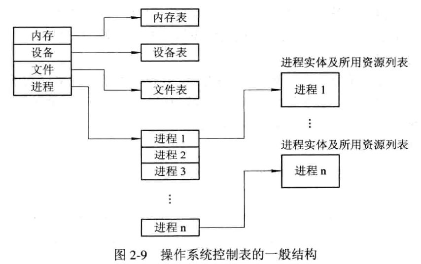

# 并行与并发

+ 并行性是指两个或多个事件在同一时刻发生

+ 并发性是指两个或多个事件在同一时间间隔发生

在多道程序环境下，并发性是指在一段时间内宏观上有多个程序在同时运行，但在单处理机系统中，每一时刻却仅能有一道程序执行，故微观上这些程序只能是分时地交替执行。

# 进程管理

**程序顺序执行特征**

+ 顺序性：处理机的操作严格按照程序所规定的顺序执行
+ 封闭性：程序是在封闭的环境下执行的，即程序运行时独占全机资源，资源的状态(除初始状态外)只有本程序才能改变它。程序一旦开始执行，其执行结果不受外界因素影响。
+ 可再现性：只要程序执行时的环境和初始条件相同，当程序重复执行时，不论它是从头到尾不停顿地执行，还是“停停走走”地执行，都将获得相同的结果。

**程序并发执行特征**

+ 间断性：程序在并发执行时，由于它们共享系统资源，以及为完成同一项任务而相互合作，致使在这些并发执行的程序之间，形成了相互制约的关系。
+ 失去封闭性：程序在并发执行时，是多个程序共享系统中的各种资源，因而这些资源的状态将由多个程序来改变，致使程序的运行失去了封闭性。
+ 不可再现性：程序在并发执行时，由于失去了封闭性，也将导致其再失去可再现性。

## 进程的描述

一般情况下，进程实体简称进程。

进程：在系统中能独立运行并作为资源分配的基本单位。

多个进程之间可以并发执行和交换信息。

**进程特征**

+ 动态性：进程的实质是进程实体的一次执行过程，“它由创建而产生，由调度而执行，由撤消而消亡”。
+ 并发性：指多个进程实体同存于内存中，且能在一段时间内同时运行。
+ 独立性：指进程实体是一个能独立运行、独立分配资源和独立接受调度的基本单位。
+ 异步性：指进程按各自独立的、 不可预知的速度向前推进，或说进程实体按异步方式运行。

**进程三种基本状态**

+ 就绪状态（Ready）：当进程已分配到除 CPU 以外的所有必要资源后，只要再获得 CPU，便可立即执行，进程这时的状态称为就绪状态。

  在一个系统中处于就绪状态的进程可能有多个，通常将它们排成一个队列，称为就绪队列。

+ 执行状态（Running）：进程已获得 CPU，其程序正在执行。在单处理机系统中，只有一个进程处于执行状态；
  在多处理机系统中，则有多个进程处于执行状态。

+ 阻塞状态（Block）：正在执行的进程由于发生某事件（请求 I/O，申请缓冲区失败等）而暂时无法继续执行时，亦即进程的执行受到阻塞。此时引起进程调度，OS把处理机分配给另一个就绪进程，而让受阻进程处于暂停状态，把这种暂停状态称为阻塞状态，有时也称为等待状态或封锁状态。
  通常将这种处于阻塞状态的进程也排成一个队列。有的系统则根据阻塞原因的不同而把处于阻塞状态的进程排成多个队列。

### 进程管理中的数据结构

**操作系统中用于管理控制的数据结构**

在计算机系统中，对于每个资源和每个进程都设置了一个数据结构，用于表征其实体，称之为资源信息表或进程信息表，包含了资源或进程的标识、描述、状态等信息以及一批指针。

OS管理的这些数据结构一般分为：内存表、设备表、文件表和用于进程管理的进程表，进程表又称为进程控制块PCB。

**进程控制块PCB的作用**

为了便于系统描述和管理进程的运行，在OS的核心为每个进程专门定义了一个数据结构——**进程控制块PCB（Process Control Block）**。PCB作为进程实体的一部分，记录操作系统所需的，用于描述进程的当前情况以及管理进程运行的全部信息，是操作系统中最重要的记录型数据结构。

PCB的作用是使一个在多道程序环境下不能独立运行的程序（含数据）成为一个能独立运行的基本单位，一个能与其他进程并发执行的进程。

具体作用：

+ 作为独立运行的基本单位的标志
+ 能实现间断性运行方式
+ 提供进程管理所需要的信息
+ 提供进程调度所需要的信息
+ 是心啊与其他进程的同步与通信

**进程控制块中的信息**

+ 进程标志符
  + 内部标识符
  + 外部标识符
+ 处理机状态
+ 进程调度信息
+ 进程控制信息

## 进程控制

进程控制是进程管理中最基本的功能，主要包括创建新进程、终止已完成的进程、将因发生异常情况而无法继续运行的进程置于阻塞状态、负责进程运行中的状态转换等功能。

### 操作系统内核

处理机执行状态分为系统态和用户态：

+ 系统态：又称管态，也称内核态。具有较高的特权，能执行一切指令，访问所有寄存器和存储区，传统的OS都在系统态执行。
+ 用户态：又称目态。具有较低的特权执行状态，仅能执行锁定的指令，访问指定的寄存器和存储区。一般情况下，应用程序只能在用户态执行。

OS内核包含两大方面功能：

+ 支撑功能：
  + 中断处理
  + 时钟管理
  + 原语操作
+ 资源管理功能：
  + 进程管理
  + 存储器管理
  + 设备管理

### 进程的创建

**进程的层次结构**

在OS中，允许进程创建另一个进程，通常把创建进程的进程称为父进程，把被创建的进程称为子进程。子进程可继续创建多个孙进程。

子进程可继承父进程所拥有的资源。子进程撤销时，应将资源归还给父进程；撤销父进程时，也必须同时撤销所有子进程。

注：Windows中不存在任何进程层次结构的概念，所有进程具有相同的地位。

**引起创建进程的事件**

+ 用户登录
+ 作业调度
+ 提供服务
+ 应用请求

**进程的创建**

当出现创建新进程的请求后，OS调用进程创建原语Creat按下述步骤创建新进程：

1. 申请空白PCB，为新进程申请获得唯一的数字标识符，并从PCB集合中索取一个空白PCB。
2. 为新进程分配其运行所需的资源，包括各种物理和逻辑资源，如内存、文件、I/O设备和CPU时间等。
3. 初始化进程控制块（PCB）
4. 如果进程就绪队列能够接纳新进程，便将新进程插入就绪队列。
